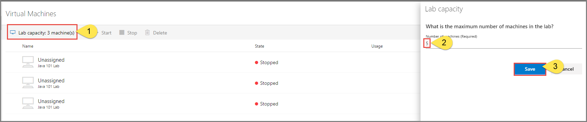

# Configure usage settings and policies
This article describes how to add users to the lab, get them registered with the lab, control the number of hours they can use the VM, and more. 

## Add users to the lab
If you have the **Restrict access** enabled, add users (email addresses) to the list.

1. Select **Users** on the left menu.
2. Select **Add users** on the toolbar. 

    
1. On the **Add users** page, enter email addresses of users in separate lines or in a single line separated by semicolons. 

    
4. Select **Save**. You see the email addresses of users and their statuses (registered or not) in the list. 

    

## Share registration link with students
To send the registration link to students, use one of the following methods. The first method shows you how to send emails to students with the registration link and an optional message. The second method shows you how to get the registration link that you can share with others any way you want. 

If the **Restrict access** is enabled for the lab, only users in the list of users can use the registration link to register to the lab. This option is enabled by default. 

### Send email to users
1. Switch to the **Users** view if you are not on the page already. 
2. Select specific or all users in the list. To select specific users, select check boxes in the first column of the list. To select all users, select the check box in front of the title of the first column (**Name**) or select all check boxes for all users in the list.
3. Select **Send invitation** on the toolbar. You can also hover the mouse over a student name in the list and send the email icon. 

    
4. On the **Send registration link by email** page, follow these steps: 
    1. Type an **optional message** that you want to send to the students. The email automatically includes the registration link. 
    2. On the **Send registration link by email** page, select **Send**. 

## Get registration link
1. Switch to the **Users** view by selecting **Users** on the left menu. 
2. Select **Get registration link** tile.

    
1. In the **User registration** dialog box, select the **Copy** button. The link is copied to the clipboard. Paste it in an email editor, and send an email to the student. 

    
2. On the **User registration** dialog box, select **Close**. 
4. Share the **registration link** with a student so that the student can register for the class. 

## View users registered with the lab

Select **Users** on the left menu to see the list of users registered with the lab. 

## Set quotas per user
You can set quotas per user by using the following steps: 

1. Select **Users** on the left menu.
2. Select **Quota per user: unlimited** on the toolbar. 
3. On the **Quota per user** page, select one of the following options: 
    1. **None**. Users can use their virtual machines only during scheduled time or when lab owner turns on virtual machines for them.
    2. **Unlimited (default)**. Users can use their virtual machines without any time restrictions.
    3. **Specify number of hours per user**. Users can use their virtual machines for the set number of hours (specified below) in addition to the scheduled time. If you select this option, enter the **number of hours** in the text box. 

        
    4. Select **Save**. 
5. You see the changed values on the toolbar now: **Quota per user: &lt;number of hours&gt;**. 

    

> [!IMPORTANT]
> The [scheduled running time of VMs](how-to-create-schedules.md) does not count against the quota allotted to a user. The quota is for the time outside of schedule hours that a student spends on VMs. 

### Add users by uploading a CSV file
You can also add users by uploading a CSV file with email addresses of users.

1. Create a CSV file with email addresses of users in one column.

    
2. On the **Users** page of the lab, select **Upload CSV** on the toolbar.

    
3. Select the CSV file with user email addresses. When you select **Open** after selecting the CSV file, you see the following **Add users** window. The email address list is filled with email addresses from the CSV file. 

    
4. Select **Save** in the **Add users** window. 
5. Confirm that you see users in the list of users. 

    

## Manage user VMs
Once students register with Azure Lab Services using the registration link you provided to them, you see the VMs assigned to students on the **Virtual machines** tab. 

You can do the following tasks on a student VM: 

- Stop a VM if the VM is running. 
- Start a VM if the VM is stopped. 
- Connect to the VM. 
- Delete the VM. 
- View the number of hours that users used the virtual machine. 

## Update number of virtual machines in lab
To update the number of virtual machines in the lab, take the following steps in the **Virtual Machines** page:

1. Select **Virtual machines** on the left menu. 
2. Select **Lab capacity: &lt;number&gt; machine(s)** on the toolbar. 
3. Enter the **number** of virtual machines.
4. Select **Save**.

    

## Next steps
See the following articles:

- [As an admin, create and manage lab accounts](how-to-manage-lab-accounts.md)
- [As a lab owner, create and manage labs](how-to-manage-classroom-labs.md)
- [As a lab owner, set up and publish templates](how-to-create-manage-template.md)
- [As a lab user, access classroom labs](how-to-use-classroom-lab.md)
