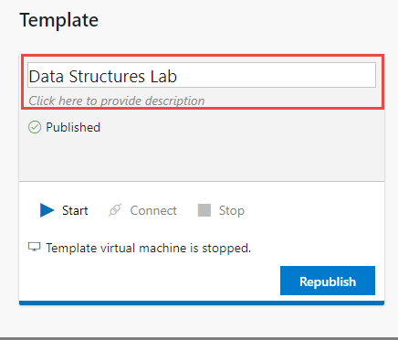
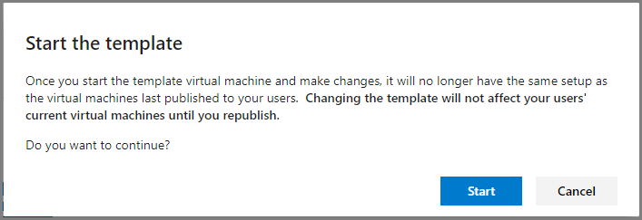
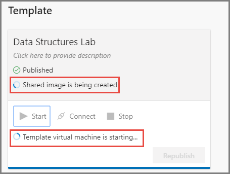
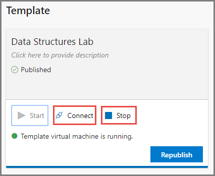
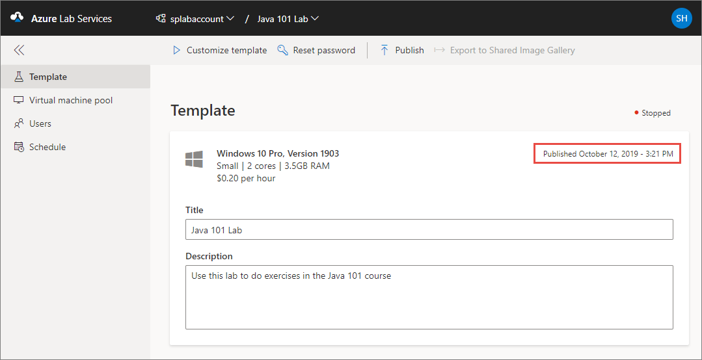
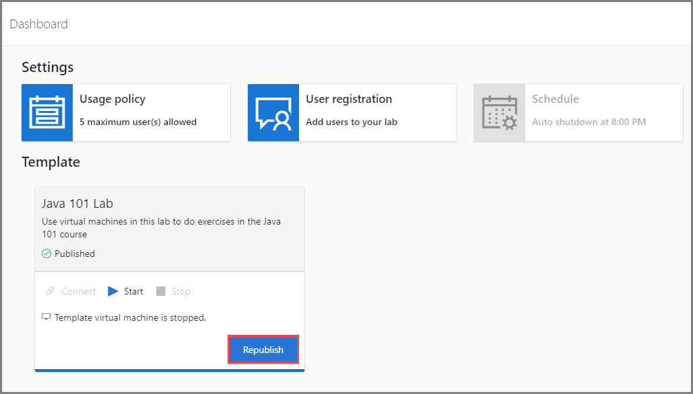
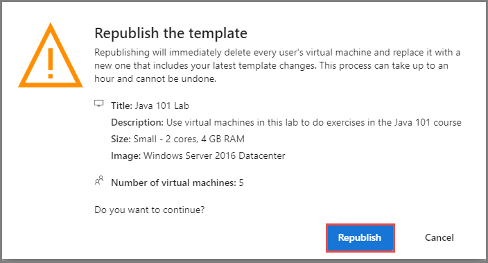
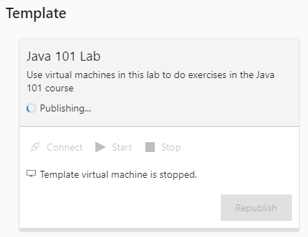
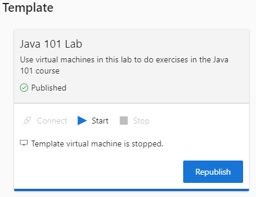

# Create and manage a classroom template in Azure Lab Services
A template in a lab is a base virtual machine image from which all users’ virtual machines are created. Set up the template virtual machine so that it is configured with exactly what you want to provide to the lab users. You can provide a name and description of the template that the lab users see. Then, you publish the template to make instances of the template VM available to your lab users. When you publish a template, Azure Lab Services creates VMs in the lab by using the template. The number of VMs created in this process is same as the maximum number of users allowed into the lab, which you can set in the usage policy of the lab. All virtual machines have the same configuration as the template.

This article describes how to create and manage a template virtual machine in a classroom lab of Azure Lab Services. 

## Publish a template while creating a classroom lab
First, you can set up and publish a template while creating a classroom lab.

1. Navigate to [Azure Lab Services website](https://labs.azure.com). 
2. Select **Sign in** and enter your credentials. Azure Lab Services supports organizational accounts and Microsoft accounts. 
3. In the **New Lab** window, do the following actions: 
    1. Specify a **name** for your lab. 
    2. Specify the maximum **number of users** allowed into the lab. 
    6. Select **Save**.

        
4. On the **Select virtual machine specifications** page, do the following steps:
    1. Select a **size** for virtual machines (VMs) created in the lab. 
    2. Select the **region** in which you want the VMs to be created. 
    3. Select the **VM image** to be used to create VMs in the lab. 
    4. Select **Next**.

            
5. On the **Set credentials** page, specify default credentials for all VMs in the lab. 
    1. Specify the **name of the user** for all VMs in the lab.
    2. Specify the **password** for the user. 

        > [!IMPORTANT]
        > Make a note of user name and password. They won't be shown again.
    3. Select **Create**. 

        
6. On the **Configure template** page, you see the status of lab creation process. The creation of the template in the lab takes up to 20 minutes. 

    
7. After the configuration of the template is complete, you see the following page: 

    
8. The following steps are optional steps in this tutorial: 
    1. Start the template VM by selecting **Start**.
    2. Connect to the template VM by selecting **Connect**. 
    3. Install and configure software on your template VM. 
    4. **Stop** the VM.  
    5. Enter a **description** for the template

        
9. Select **Next** on the template page. 
10. On **Publish the template** page, do the following actions. 
    1. To publish the template immediately, select the checkbox for *I understand I can't modify the template after publishing. This process can only be done once and can take up to an hour*, and select **Publish**.  

        > [!WARNING]
        > Once you publish, you can't unpublish. 
    2. To publish later, select **Save for later**. You can publish the template VM after the wizard completes. For details on how to configure and publish after the wizard completes, see For details on how to configure and publish after the wizard completes, see Publish the template section in the [How to manage classroom labs](how-to-manage-classroom-labs.md) article.

        
11. You see the **progress of publishing** the template. This process can take up to an hour. 

    
12. You see the following page when the template is published successfully. Select **Done**.

    
1. You see the **dashboard** for the lab. 
    
    

 
## Set or update template title and description
Use the following steps to set title and description for the first time, and update them later. 

1. In the **Template** section, move your mouse over **name** of the template or **description** of the template, and select it. 
2. Enter the **new name** or **new description** for the template, and press **ENTER**.

    

## Set up or update a template VM
 You connect to the template VM and install any required software on it before making it available to your students. Use the following steps to set up a template VM for the first time or to update the VM. 

1. Wait until the template virtual machine is ready. Once it is ready, the **Start** button should be enabled. To start the VM, select **Start**.

    
1. Review the warning, and select **Start**. 

    
2. You see the status on the lab tile in the **Template** section.

    
1. After it's started, to connect to the VM, select **Connect**, and follow instructions. 

    
1. Install any software that's required for students to do the lab (for example, Visual Studio, Azure Storage Explorer, etc.). 
2. Disconnect (close your remote desktop session) from the template VM. 
3. **Stop** the template VM by selecting **Stop**. 

## Publish the template VM  
If you don't publish the template while creating the lab, you can publish it later. Before publishing, you may want to connect to the template VM, and update it with any software. When you publish a template, Azure Lab Services creates VMs in the lab by using the template. The number of VMs created in this process is same as the maximum number of users allowed into the lab, which you can set in the usage policy of the lab. All virtual machines have the same configuration as the template. 

1. Select **Publish** in the **Template** section. 

    
1. On the **Publish the template** message box, review the message, and select **Publish**. This process may take some time depending on how many VMs are being created.
    
    > [!IMPORTANT]
    > Once a template is published, it can't be unpublished. You can republish the template though. 
4. Wait for the status of the template to change to **Published**. 

    
1. Switch to the **Virtual machines** page, and confirm that you see virtual machines that are in **Unassigned** state. These VMs are not assigned to students yet. Wait until the VMs are created. They should be in **Stopped** state. You can start a student VM, connect to the VM, stop the VM, and delete the VM on this page. You can start them on this page or let your students start the VMs. 

    

## Republish the template 
After you publish a template, you can still connect to the template VM, update it, and then republish it. When you republish a template VM, all user VMs get disconnected and they are recreated based on the updated template. 

1. On the dashboard page of your lab, select **Republish** in the Template section. 

    
2. On the **Republish the template** message box, review the text, and select **Republish** to continue. Otherwise, select **Cancel**. 

    
3. You see the status of the republish on the tile in the **Template** section.

    
4. After the template is published, the status is set to **Published**. 

    

## Next steps
See the following articles:

- [As an admin, create and manage lab accounts](how-to-manage-lab-accounts.md)
- [As a lab owner, create and manage labs](how-to-manage-classroom-labs.md)
- [As a lab owner, configure and control usage of a lab](how-to-configure-student-usage.md)
- [As a lab user, access classroom labs](how-to-use-classroom-lab.md)
