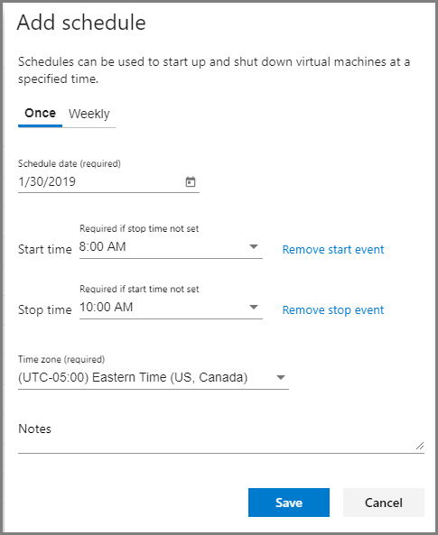
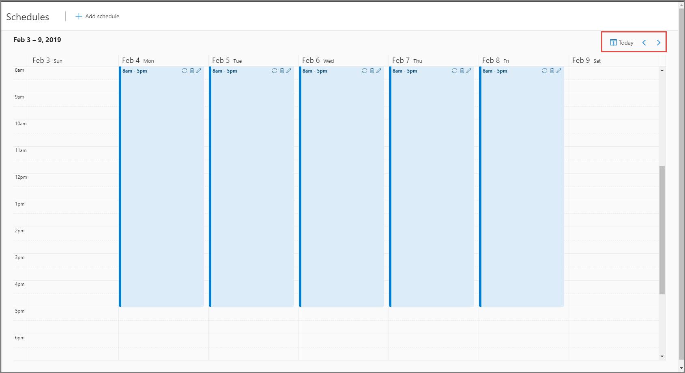
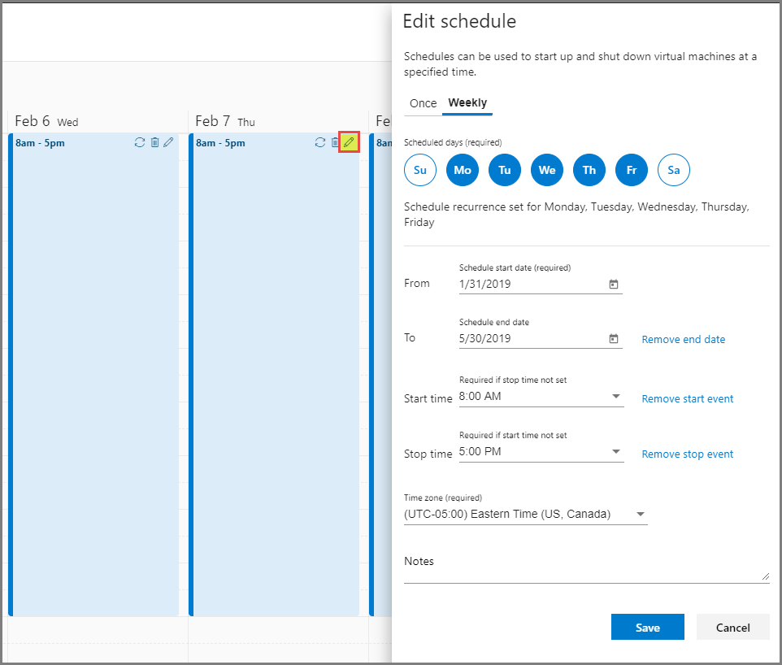
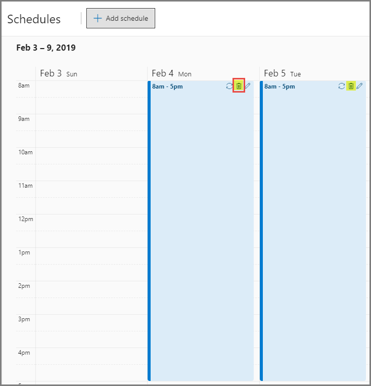
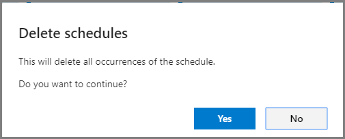

# Create and manage schedules for classroom labs in Azure Lab Services 
Schedules allow you to configure a classroom lab such that VMs in the lab automatically start and shut down at a specified time. You can define a one-time schedule or a recurring schedule. The following procedures give you steps to create and manage schedules for a classroom lab: 

> [!IMPORTANT]
> The scheduled running time of VMs does not count against the [quota allotted to a user](how-to-configure-student-usage.md#set-quotas-per-user). The quota is for the time outside of schedule hours that a student spends on VMs. 

## Add a schedule (once)

1. Switch to the **Schedules** page, and select **Add schedule** on the toolbar. 

    
2. On the **Add schedule** page, confirm that **Once** option is selected at the top. If it's not, select **Once**. 
3. For **Schedule date (required)**, enter the date or select the calendar icon to select a date. 
4. For **Start time**, select the time when you want the VMs to be started. The start time is required if the stop time is not set. Select **Remove start event** if you want to specify only the stop time. if the **Start time** is disabled, select **Add start event** next to the drop-down list to enable it. 
5. For **Stop time**, select the time when you want the VMs to be shut down. The stop time is required if the start time is not set. Select **Remove stop event** if you want to specify only the start time. if the **Stop time** is disabled, select **Add stop event** next to the drop-down list to enable it.
6. For **Time zone (required)**, select the time zone for the start and stop times you specified. 
7. For **Notes**, enter any description or notes for the schedule. 
8. Select **Save**. 

    

## Add a recurring schedule (weekly)

1. Switch to the **Schedules** page, and select **Add schedule** on the toolbar. 

    
2. On the **Add schedule** page, switch to **Weekly** at the top. 
3. For **Schedule days (required)**, select the days on which you want the schedule to take effect. In the following example, Monday-Friday is selected. 
4. For the **From** field, enter the **schedule start date** or pick a date by selecting the **calendar** button. This field is required. 
5. For **Schedule end date**, enter or select an end date on which the VMs are to be shut down. 
6. For **Start time**, select the time at which you want the VMs to be started. The start time is required if the stop time is not set. Select **Remove start event** if you want to specify only the stop time. if the **Start time** is disabled, select **Add start event** next to the drop-down list to enable it. 
7. For **Stop time**, select the time at which you want the VMs to be shut down. The stop time is required if the start time is not set. Select **Remove stop event** if you want to specify only the start time. if the **Stop time** is disabled, select **Add stop event** next to the drop-down list to enable it.
8. For **Time zone (required)**, select the time zone for the start and stop times you specified.  
9. For **Notes**, enter any description or notes for the schedule. 
10. Select **Save**. 

    

## View schedules in calendar
You can see the scheduled dates and times highlighted in the calendar view as shown in the following image:

Select the **Today** button in the top-right corner to switch to current date in the calendar. Select **left arrow** to switch to the previous week and **right arrow** to switch to the next week in the calendar. 

## Edit a schedule
When you double-click on a highlighted schedule in the calendar or select the **pencil** button on the toolbar, you see the **Edit schedule** page. Updating settings on this page is same as updating settings in the **Add schedule** page as described in the [Add a recurring schedule](#add-a-recurring-schedule-weekly) section. 

## Delete a schedule

1. To delete a schedule, select the trash can (delete) button on the toolbar as shown in the following image:

    

    You can use the delete button for any of the scheduled dates and times in the calendar, and select **delete**. 
2. On the **Delete schedules** page, select **Yes**.

    

## Next steps
See the following articles:

- [As an admin, create and manage lab accounts](how-to-manage-lab-accounts.md)
- [As a lab owner, create and manage labs](how-to-manage-classroom-labs.md)
- [As a lab owner, configure and control usage of a lab](how-to-configure-student-usage.md)
- [As a lab user, access classroom labs](how-to-use-classroom-lab.md)
