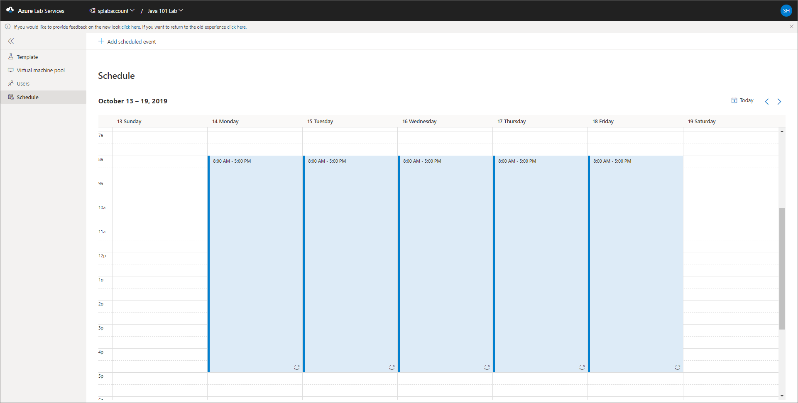
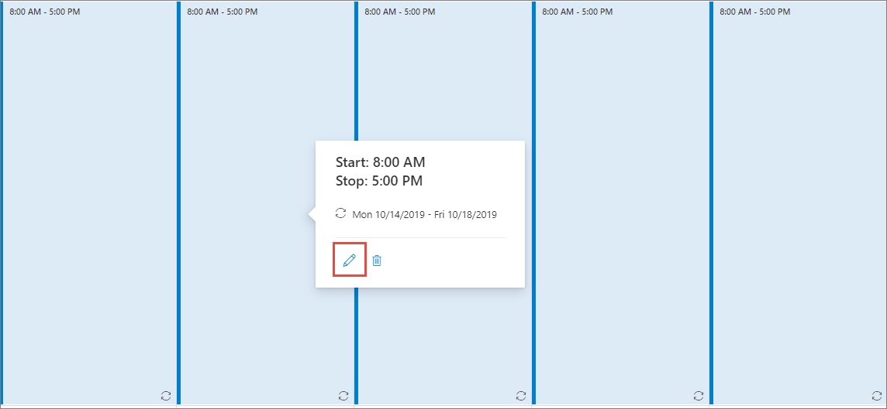
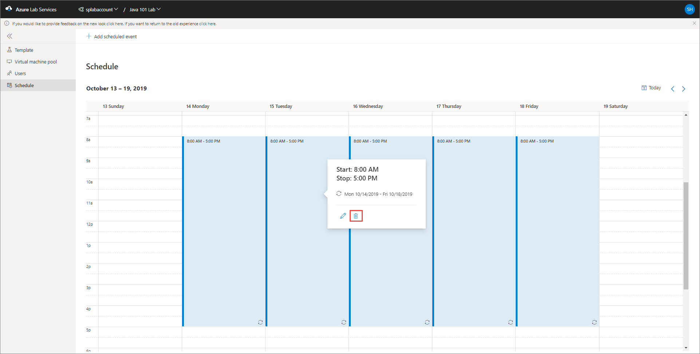

# Create and manage schedules for classroom labs in Azure Lab Services 
Schedules allow you to configure a classroom lab such that VMs in the lab automatically start and shut down at a specified time. You can define a one-time schedule or a recurring schedule. The following procedures give you steps to create and manage schedules for a classroom lab: 

> [!IMPORTANT]
> The scheduled running time of VMs does not count against the [quota allotted to a user](how-to-configure-student-usage.md#set-quotas-for-users). The quota is for the time outside of schedule hours that a student spends on VMs. 

## Set a schedule for the lab
Create a scheduled event for the lab so that VMs in the lab are automatically started/stopped at specific times. The user quota you specified earlier is the additional time assigned to each user outside this scheduled time. 

> [!NOTE]
> Before we get started, here's how schedules affect lab virtual machines: 
>- Template virtual machine is not included in schedules. 
>- Only assigned virtual machines are started. This means, if a machine is not claimed by an end user (student), the the machine will not start on the scheduled hours. 
>- All virtual machines (whether claimed by a user or not) are stopped based on the lab schedule. 

1. Switch to the **Schedules** page, and select **Add scheduled event** on the toolbar. 

    
2. Confirm that **Standard** is selected the **Event type**. You select **Start only** to specify only the start time for the VMs. You select **Stop only** to specify only the stop time for the VMs. 
7. In the **Repeat** section, select the current schedule. 

    
5. On the **Repeat** dialog box, do the following steps:
    1. Confirm that **every week** is set for the **Repeat** field. 
    3. Specify the **start date**.
    4. Specify the **start time** at which you want the VMs to be started.
    5. Specify the **stop time** on which the VMs are to be shut down. 
    6. Specify the **time zone** for the start and stop times you specified. 
    2. Select the days on which you want the schedule to take effect. In the following example, Monday-Thursday is selected. 
    8. Select **Save**. 

        

3. Now, on the **Add scheduled event** page, for **Notes (optional)**, enter any description or notes for the schedule. 
4. On the **Add scheduled event** page, select **Save**. 

    

## View schedules in calendar
You can see the scheduled dates and times highlighted in the calendar view as shown in the following image:

Select the **Today** button in the top-right corner to switch to current date in the calendar. Select **left arrow** to switch to the previous week and **right arrow** to switch to the next week in the calendar. 

## Edit a schedule
When you select a highlighted schedule in the calendar, you see buttons to **edit** or **delete** the schedule. 

On the **Edit scheduled event** page, you can update the schedule, and select **Save**. 

## Delete a schedule

1. To delete a schedule, select a highlighted schedule in the calendar, and select the trash icon (delete) button:

    
2. On the **Delete scheduled event** dialog box, select **Yes** to confirm the deletion. 

## Next steps
See the following articles:

- [As an admin, create and manage lab accounts](how-to-manage-lab-accounts.md)
- [As a lab owner, create and manage labs](how-to-manage-classroom-labs.md)
- [As a lab owner, configure and control usage of a lab](how-to-configure-student-usage.md)
- [As a lab user, access classroom labs](how-to-use-classroom-lab.md)
