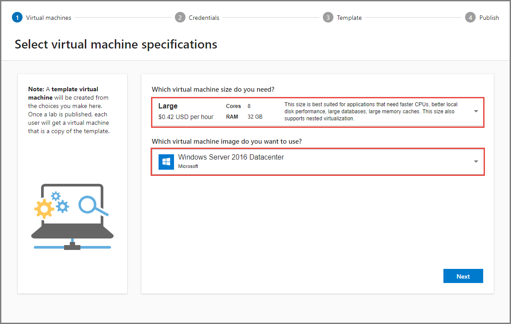
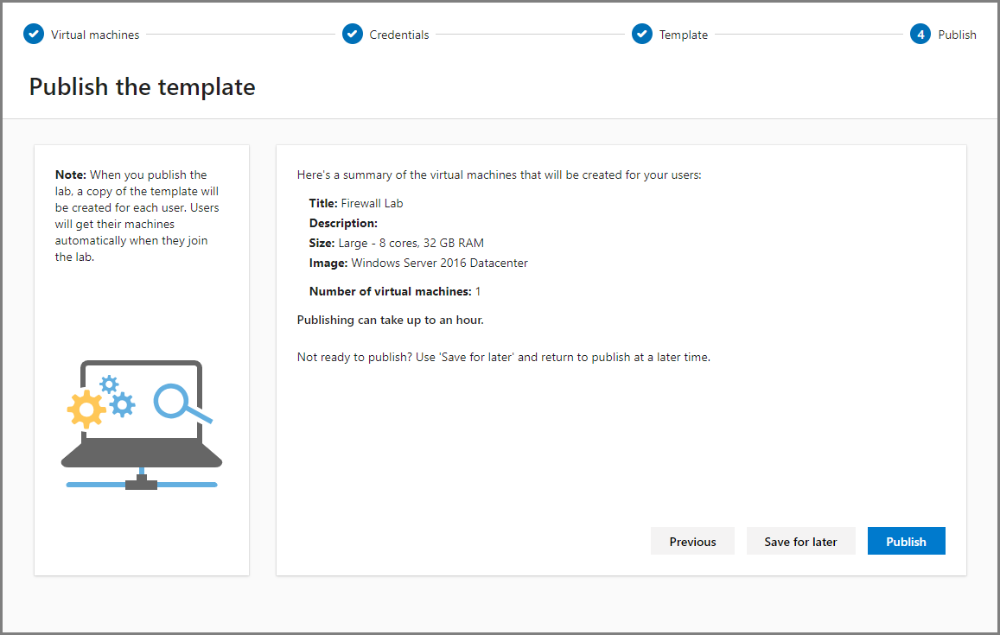
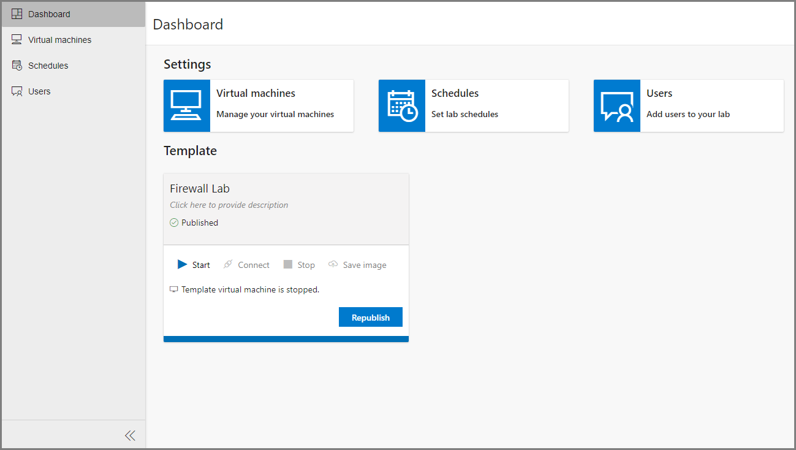

# Create an environment with multiple VMs inside a template VM of a classroom lab
Currently Azure Lab Services enables you to set up one template virtual machine in a lab and make a single copy available to each of your user. But if you are a professor teaching an IT class on how to set up firewalls or servers, you may need to provide each of your students with an environment in which multiple virtual machines can talk to each other over a network.

Nested virtualization enables you to create a multi-VM environment inside a lab’s template virtual machine. Publishing the template will provide each user in the lab with a virtual machine set up with multiple VMs within it.

## What is nested virtualization?
Nested virtualization enables you to create virtual machines within a virtual machine. Nested virtualization is done through Hyper-V, and is only available on Windows VMs.

For more information about nested virtualization, see the following articles:

- [Nested Virtualization in Azure](https://azure.microsoft.com/blog/nested-virtualization-in-azure/)
- [How to enable nested virtualization in an Azure VM](../../virtual-machines/windows/nested-virtualization.md)

## Use nested virtualization in Azure Lab Services
The important steps are:

1. Create a **large** sized **Windows** template machine for the lab. 
2. Connect to it and [enable nested virtualization](../../virtual-machines/windows/nested-virtualization.md).

The following procedure gives you the detailed steps: 

1. Create a lab account if you don't have one already. For instructions, see [Tutorial: Set up a lab account with Azure Lab Services](tutorial-setup-lab-account.md).
2. Navigate to [Azure Lab Services website](https://labs.azure.com). 
3. Select **Sign in** and enter your credentials. Azure Lab Services supports organizational accounts and Microsoft accounts. 
4. In the **New Lab** window, do the following actions: 
    1. Specify a **name** for your lab. 
    2. Specify the maximum **number of virtual machines** in the lab. You can increase or decreate the number of VMs after creating the lab or in an existing lab. For more information, see [Update number of VMs in a lab](how-to-configure-student-usage.md#update-number-of-virtual-machines-in-lab)
    6. Select **Save**.

        
4. On the **Select virtual machine specifications** page, do the following steps:
    1. Select **Large** for the size of virtual machines (VMs) to be created in the lab. Currently, only the large size supports nested virtualization.
    2. Choose a virtual machine image that is a **Windows image**. Nested virtualization is only available on Windows machines. 
    3. Select **Next**.

            
5. On the **Set credentials** page, specify default credentials for all VMs in the lab. 
    1. Specify the **name of the user** for all VMs in the lab.
    2. Specify the **password** for the user. 

        > [!IMPORTANT]
        > Make a note of user name and password. They won't be shown again.
    3. Select **Create**. 

        
6. On the **Configure template** page, you see the status of lab creation process. The creation of the template in the lab takes up to 20 minutes. 

    
7. After the configuration of the template is complete, you see the following page: 

    
8. On the **Configure template** page, select **Connect** to connect to the template VM to configure nested virtualization. You can also configure later after you complete the steps in this wizard. 
9. Inside the template virtual machine, set up nested virtualization and configure a virtual network with multiple virtual machines. For detailed step-by-step instructions, see [How to enable nested virtualization in an Azure VM](../../virtual-machines/windows/nested-virtualization.md). Here’s a quick summary of the steps: 
    1. Enable the Hyper-V feature in the template virtual machine.
    2. Set up an internal virtual network with internet connectivity for the nested virtual machines
    3. Create virtual machines through the Hyper-V Manager
    4. Assign an IP address to the virtual machines
10. Select **Next** on the template page. 
11. On **Publish the template** page, do the following actions. 
    1. To publish the template immediately, and select **Publish**.  

        > [!WARNING]
        > Once you publish, you can't unpublish. 
    2. To publish later, select **Save for later**. You can publish the template VM after the wizard completes. For details on how to configure and publish after the wizard completes, see [Publish the template](how-to-create-manage-template.md#publish-the-template-vm) section in the [How to manage classroom labs](how-to-manage-classroom-labs.md) article.

        
11. You see the **progress of publishing** the template. This process can take up to an hour. 

    
12. You see the following page when the template is published successfully. Select **Done**.

    
1. You see the **dashboard** for the lab. 
    
    

## Next steps

Now, each user gets a single virtual machine that includes a multi-VM environment within it. To learn how to add users to the lab and send registration link to them, see the following article: [Add users to the lab](tutorial-setup-classroom-lab.md#add-users-to-the-lab).