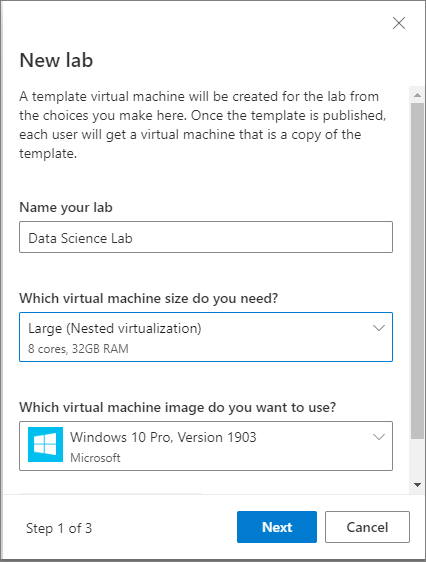
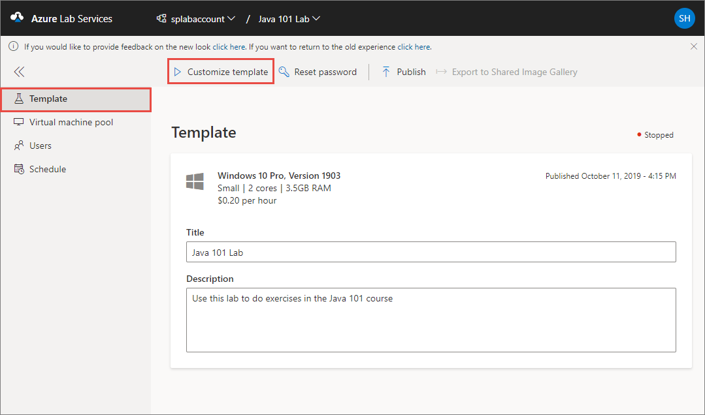

# Create an environment with multiple VMs inside a template VM of a classroom lab
Currently Azure Lab Services enables you to set up one template virtual machine in a lab and make a single copy available to each of your user. But if you are a professor teaching an IT class on how to set up firewalls or servers, you may need to provide each of your students with an environment in which multiple virtual machines can talk to each other over a network.

Nested virtualization enables you to create a multi-VM environment inside a lab’s template virtual machine. Publishing the template will provide each user in the lab with a virtual machine set up with multiple VMs within it.

## What is nested virtualization?
Nested virtualization enables you to create virtual machines within a virtual machine. Nested virtualization is done through Hyper-V, and is only available on Windows VMs.

For more information about nested virtualization, see the following articles:

- [Nested Virtualization in Azure](https://azure.microsoft.com/blog/nested-virtualization-in-azure/)
- [How to enable nested virtualization in an Azure VM](../../virtual-machines/windows/nested-virtualization.md)

## Use nested virtualization in Azure Lab Services
The important steps are:

1. Create a **large** sized **Windows** template machine for the lab. 
2. Connect to it and [enable nested virtualization](../../virtual-machines/windows/nested-virtualization.md).

The following procedure gives you the detailed steps: 

1. Create a lab account if you don't have one already. For instructions, see [Tutorial: Set up a lab account with Azure Lab Services](tutorial-setup-lab-account.md).
1. Navigate to [Azure Lab Services website](https://labs.azure.com). Note that Internet Explorer 11 is not supported yet. 
2. Select **Sign in** and enter your credentials. Azure Lab Services supports organizational accounts and Microsoft accounts. 
3. Select **New lab**. 
    
    
4. In the **New Lab** window, do the following actions: 
    1. Specify a **name** for your lab. 
    2. Select **Large (nested virtualization)** or **Medium (nested virtualization)** for the **virtual machine size**.
    6. Select a Windows **image** that you want to use. Nested virtualization is only available on Windows machines. 
    4. Then, select **Next**. 

        
    1. On the **Virtual machine credentials** page, specify default credentials for all VMs in the lab. Specify the **name** and the **password** for the user, and then select **Next**.  

        

        > [!IMPORTANT]
        > Make a note of user name and password. They won't be shown again.
    3. On the **Lab policies** page, enter the number of hours allotted for each user (**quota for each user**) outside the scheduled time for the lab, and then select **Finish**. 

        
5. You should see the following screen that shows the status of the template VM creation. The creation of the template in the lab takes up to 20 minutes. 

    
1. On the **Template** page, select **Customize template** on the toolbar. 

    
2. On the **Customize template** dialog, select **Continue**. Once you start the template and make changes, it will no longer have the same setup as the virtual machines last published to your users. Template changes will not be reflected on your users' existing virtual machines until after you publish again.

    
1. Select **Connect to template** button on the toolbar to connect to the template VM to configure nested virtualization., and follow instructions. If it's a Windows machine, you will see an option to download the RDP file. 

     
9. Inside the template virtual machine, set up nested virtualization and configure a virtual network with multiple virtual machines. For detailed step-by-step instructions, see [How to enable nested virtualization in an Azure VM](../../virtual-machines/windows/nested-virtualization.md). Here’s a quick summary of the steps: 
    1. Enable the Hyper-V feature in the template virtual machine.
    2. Set up an internal virtual network with internet connectivity for the nested virtual machines
    3. Create virtual machines through the Hyper-V Manager
    4. Assign an IP address to the virtual machines
10. On **Template** page, select **Publish** on the toolbar. 

    

    > [!WARNING]
    > Once you publish, you can't unpublish. 
8. On the **Publish template** page, enter the number of virtual machines you want to create in the lab, and then select **Publish**. 

    
11. You see the **status of publishing** the template on page. This process can take up to an hour. 

    

## Next steps

Now, each user gets a single virtual machine that includes a multi-VM environment within it. To learn how to add users to the lab and send registration link to them, see the following article: [Add users to the lab](tutorial-setup-classroom-lab.md#add-users-to-the-lab).