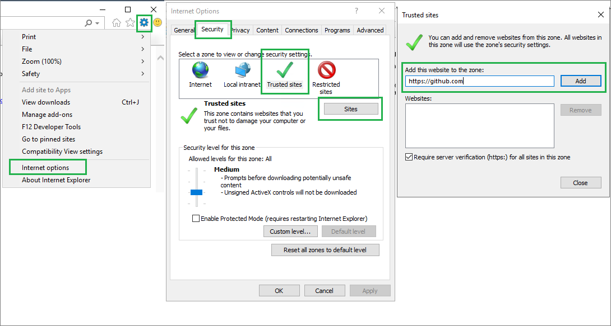

# Enable nested virtualization on a template virtual machine in Azure Lab Services
This article covers how to set up nested virtualization on a template virtual machine in Azure Lab Services. Nested virtualization is used in Azure Lab Services when each student in a class requires multiple machines.
 
## Considerations
Before setting up a lab with nested virtualization, here are a few things to take into consideration.

- When creating a new lab, select **Medium (Nested Virtualization)** or **Large** sizes for the virtual machine size. These virtual machine sizes support nested virtualization. 
- Choose a size that will provide good performance for both the host and client virtual machines.  Remember, when using virtualization, the size you choose must be adequate for not just one machine, but the host as well as any client machines that must be run concurrently.
- Client virtual machines will not have access to Azure resources, such as DNS servers on the Azure virtual network.
- Host virtual machine requires setup to allow for the client machine to have internet connectivity. 
- Client virtual machines are licensed as independent machines. See [Microsoft Licensing](https://www.microsoft.com/licensing/default) for information about licensing for Microsoft operation systems and products. Check licensing agreements for any other software being used before setting up the template machine.

## Enable nested virtualization on a template VM
The steps in this section focus on setting up nested virtualization for Windows Server 2016 or Windows Server 2019. You will use a script to set up template machine with Hyper-V. For an automated solution, see scripts at [Lab Services Hyper-V Scripts](https://github.com/Azure/azure-devtestlab/tree/master/samples/ClassroomLabs/Scripts/HyperV). The following steps will walk you through how to use the script.

1. If you're using Internet Explorer, you may have to add `https://github.com` to the trusted sites list. 
    1. Open Internet Explorer.
    1. Select the gear icon, and choose **Internet options**.  
    1. When the **Internet Options** dialog appears, select **Security**, select **Trusted Sites**, click **Sites** button.
    1. When the **Trusted sites** dialog appears, add `https://github.com` to the trusted websites list, and select **Close**.

        
1.  Download the Git repository files as outlined in the following steps.  Alternatively, the Git repository can be cloned from [https://github.com/Azure/azure-devtestlab.git](https://github.com/Azure/azure-devtestlab.git). 
    1. Go to  [https://github.com/Azure/azure-devtestlab/](https://github.com/Azure/azure-devtestlab/).
    1. Click the ***Clone or Download** button.
    1. Click **Download ZIP**.
    1. Extract the ZIP file
1. Launch **PowerShell** in **Administrator** mode.
1. In the PowerShell window, navigate to the folder with the downloaded script. If you're navigating from the top folder of the repository files, the script is located at `azure-devtestlab\samples\ClassroomLabs\Scripts\HyperV\`.
1. You may have to change the execution policy to successfully run the script. Run the following command:
    
    ```powershell
    Set-ExecutionPolicy bypass -force 
    ```
1. Run the script:
    
    ```powershell
    .\SetupForNestedVirtualization.ps1
    ```

    > [!NOTE]
    > The script may require the machine to be restarted. Follow instructions from the script and re-run the script until **Script completed** is seen in the output.
1. Don’t forget to reset the execution policy. Run the following command: 

    ```powershell
    Set-ExecutionPolicy default -force
    ```

## Conclusion
Now your template machine is ready to create Hyper-V virtual machines. See [Create a Virtual Machine in Hyper-V](/windows-server/virtualization/hyper-v/get-started/create-a-virtual-machine-in-hyper-v) for instructions on how to create Hyper-V virtual machines. Also, see [Microsoft Evaluation Center](https://www.microsoft.com/evalcenter/) to check out available operating systems and software.  

## Next steps 
See the following articles:

- [How to enable nested virtualization in an Azure VM](../../virtual-machines/windows/nested-virtualization.md) 
- [Install the Hyper-V role on Windows Server](/windows-server/virtualization/hyper-v/get-started/install-the-hyper-v-role-on-windows-server)
- [Lab Services Hyper-V scripts](https://github.com/Azure/azure-devtestlab/tree/master/samples/ClassroomLabs/Scripts/HyperV)
