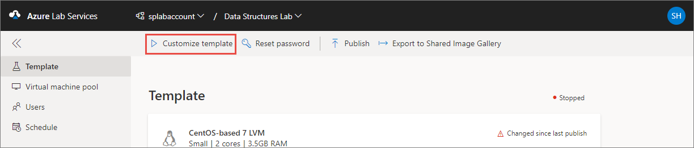

# Enable remote desktop for Linux virtual machines in a lab in Azure Lab Services
This article shows you how to do the following tasks:

- Enable remote desktop for Linux VM
- How teacher can connect to the template VM via Remote Desktop Connection (RDP).

## Enable remote desktop for Linux VM
During lab creation, teachers can enable **remote desktop connection** for **Linux** images. The **Enable Remote Desktop Connection** option is shown when a Linux image is selected for the template. When this option is enabled, teachers can connect to template VM and student VMs via RDP (Remote Desktop). 

On the **Enabling Remote Desktop Connection** message box, select **Continue with Remote Desktop**. 

> [!IMPORTANT] 
> Enabling **remote desktop connection** only opens the **RDP** port on Linux machines. If RDP is already installed and configured on the virtual machine image (for example: Ubuntu Data Science Virtual Machine image), you/students can connect to VMs via RDP without following any additional steps.
> 
> If the VM image doesn't have RDP installed and configured, you need to connect to the Linux machine using SSH for the first time, and install RDP and GUI packages so that you/students can connect to the Linux machine using RDP later. For more information, see [Install and configure Remote Desktop to connect to a Linux VM in Azure](../../virtual-machines/linux/use-remote-desktop.md). Then, you publish the image so that students can RDP in to the student Linux VMs. 

## Supported operating systems
Currently, the remote desktop connection is supported for the following operating systems:

- openSUSE Leap 42.3
- CentOS-based 7.5
- Debian 9 "Stretch"
- Ubuntu Server 16.04 LTS

## Connect to the template VM 
Teachers must connect to the template VM using SSH first, and install RDP and GUI packages on it. Then, the teachers can use RDP to connect to the template VM: 

1. If you see **Customize template** on the toolbar, select it. Then, select **Continue** on the **Customize template** dialog box. This action starts the template VM.  

    
2. After the template VM is started, you can select **Connect template** and then **Connect via SSH** on the toolbar. 

     
3. You see the following **Connect to your virtual machine** dialog box. Select the **Copy** button next to the text box to copy it to the clipboard. Save the SSH connection string. Use this connection string from an SSH terminal (like [Putty](https://www.putty.org/)) to connect to the virtual machine.
 
    
4. Install RDP and GUI packages so that you/students can connect to the Linux machine using RDP later. For more information, see [Install and configure Remote Desktop to connect to a Linux VM in Azure](../../virtual-machines/linux/use-remote-desktop.md). Then, you publish the image so that students can RDP in to the student Linux VMs.
5. After these packages are installed, you can use the **Connect to template** on the toolbar and then select **Connect via RDP** to connect to the template VM via RDP. Save the RDP file and use it to connect to the template VM via RDP. 

## Next steps
After an instructor enabled the remote desktop connection feature, students can connect to their VMs via RDP/SSH. For more information, see [Use remote desktop for Linux VMs in a classroom lab](how-to-use-remote-desktop-linux-student.md). 