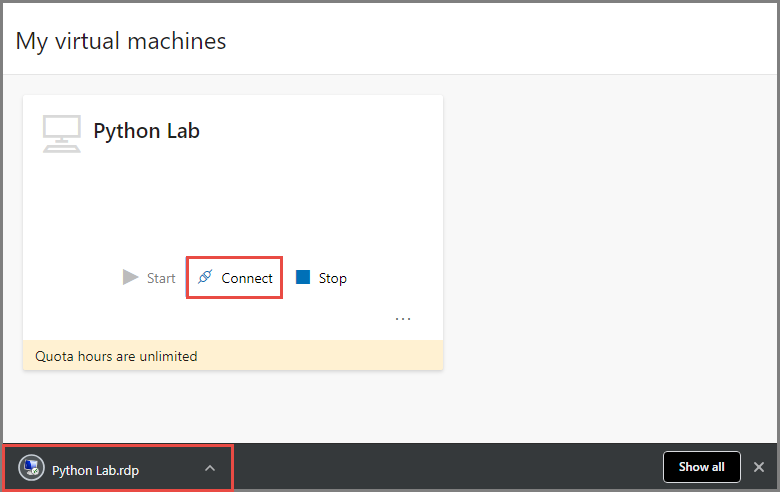
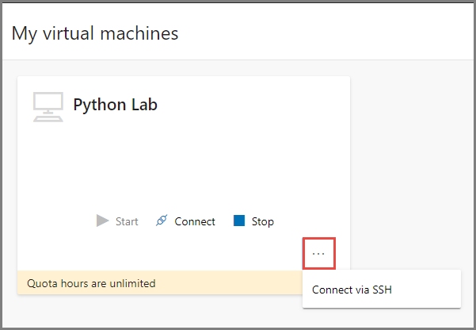

# Enable and use remote desktop for Linux virtual machines in a lab in Azure Lab Services
This article shows you how to do the following tasks:

- Enable remote desktop for Linux VM
- How teacher can connect to the template VM via Remote Desktop Connection (RDP).
- How students connect to the student VM via RDP

## Enable remote desktop for Linux VM
During lab creation, teachers can enable **remote desktop connection** for **Linux** images. The **Enable Remote Desktop Connection** option is shown when a Linux image is selected for the template. When this option is enabled, teachers can connect to template VM and student VMs via RDP (Remote Desktop). 

> [!IMPORTANT] 
> Enabling **remote desktop connection** only opens the **RDP** port on Linux machines. You, as a teacher, connect to the Linux machine using SSH for the first time, and install RDP and GUI packages so that you can connect to the Linux machine using RDP later. Then, you **publish** the image so that students can RDP in to the student Linux VMs. 

## Supported operating systems
Currently, the remote desktop connection is supported for the following operating systems:

- openSUSE Leap 42.3
- CentOS-based 7.5
- Debian 9 "Stretch"
- Ubuntu Server 16.04 LTS

## Teachers connecting to the template VM using RDP
Teachers must connect to the template VM using SSH first, and install RDP and GUI packages on it. Then, the teachers can use the following steps to connect to the Linux VMs using RDP: 

You see the **Remote Desktop** option to connect to the template VM at the time of creating the lab. 

You see the **Remote Desktop** option on the lab's home page after the lab is created and the template VM is started. Start the template VM if it's not started already. 

 

When you select the **RDP** option, it downloads an RDP file. You open it to connect to the Linux machine. 

## Teachers connecting to a student VM using RDP
A lab owner (teacher/professor) can connect to a student VM by switching to the **Virtual Machines** view, and selecting the **connect** icon. Before that, teachers must **publish** the template image with RDP and GUI packages installed on it. 

## Students connecting to the student VM
Student can RDP in to their Linux VMs after the lab owner (teacher/professor) **publishes** the template VM with RDP and GUI packages installed on the machine. Here are the steps: 

1. When a student signs in to the Labs portal directly (`http://labs.azure.com`) or by using a registration link (`http://labs.azure.com/register/<registrationCode>`), a tile for each lab the student has access to is displayed. 
2. On the tile, select **Start** if the VM is stopped. 
3. Select **Connect**. This action downloads the RDP file on to your machine. Save it and open to connect to the Linux machine via RDP. 

    

    You can still connect to the Linux VM by using SSH. Select **... (ellipsis)** to see the SSH option. 
    
    

    Copy and save the SSH connection string on the **Connect to your virtual machine** dialog box. Use this connection string from an SSH terminal (like [Putty](https://www.putty.org/)) to connect to the virtual machine. 

## Next steps
See the following articles:

- [As an admin, create and manage lab accounts](how-to-manage-lab-accounts.md)
- [As a lab owner, create and manage labs](how-to-manage-classroom-labs.md)
- [As a lab owner, set up and publish templates](how-to-create-manage-template.md)
- [As a lab user, access classroom labs](how-to-use-classroom-lab.md)

