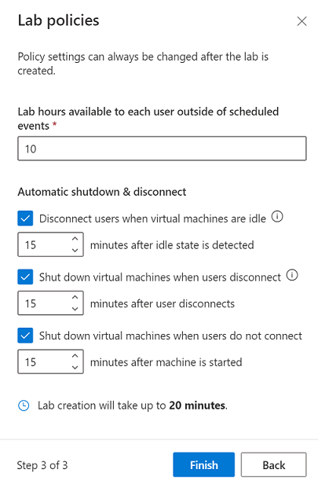
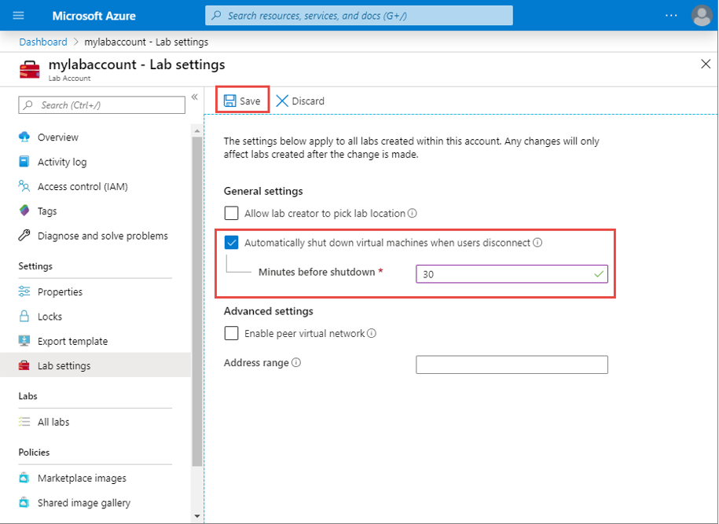

# Enable automatic shutdown of VMs on disconnect
This article shows you how you can enable or disable automatic shutdown of **Windows 10** lab VMs (template or student) after a remote desktop connection is disconnected. You can also specify how long the VMs should wait for the user to reconnect before automatically shutting down.

A lab account administrator can configure this setting for the lab account in which you create labs. For more information, see [Configure automatic shutdown of VMs on disconnect for a lab account](how-to-configure-lab-accounts.md). As a lab owner, you can override the setting when creating a lab or after the lab is created. 

## Configure when creating a lab
On the step 3 page of lab creation wizard, you can enable or disable this feature and also specify how long the VM should wait for the user to reconnect before automatically shutting down. 

## Configure after the lab is created
You can configure this setting on the **Settings** page as shown in the following image: 

> [!WARNING]
> If you shutdown the Windows operating system (OS) on a VM before disconnecting an RDP session to the VM, the autoshutdown feature will not work properly.  

## Next steps
See the following articles:

- [Dashboard for classroom labs](use-dashboard.md)