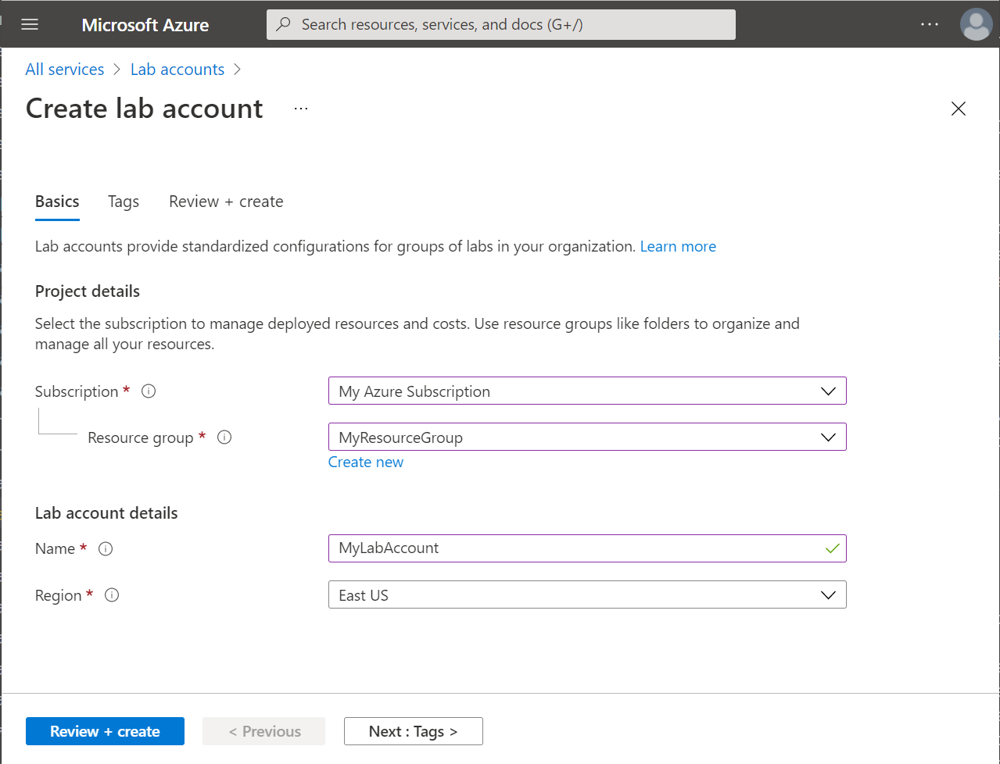
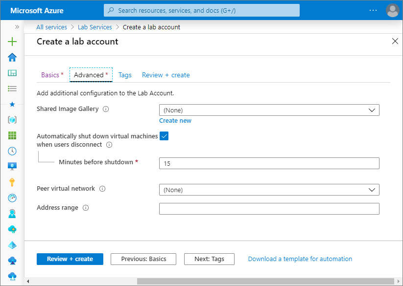
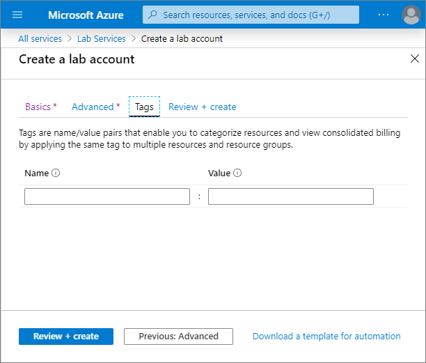
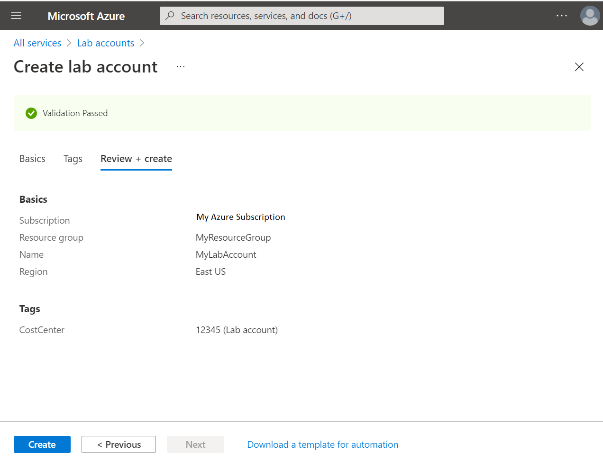
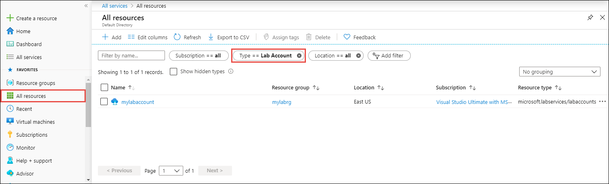
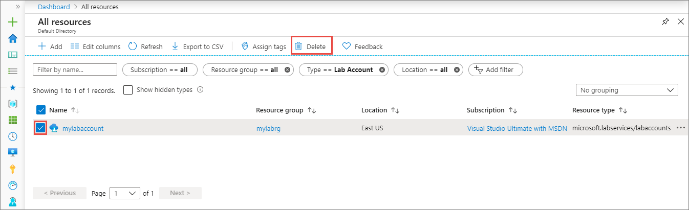

# Create and manage lab accounts
In Azure Lab Services, a lab account is a container for managed lab types such as classroom labs. An administrator sets up a lab account with Azure Lab Services and provides access to lab owners who can create labs in the account. This article describes how to create a lab account, view all lab accounts, or delete a lab account.

## Create a lab account
The following steps illustrate how to use the Azure portal to create a lab account with Azure Lab Services. 

1. Sign in to the [Azure portal](https://portal.azure.com).
2. Select **All Services** on the left menu. Select **Lab Accounts** in the **DevOps** section. If you select star (`*`) next to **Lab Accounts**, it's added to the **FAVORITES** section on the left menu. From the next time onwards, you select **Lab Accounts** under **FAVORITES**.

    
3. On the **Lab Accounts** page, select **Add** on the toolbar or **Create lab account** on the page. 

    
4. On the **Basics** tab of the **Create a lab account** page, do the following actions: 
    1. For **Lab account name**, enter a name. 
    2. Select the **Azure subscription** in which you want to create the lab account.
    3. For **Resource group**, select **Create new**, and enter a name for the resource group.
    4. For **Location**, select a location/region in which you want the lab account to be created.
    5. For the **Allow lab creator to pick lab location** field, specify whether you want lab creators to be able to select a location for the lab. By default, the option is disabled. When it's disabled, lab creators can't specify a location for the lab they are creating. The labs are created in the closest geographical location to lab account. When it's enabled, a lab creator can select a location at the time of creating a lab. For more information, see [Allow lab creator to pick location for the lab](allow-lab-creator-pick-lab-location.md). 

        
5. Select **Next: Advanced** at the bottom of the page to navigate to the **Advanced** tab, and then do the following steps: 
    1. Select an existing **shared image gallery** or create one. You can save the template VM in the shared image gallery for it to be reused by others. For detailed information on shared image galleries, see [Use a shared image gallery in Azure Lab Services](how-to-use-shared-image-gallery.md).
    2. Specify whether you want to **automatically shut down Windows virtual machines** when users disconnect from them. Specify how long the virtual machines should wait for the user to reconnect before automatically shutting down. 
    3. For **Peer virtual network**, select a peer virtual network (VNet) for the lab network. Labs created in this account are connected to the selected VNet and have access to the resources in the selected VNet. For more information, see [Connect your lab's virtual network with a peer virtual network](how-to-connect-peer-virtual-network.md).    
    8. Specify an **address range** for VMs in the lab. The address range should be in the classless inter-domain routing (CIDR) notation (example: 10.20.0.0/23). Virtual machines in the lab will be created in this address range. For more information, see [Specify an address range for VMs in the lab](how-to-connect-peer-virtual-network.md#specify-an-address-range-for-vms-in-the-lab-account)  

        > [!NOTE]
        > The **address range** property applies only if a **peer virtual network** is enabled for the lab.

          
6. Select **Next: Tags** at the bottom of the page to switch to the **Tags** tab. Add any tags you want to associate with the lab account. Tags are name/value pairs that enable you to categorize resources and view consolidated billing by applying the same tag to multiple resources and resource groups. For more information, see [Use tags to organize your Azure resources](../../azure-resource-manager/management/tag-resources.md).

    
7. Select **Review + create** at the bottom of this page to switch to the **Review + create** tab. 
4. Review the summary information on this page, and select **Create**. 

    
5. Wait until the deployment is complete, expand **Next steps**, and select **Go to resource** as shown in the following image: 

    You can also select the **bell icon** on the toolbar (**Notifications**), confirm that the deployment succeeded, and then select **Go to resource**. 

    Alternatively, select **Refresh** on the **Lab Accounts** page, and select the lab account you created. 

        
6. You see the following **lab account** page:

    

## View lab accounts
1. Sign in to the [Azure portal](https://portal.azure.com).
2. Select **All resources** from the menu. 
3. Select **Lab Accounts** for the **type**. 
    You can also filter by subscription, resource group, locations, and tags. 

    

## Delete a lab account
Follow instructions from the previous section that displays lab accounts in a list. Use the following instructions to delete a lab account: 

1. Select the **lab account** that you want to delete. 
2. Select **Delete** from the toolbar. 

    
1. Type **Yes** for confirmation.
1. Select **Delete**. 

    

> [!NOTE]
> You can also use the Az.LabServices PowerShell module (preview) to manage lab accounts. For more information, see the [Az.LabServices home page on GitHub](https://github.com/Azure/azure-devtestlab/tree/master/samples/ClassroomLabs/Modules/Library).

## Next steps
See other articles in the **How-to guides** -> **Create and configure lab accounts (lab account owner)** section of the table-of-content (TOC). 