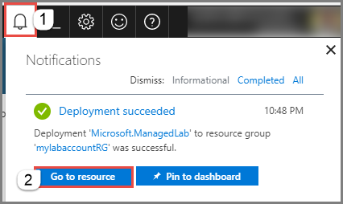
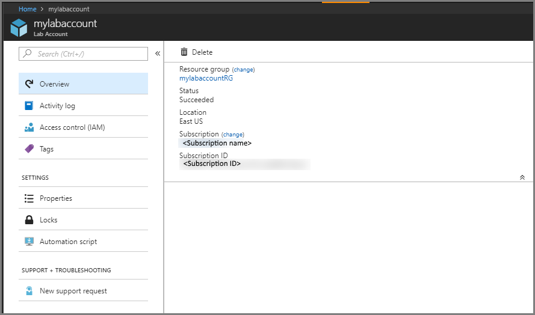
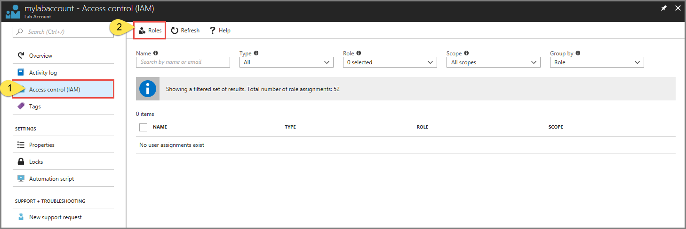
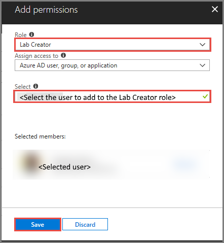

# Manage lab accounts in Azure Lab Services 
In Azure Lab Services, a lab account is a container for managed labs such as classroom labs. An administrator sets up a lab account with Azure Lab Services and provides access to lab owners who can create labs in the account. This article describes how to create a lab account, view all lab accounts, or delete a lab account.

## Create a lab account
1. Sign in to the [Azure portal](https://portal.azure.com).
2. From the main menu on the left side, select **Create a resource**.
3. Search for **Lab Services** in the Azure Marketplace, and select **Lab Services** in the drop-down list. 
4. Select **Lab Services (Preview)** in the filtered list of services. 
5. In the **Create a lab account** window, select **Create**.
7. In the **Lab account** window, do the following actions: 
    1. For **Lab account name**, enter a name. 
    2. Select the **Azure subscription** in which you want to create the lab account.
    3. For **Resource group**, select **Create new**, and enter a name for the resource group.
    4. For **Location**, select a location/region in which you want the lab account to be created. 
    5. Select **Create**. 

        
5. If you don't see the page for the lab account, select the **notifications** button, and then click **Go to resource** button in the notifications. 

        
6. You see the following **lab account** page:

    

## Add a user to the Lab Creator role
To set up a classroom lab in a lab account, the user must be a member of the **Lab Creator** role in the lab account. The account you used to create the lab account is automatically added to this role. If you are planning to use the same user account to create a classroom lab, you can skip this step. To use another user account to create a classroom lab, do the following steps: 

1. On the **Lab Account** page, select **Access control (IAM)**, and click **+ Add** on the toolbar. 

    
2. On the **Add permissions** page, select **Lab Creator** for **Role**, select the user you want to add to the Lab Creators role, and select **Save**. 

    

## Specify Marketplace images available to lab owners
As a lab account owner, you can specify the Marketplace images that lab creators can use to create labs in the lab account. 

1. Select **Marketplace images** on the menu to the left. By default, you see the full list of images (both enabled and disabled). You can filter the list to see only enabled/disabled images by selecting the **Enabled only**/**Disabled only** option from the drop-down list at the top. 
    
    

    The Marketplace images that are displayed in the list are only the ones that satisfy the following conditions:
        
    - Creates a single VM.
    - Uses Azure Resource Manager to provision VMs
    - Doesn't require purchasing an extra licensing plan
2. To **disable** a Marketplace image that has been enabled, do one of the following actions: 
    1. Select **... (ellipsis)** in the last column, and select **Disable image**. 

         
    2. Select one or more images from the list by selecting the checkboxes before the image names in the list, and select **Disable selected images**. 

         
1. Similarly, to **enable** a Marketplace image, do one of the following actions: 
    1. Select **... (ellipsis)** in the last column, and select **Enable image**. 
    2. Select one or more images from the list by selecting the checkboxes before the image names in the list, and select **Enable selected images**. 

## View lab accounts
1. Sign in to the [Azure portal](https://portal.azure.com).
2. Select **All resources** from the menu. 
3. Select **Lab Services** for the **type**. 
    You can also filter by subscription, resource group, locations, and tags. 

## Delete a lab account
Follow instructions from the previous section that displays lab accounts in a list. Use the following instructions to delete a lab account: 

1. Select the **lab account** that you want to delete. 
2. Select **Delete** from the toolbar. 
3. Type **Yes** for confirmation.
4. Select **Delete**. 

## Next steps
Get started with setting up a lab using Azure Lab Services:

- [Set up a classroom lab](tutorial-setup-classroom-lab.md)
- [Set up a lab](../tutorial-create-custom-lab.md)
