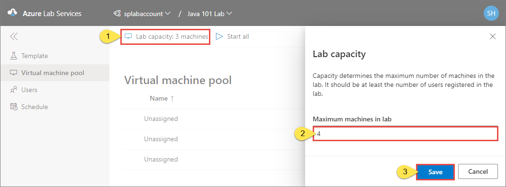
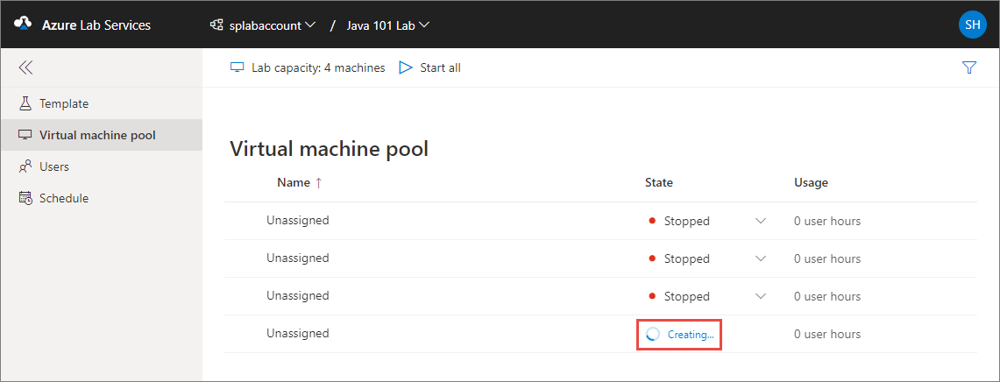
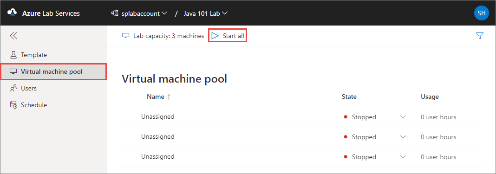
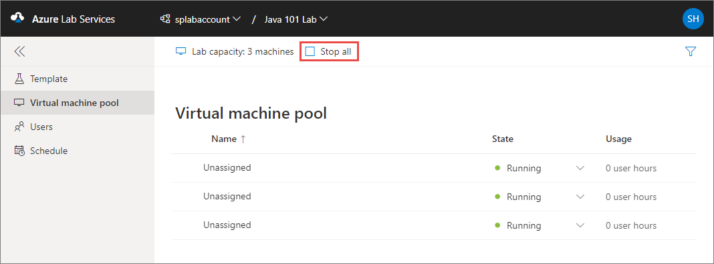
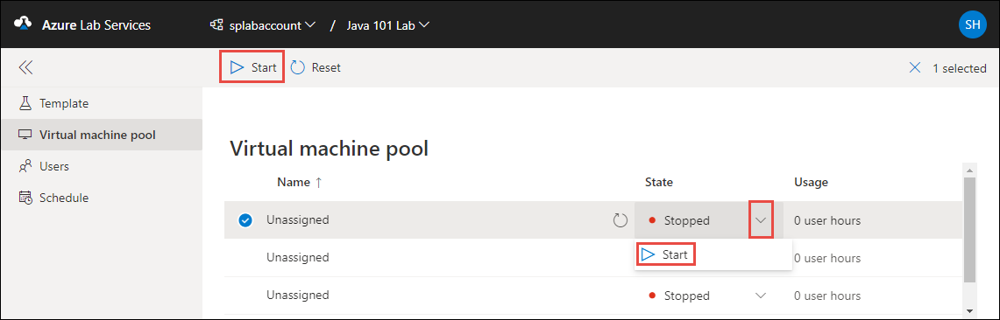
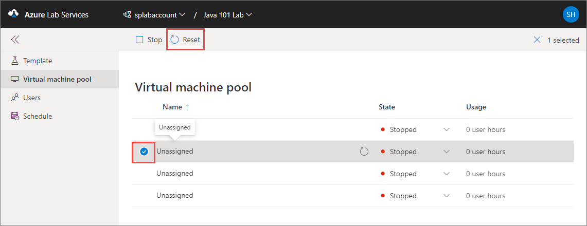
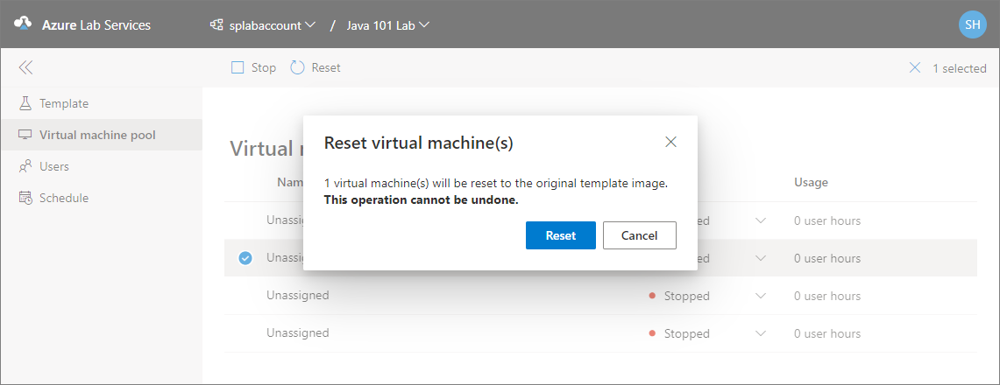
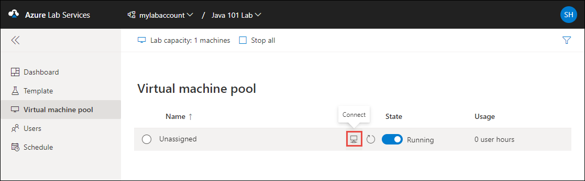
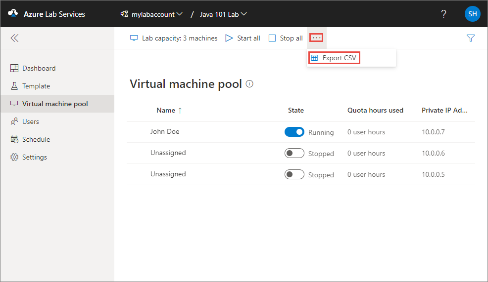

# Set up and manage virtual machine pool 
This article shows you how to do the following tasks:

- Increase the number of virtual machines (VMs) in the lab
- Start all VMs or selected VMs 
- Reset VMs

## Update the lab capacity
To increase or decrease the lab capacity (number of virtual machines in a lab), do the following steps:

1. On the **Virtual machine pool** page, select **Lab capacity: &lt;number&gt; machines**.
2. Enter the new **number of VMs** you want in the lab. This number must be greater than or equal to the number of users registered in the lab. 
3. Then, select **Save**. 

    
4. If you increased the capacity, you can see the VM or VMs being created. If you don't see the new VM in the list, refresh the page. 

    

## Start VMs

### Start ot stop all VMs
1. Switch to the **Virtual machine pool** page. 
2. Select **Start all** from the toolbar. 

    
3. After all the VMs are started, you can stop all VMs by selecting the **Stop all** button on the toolbar. 

    

### Start selected VMs
There are two ways to start selected VMs (one or more). First way is to select the VM or VMs in the list, and then select **Start** on the toolbar. 

The second way is to select one or more VMs in the list, and toggle the button in the **State** column. 

Similarly, you can stop one or more VMs by toggling the button in the **State** column or selecting **Stop** on the toolbar. 

> [!NOTE]
> When an educator turns on a student VM, quota for the student isn't affected. Quota for a user specifies the number of lab hours available to the user outside of the scheduled class time. For more information on quotas, see [Set quotas for users](how-to-configure-student-usage.md?#set-quotas-for-users).

## Reset VMs
To reset one or more VMs, select them in the list, and then select **Reset** on the toolbar. 

On the **Reset virtual machine(s)** dialog box, select **Reset**. 

## Set password for VMs
A lab owner (educator) can set/reset the password for VMs at the time of creating the lab (lab creation wizard) or after creating the lab on the **Template** page. 

### Set password at the time of lab creation
A lab owner (educator) can set a password for VMs in the lab on the **Virtual machine credentials** page of the lab creation wizard.

By enabling/disabling the **Use same password for all virtual machines** option on this page, an educator can choose to use same password for all VMs in the lab or allow students to set passwords for their VMs. By default, this setting is enabled for all Windows and Linux operating system images except Ubuntu. When this setting is disabled, students will be prompted to set a password when they try to connect to the VM for the first time. 

### Reset password later

1. On the **Template** page of the lab, select **Reset password** on the toolbar. 
1. On the **Reset password** dialog box, enter a password, and select **Reset password**.
    
    

## Connect to student VMs
The lab creator (educator) can connect to a student VM if the following conditions are met: 

- The **Use same password for all virtual machines** option was selected when creating the lab
- The VM is running 

 To connect to the student VM, hover the mouse on the VM in the list and select the computer button.  

> [!NOTE]
> When the educator starts the VM and connects to it, the student quota is unaffected. 

## Export list of virtual machines to a CSV file

1. Switch to the **Virtual machine pool** tab.
2. Select **...** (ellipsis) on the toolbar and then select **Export CSV**. 

    

## Next steps
To learn about other student usage options you (as a lab owner) can configure, see the following article: [Configure student usage](how-to-configure-student-usage.md).

To learn about how students can reset passwords for their VMs, see [Set or reset password for virtual machines in classroom labs (students)](how-to-set-virtual-machine-passwords-student.md).