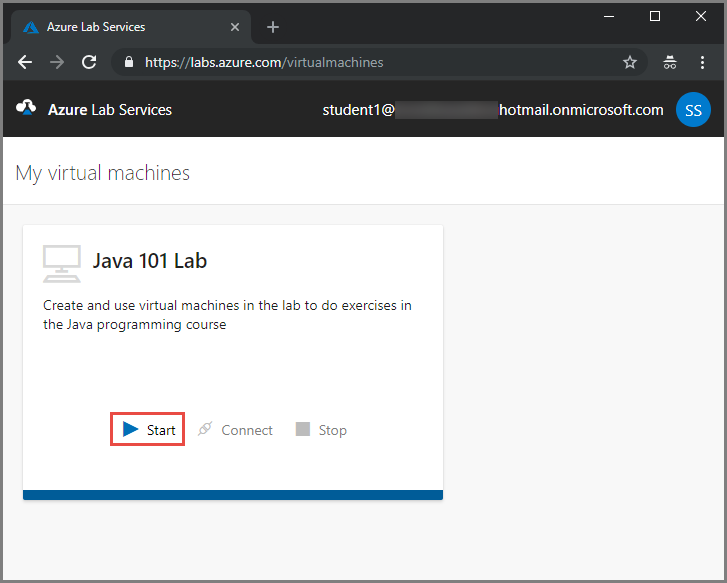
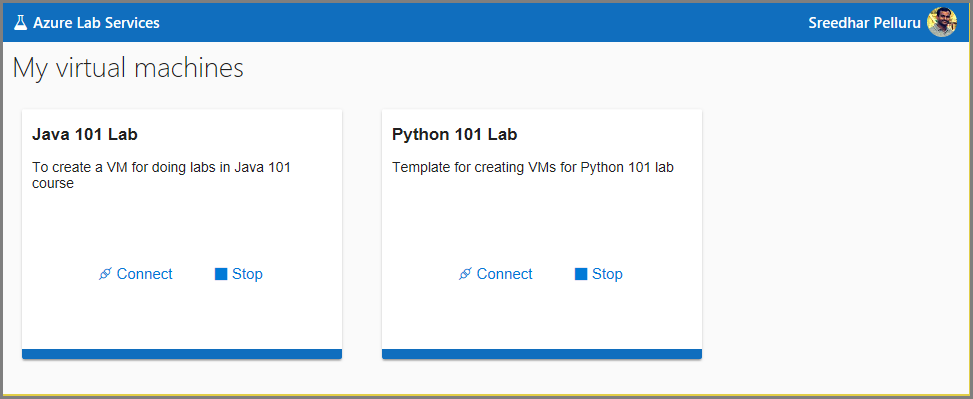

# How to access a classroom lab in Azure Lab Services
This article describes how to access a classroom lab, connect to the VM in the lab, and stop the VM. 

## Register to a lab
1. Navigate to the **registration URL** that you received from the professor/educator. 
2. Sign in to the service using your school account to complete the registration. 
3. Once registered, confirm that you see the virtual machine for the lab you have access to. 
2. Wait until the virtual machine is ready, and then **start** the VM. This process takes some time.  

    

## View all the classroom labs
After you register to the labs, you can view all the classroom labs by taking the following steps: 

1. Navigate to [https://labs.azure.com](https://labs.azure.com). Note that Internet Explorer 11 is not supported yet. 
2. Sign in to the service by using the user account that you used to register to the lab. 
3. Confirm that you see all the labs you have access to. 

    

## Connect to the virtual machine in a classroom lab

1. Start the VM if it's not already started, select **Start** on the tile. 
2. Select **Connect** on the tile that represents the virtual machine of the lab that you want to access. 
3. Do one of the following steps: 
   1. For **Windows** virtual machines, save the **RDP** file to the hard disk. Open the RDP file to connect to the virtual machine. Use the **user name** and **password** you get from your educator/professor to log in to the machine. 
   3. For **Linux** virtual machines, copy and save the SSH connection string on the **Connect to your virtual machine** dialog box. Use this connection string from an SSH terminal (like [Putty](https://www.putty.org/)) to connect to the virtual machine.

## Stop the virtual machine in a classroom lab

To stop your VM, select **Stop** on the tile. When the VM is stopped, the **Start** button on the tile is enabled. 

## Next steps
See the following articles:

- [As an admin, create and manage lab accounts](how-to-manage-lab-accounts.md)
- [As a lab owner, create and manage labs](how-to-manage-classroom-labs.md)
- [As a lab owner, set up and publish templates](how-to-create-manage-template.md)
- [As a lab owner, configure and control usage of a lab](how-to-configure-student-usage.md)
 