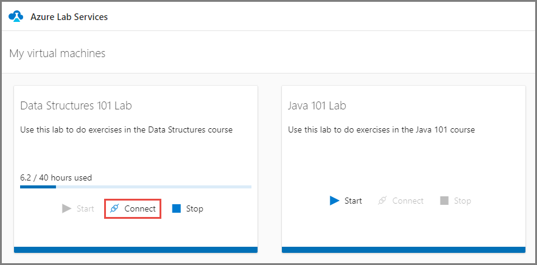
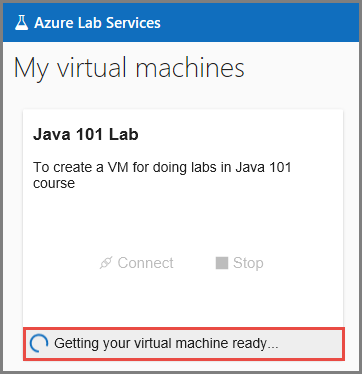
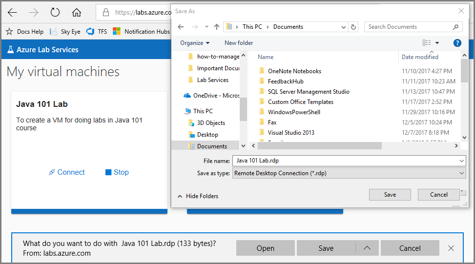

# How to access a classroom lab in Azure Lab Services
This article describes how to access a classroom lab, connect to the VM in the lab, and stop the VM. 

## View all the classroom labs

1. Navigate to the **registration URL** that you received from the professor/educator. 
2. Sign in to the service using your school account to complete the registration. 
3. Once registered, confirm that you see the virtual machines for the labs you have access to. 

    

## Connect to the virtual machine in a classroom lab

1. Select **Connect** on the tile that represents the virtual machine of the lab that you want to access.

    
2. It takes a few minutes for the virtual machine to be ready.

    
3. Save the RDP file to the hard disk and open it. 
    
    
4. Use the **user name** and **password** you get from your educator/professor for logging in to the machine. 

## Stop the virtual machine in a classroom lab

Select **Stop** on the tile that represents the classroom lab. When the VM is stopped, the **Start** button on the tile is enabled. 

## Next steps
Get started with setting up a lab using Azure Lab Services:

- [Set up a classroom lab](how-to-manage-classroom-labs.md)
- [Set up a lab](../tutorial-create-custom-lab.md)

 