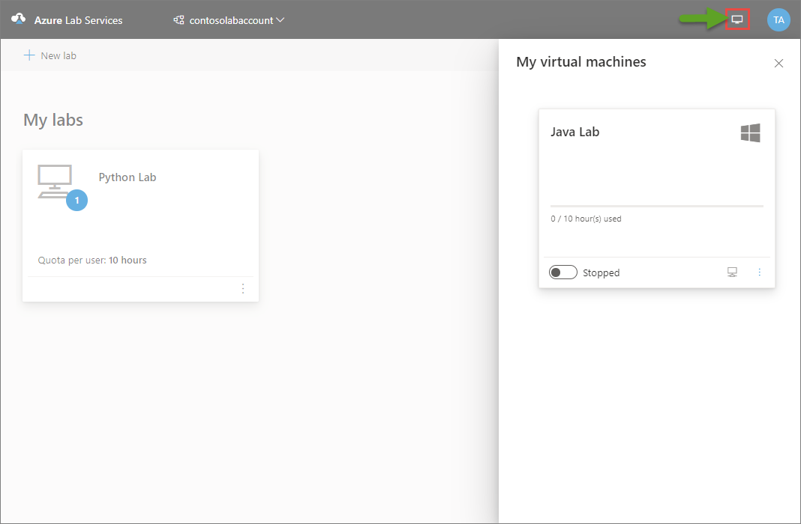

# Access virtual machines as a student from the educator view
This article shows how educators can access their VMs for classes that they attend as students. 

Here is a scenario where this feature will help. A teaching assistant is an educator for one class but a student in other classes. And, the teaching assistant wants to view and access the student VMs from the educator view that shows the labs they own. 

## Access VMs from educator view

1. Sign in to the [Azure Lab Services website](https://labs.azure.com). You see the labs that you own. These labs may be labs you created yourself or the labs that admin assigned to you as owner. For more information, see [How to add additional owners to an existing lab](how-to-add-user-lab-owner.md)
2. To access VMs for classes that you attend as a student, select the computer icon in the top-right corner. Confirm that you see VMs you can access as a student. In the following example, the user is a teaching assistant for the Python lab, but a student of the Java lab. So, the user sees the VM from the Java lab in the drop-down list. The user can start the VM and connect to it. 
    
    

## Next steps
See the following articles:

- [Connect to a VM](how-to-use-classroom-lab.md#connect-to-the-vm)
- [Connect to a VM using RDP on a Mac](connect-virtual-machine-mac-remote-desktop.md)
- [Connect to a VM using RDP on a Chromebook](connect-virtual-machine-chromebook-remote-desktop.md)
- [Use remote desktop for Linux virtual machines](how-to-use-remote-desktop-linux-student.md)
