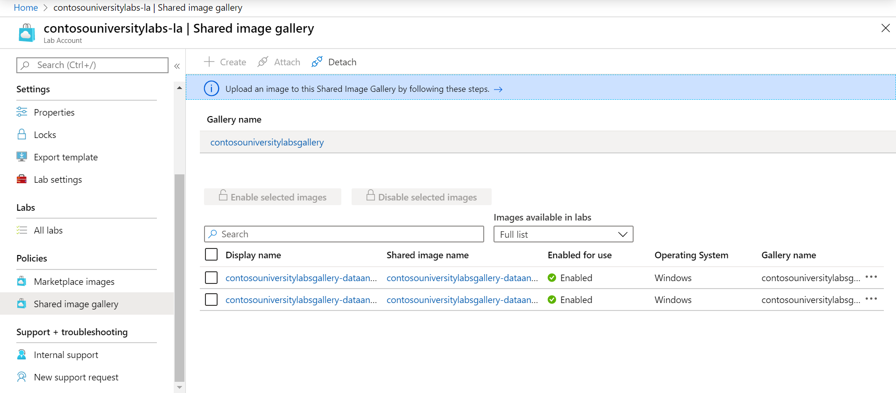

# Lab Account Setup Guide

The first step that needs to be completed by administrators is to set up a lab account within your Azure subscription.  A lab account is a container for your classroom labs and only takes a few minutes to set up.

## Understand Your School's Lab Account Requirements

To understand how to configure your lab account based on your school's needs, you should consider the following questions:

1. **Do I have access to an Azure subscription?**

   To create a lab account, you will need access to an Azure subscription that is configured for your school; your school may have one or more subscriptions.  A subscription is used to manage billing and security for all your Azure resources\services that are used within it, including Lab Accounts.  If you don't have a subscription, you should contact your account specialist to help with setting this up.

1. **How many lab accounts need to be created?**

   To get started quickly, a reasonable approach is to create a single lab account and then later create additional Lab Accounts as needed.  For example, you may eventually evolve to having one lab account per department.

1. **Who should be owners and contributors of the lab account?**

   Your administrators are typically the owners\contributors for a lab account since they are responsible for managing the policies that apply to all the labs contained within the lab account.  The person that creates the lab account is automatically an owner.  You can add additional owners\contributors (typically from the AAD tenant associated with your subscription) to help manage a lab account by assigning either the Owner\Contributor role at the lab account level.

1. **Who will be allowed to create\manage labs?**

   You may choose to have your administrators and\or faculty members create and manage labs; these users (typically from the AAD tenant associated with your subscription) are assigned to the Lab Creator role within the lab account.

1. **Do you want to give lab creators the ability to save images that can be shared across labs?**

    A Shared Image Gallery is a repository that you can use for saving and sharing images.  The benefit of this is that if you have several classes that need the same images, lab creators can create the image once and share it across labs.  However, to get started, it's perfectly reasonable to start without a Shared Image Gallery; and, you can always choose to add one later.

    If you answered 'Yes' to this question, then you will need to create and\or attach a Shared Image Gallery to your lab account.  If you answered, 'I don't know', then you can postpone this decision until later.

    When you have a Shared Image Gallery attached to your lab account

1. **Which images in the Azure Marketplace will your classroom labs use?**

    The Azure Marketplace provides hundreds of images that you can enable so that lab creators can use the image for creating their lab.  Some images may include everything that a lab already needs.  In other cases, you may use an image as a starting point and then the lab creator may customize it by installing additional applications, tools, etc.

    If you don't know which images you will need to use, you can always come back to this later to enable them.  Also, the best way to see which images are available is to first create a lab account – this will give you access so that you can review the list of available images and their contents.  More information is provided below.
  
1. **Do the lab's virtual machines (VMs) need to have access to other Azure or on-prem resources?**

    When you setup a lab account, you also have the option to peer with a virtual network (VNet).  To decide whether you need to peer with a VNet, consider the following questions:
    - **Do you need to provide access to a licensing server?**
  
        > [!NOTE]
        > If you plan to use Azure Marketplace images, the cost of the OS license is bundled into the pricing for Lab Services, so you do *not* need to provide licenses for the OS itself.  However, for additional software\applications that are installed, you will need to provide a license as appropriate.

    - **Do the lab VMs need access to other on-prem resources, such as a file share, database, etc.?**

        > [!NOTE]
        >  A VNet needs to be created to provide access to on-prem resources, typically using a site-to-site Virtual Network Gateway.  If you don't have a VNet configured, additional time will need to be invested for this.  More information on how to set this up is provided below.

    - **Do the lab VMs need access to other Azure resources that are located within a VNet?**

        > [!NOTE]
        >  If you need access to Azure resources that are *not* secured within a VNet, then you can access these resources via the public internet without doing any peering.

    If you answered 'Yes' to one or more questions, then you will need to peer the lab account to a VNet.  If you answered, 'I don't know', then you can postpone this decision until later since you can always choose to peer a VNet after creating the lab account.

## Set Up Your Lab Account

Once you understand the requirements for your lab account, you are ready to set it up.  Follow the links in this section to see how to set up your lab account:

1. **Create your lab account**

   Refer to the how-to guide on [creating a lab account](https://docs.microsoft.com/azure/lab-services/classroom-labs/how-to-manage-lab-accounts#create-a-lab-account) for instructions.

   When creating a lab account, you may find it helpful to familiarize yourself with the Azure resources involved; refer to the following list for more information and guidance on creating these resources:

   - [Subscription](administrator-guide.md:subscription)
   - [Resource Group](administrator-guide.md:resource-group)
   - [Lab Account](administrator-guide.md:lab-account)
   - [Classroom Lab](administrator-guide.md:classroom-lab)
   - [Selecting a Region\Location](administrator-guide.md:regions-or-locations)
   - [Naming Guidance for Resources](administrator-guide.md:naming)

2. **Add users to the Lab Creator role**

   Refer to the how-to guide on [adding users to the Lab Creator role](https://docs.microsoft.com/azure/lab-services/classroom-labs/add-lab-creator) for instructions.

   Also, for more information on the different roles that can be assigned to suers that will manage lab lab accounts and labs, see the [guide on managing identity](https://docs.microsoft.com/azure/lab-services/classroom-labs/administrator-guide#manage-identity).

3. **Connect to a peer VNet**

   Refer to the how-to guide on [connecting your lab's network with a peer VNet](https://docs.microsoft.com/azure/lab-services/classroom-labs/how-to-connect-peer-virtual-network) for instructions.

   You may also need to refer to instructions on [configuring the lab VMs address range](https://docs.microsoft.com/azure/lab-services/classroom-labs/how-to-configure-lab-accounts#specify-an-address-range-for-vms-in-the-lab).

4. **Enable\Review images**

    Refer to the how-to guide on [enabling Marketplace images for lab creators](https://docs.microsoft.com/azure/lab-services/classroom-labs/specify-marketplace-images) for instructions.

    To review contents of each Marketplace image, click on the image name.  For example, refer to the following screenshot which shows the details for the Ubuntu Data Science VM image:

    

    If you have a Shared Image Gallery attached to your lab account and you want to enable custom images to be shared by lab creators, you will need to complete similar steps as shown in the following screenshot:

    
