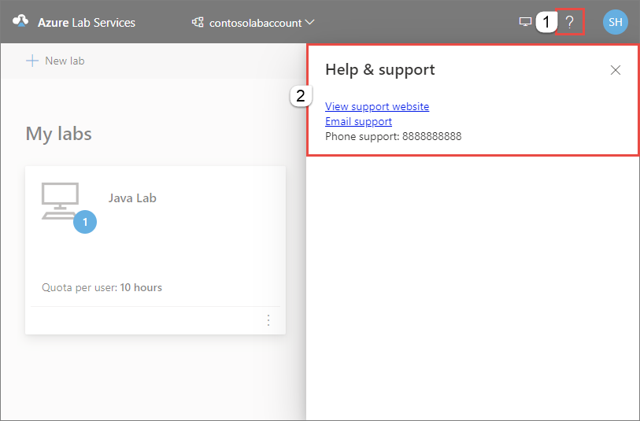

# View support information (lab creator in Azure Lab Services)
This article explains how you (as a lab creator) can view the following support information:

- URL
- Email
- Phone
- Additional instructions

You can use this information to get help when you run into any technical issues while creating a lab in a lab account.

 
## View support information
1. Sign in to [Azure Lab Services portal](https://labs.azure.com).
2. Select question mark (**?**) at the top-right corner of the page. 
3. Confirm that you see links to the **view support website**, **email support**, and **support phone number**.

    

## Next steps
See the following article to learn about how a lab user views the support contact information:

- [View contact information (lab user)](lab-user-support-information.md)
- [Specify contact information (lab account owner)](lab-account-owner-support-information.md)
