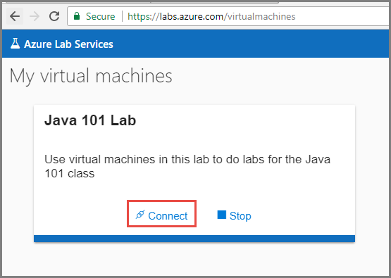

# Tutorial: Access a classroom lab in Azure Lab Services
In this tutorial, you, as a student, connect to a virtual machine (VM) in a classroom lab. 

In this tutorial, you do the following actions:

> [!div class="checklist"]
> * Use registration link 
> * Connect to the virtual machine

## Use the registration link

1. Navigate to the registration URL that you received from the professor/educator. 

    
2. Sign in to the service using your school account to complete the registration. 
3. Once registered, confirm that you see the virtual machines for the labs you have access to. 

## Connect to the virtual machine

2. Select **Connect** on the tile that represents the virtual machine of the lab that you want to access. 
3. Save the RDP file to the hard disk and open it. 
4. Use the **user name** and **password** you get from your educator/professor for logging in to the machine. 

## Next steps
In this tutorial, you accessed a classroom lab using the registration link you get from your educator/professor. 