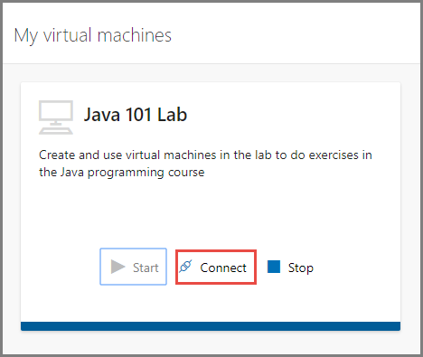

# Tutorial: Access a classroom lab in Azure Lab Services
In this tutorial, you, as a student, connect to a virtual machine (VM) in a classroom lab. 

In this tutorial, you do the following actions:

> [!div class="checklist"]
> * Use registration link 
> * Connect to the virtual machine

## Use the registration link

1. Navigate to the **registration URL** that you received from the professor/educator. You don't need to use the registration URL after you complete the registration. Instead, use the URL: [https://labs.azure.com](https://labs.azure.com). Note that Internet Explorer 11 is not supported yet. 
1. Sign in to the service using your school account to complete the registration. 
2. Once registered, confirm that you see the virtual machine for the lab you have access to. 
3. Wait until the virtual machine is ready, and then **start** the VM. This process takes some time.  

    

## Connect to the virtual machine

1. Select **Connect** on the tile for the virtual machine of the lab that you want to access. 

    
2. Do one of the following steps: 
    1. For **Windows** virtual machines, save the **RDP** file to the hard disk. Open the RDP file to connect to the virtual machine. Use the **user name** and **password** you get from your educator/professor to sign in to the machine. 
    3. For **Linux** virtual machines, you can use **SSH** or **RDP** (if it's enabled) to connect to them. For more information, see [Enable remote desktop connection for Linux machines](how-to-enable-remote-desktop-linux.md). 

## Next steps
In this tutorial, you accessed a classroom lab using the registration link you get from your educator/professor.

As a lab owner, you want to view who has registered with your lab and track the usage of VMs. Advance to the next tutorial to learn how to track the usage of the lab:

> [!div class="nextstepaction"]
> [Track usage of a lab](tutorial-track-usage.md) 
