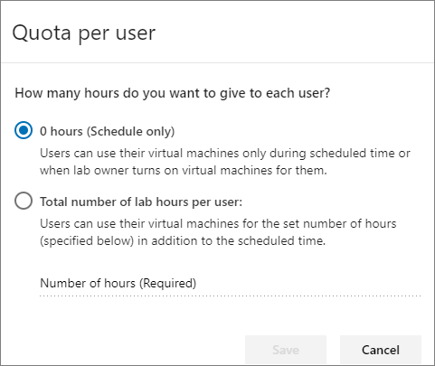
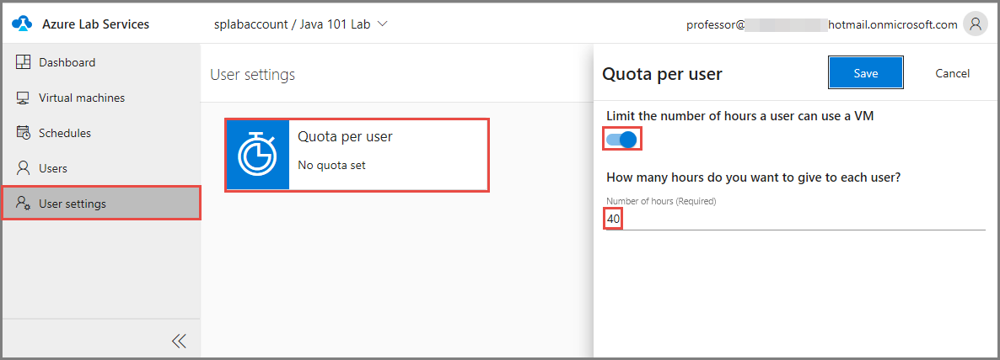
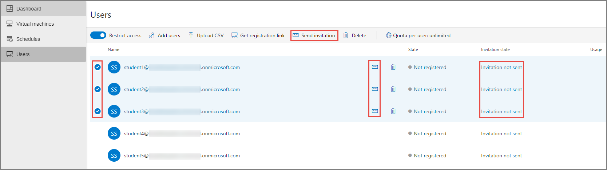
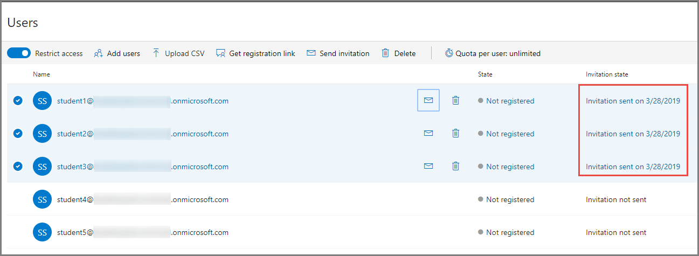

# Tutorial: Set up a classroom lab 
In this tutorial, you set up a classroom lab with virtual machines that are used by students in the classroom.  

In this tutorial, you do the following actions:

> [!div class="checklist"]
> * Create a classroom lab
> * Add users to the lab
> * Send registration link to students

## Prerequisites
To set up a classroom lab in a lab account, you must be a member of one of these roles in the lab account: Owner, Lab Creator, or Contributor. The account you used to create a lab account is automatically added to the owner role.

A lab owner can add other users to the **Lab Creator** role. For example, a lab owner adds professors to the Lab Creator role. Then, the professors create labs with VMs for their classes. Students use the registration link that they receive from professors to register to the lab. Once they are registered, they can use VMs in the labs to do the class work and home work. For detailed steps for adding users to the Lab Creator role, see [Add a user to the Lab Creator role](tutorial-setup-lab-account.md#add-a-user-to-the-lab-creator-role).

## Create a classroom lab

1. Navigate to [Azure Lab Services website](https://labs.azure.com). Note that Internet Explorer 11 is not supported yet. 
2. Select **Sign in** and enter your credentials. Azure Lab Services supports organizational accounts and Microsoft accounts. 
3. In the **New Lab** window, do the following actions: 
    1. Specify a **name** for your lab. 
    2. Specify the maximum **number of virtual machines** in the lab. You can increase or decreate the number of VMs after creating the lab or in an existing lab. For more information, see [Update number of VMs in a lab](how-to-configure-student-usage.md#update-number-of-virtual-machines-in-lab)
    6. Select **Save**.

        
4. On the **Select virtual machine specifications** page, do the following steps:
    1. Select a **size** for virtual machines (VMs) created in the lab. Currently, **small**, **medium**, **medium (virtualization)**, **large**, and **GPU** sizes are allowed.
    3. Select the **VM image** to be used to create VMs in the lab. If you select a Linux image, you see an option to enable remote desktop connection for it. For details, see [Enable remote desktop connection for Linux](how-to-enable-remote-desktop-linux.md).
    4. Select **Next**.

            
5. On the **Set credentials** page, specify default credentials for all VMs in the lab. 
    1. Specify the **name of the user** for all VMs in the lab.
    2. Specify the **password** for the user. 

        > [!IMPORTANT]
        > Make a note of user name and password. They won't be shown again.
    3. Select **Create**. 

        
6. On the **Configure template** page, you see the status of lab creation process. The creation of the template in the lab takes up to 20 minutes. 

    
7. After the configuration of the template is complete, you see the following page: 

    
8. On the **Configure template** page, do the following steps: These steps are **optional** for the tutorial.
    2. Connect to the template VM by selecting **Connect**. If it's a Linux template VM, you choose whether you want to connect using SSH or RDP (if RDP is enabled).
    1. Select **Reset password** to reset the password for the VM. 
    1. Install and configure software on your template VM. 
    1. **Stop** the VM.  
    1. Enter a **description** for the template
9. Select **Next** on the template page. 
10. On **Publish the template** page, do the following actions. 
    1. To publish the template immediately, select **Publish**.  

        > [!WARNING]
        > Once you publish, you can't unpublish. 
    2. To publish later, select **Save for later**. You can publish the template VM after the wizard finishes. For details on how to configure and publish after the wizard finishes, see [Publish the template](how-to-create-manage-template.md#publish-the-template-vm) section in the [How to manage classroom labs](how-to-manage-classroom-labs.md) article.

        
11. You see the **progress of publishing** the template. This process can take up to an hour. 

    
12. You see the following page when the template is published successfully. Select **Done**.

    
1. You see the **dashboard** for the lab. 
    
    
4. Switch to the **Virtual machines** page by selecting Virtual machines on the left menu or by selecting Virtual machines tile. Confirm that you see virtual machines that are in **Unassigned** state. These VMs are not assigned to students yet. They should be in **Stopped** state. You can start a student VM, connect to the VM, stop the VM, and delete the VM on this page. You can start them in this page or let your students start the VMs. 

    

## Add users to the lab

1. Select **Users** on the left menu. By default, the **Restrict access** option is enabled. When this setting is on, a user can't register with the lab even if the user has the registration link unless the user is in the list of users. Only users in the list can register with the lab by using the registration link you send. In this procedure, you add users to the list. Alternatively, you can turn off **Restrict access**, which allows users to register with the lab as long as they have the registration link. 
2. Select **Add users** on the toolbar. 

    
1. On the **Add users** page, enter email addresses of users in separate lines or in a single line separated by semicolons. 

    
4. Select **Save**. You see the email addresses of users and their statuses (registered or not) in the list. 

    

## Set quotas for users
You can set quotas per user by using the following steps: 

1. Select **Users** on the left menu if the page isn't already active. 
2. Select **Quota per user:** on the toolbar. 
3. On the **Quota per user** page, specify the number of hours you want to give to each user (student): 
    1. **0 hours (schedule only)**. Users can use their VMs only during the scheduled time or when you as the lab owner turns on VMs for them.

        
    1. **Total number of lab hours per user**. Users can use their VMs for the set number of hours (specified for this field) **in addition to the scheduled time**. If you select this option, enter the **number of hours** in the text box. 

        
    4. Select **Save**. 
5. You see the changed values on the toolbar now: **Quota per user: &lt;number of hours&gt;**. 

    

## Set a schedule for the lab
If you configured the quota setting to **0 hours (schedule only)**, you must set a schedule for the lab. In this tutorial, you set the schedule to be a recurring weekly schedule.

1. Switch to the **Schedules** page, and select **Add schedule** on the toolbar. 

    
2. On the **Add schedule** page, switch to **Weekly** at the top. 
3. For **Schedule days (required)**, select the days on which you want the schedule to take effect. In the following example, Monday-Friday is selected. 
4. For the **From** field, enter the **schedule start date** or pick a date by selecting the **calendar** button. This field is required. 
5. For **Schedule end date**, enter or select an end date on which the VMs are to be shut down. 
6. For **Start time**, select the time at which you want the VMs to be started. The start time is required if the stop time is not set. Select **Remove start event** if you want to specify only the stop time. if the **Start time** is disabled, select **Add start event** next to the drop-down list to enable it. 
7. For **Stop time**, select the time at which you want the VMs to be shut down. The stop time is required if the start time is not set. Select **Remove stop event** if you want to specify only the start time. if the **Stop time** is disabled, select **Add stop event** next to the drop-down list to enable it.
8. For **Time zone (required)**, select the time zone for the start and stop times you specified.  
9. For **Notes**, enter any description or notes for the schedule. 
10. Select **Save**. 

    

## Send an email with the registration link

1. Switch to the **Users** view if you are not on the page already. 
2. Select specific or all users in the list. To select specific users, select check boxes in the first column of the list. To select all users, select the check box in front of the title of the first column (**Name**) or select all check boxes for all users in the list. You can see the status of the **invitation state** in this list.  In the following image, the invitation state for all students is set to **Invitation not sent**. 

    
1. Select the **email icon (envelope)** in one of the rows (or) select **Send invitation** on the toolbar. You can also hover the mouse over a student name in the list to see the email icon. 

    
4. On the **Send registration link by email** page, follow these steps: 
    1. Type an **optional message** that you want to send to the students. The email automatically includes the registration link. 
    2. On the **Send registration link by email** page, select **Send**. You see the status of invitation changing to **Sending invitation** and then to **Invitation sent**. 
        
        

## Next steps
In this tutorial, you created a classroom lab, and configured the lab. To learn how a student can access a VM in the lab using the registration link, advance to the next tutorial:

> [!div class="nextstepaction"]
> [Connect to a VM in the classroom lab](tutorial-connect-virtual-machine-classroom-lab.md)

