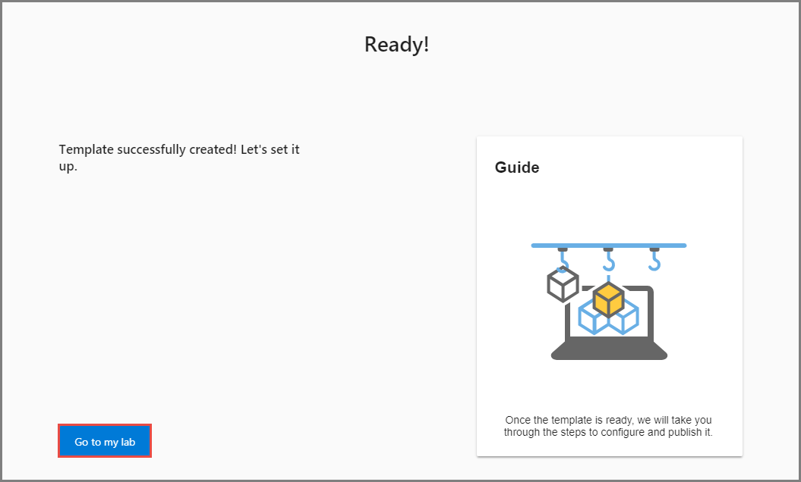
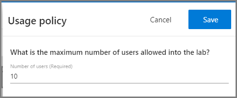
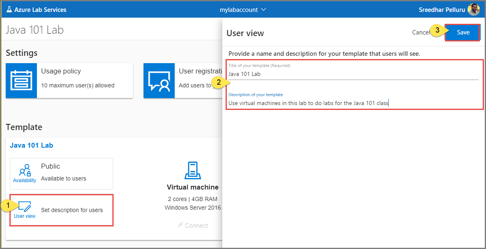

# Tutorial: Set up a classroom lab 
In this tutorial, you set up a classroom lab with virtual machines that are used by students in the classroom.  

In this tutorial, you do the following actions:

> [!div class="checklist"]
> * Create a classroom lab
> * Configure the classroom lab
> * Send registration link to students

## Prerequisites
To set up a classroom lab in a lab account, you must be a member of the **Lab Creator** role in the lab account. The account you used to create a lab account is automatically added to this role. A lab owner can add other users to the Lab Creator role by using steps in the following article: [Add a user to the Lab Creator role](tutorial-setup-lab-account.md#add-a-user-to-the-lab-creator-role).

## Create a classroom lab

1. Navigate to [Azure Lab Services website](https://labs.azure.com). 
2. Select **Sign in** and enter your credentials. Azure Lab Services supports organizational accounts and Microsoft accounts. 
3. In the **New Lab** window, do the following actions: 
    1. Specify a **name** for the classroom lab. 
    2. Select the **size** of the virtual machine that you plan to use in the classroom.
    3. Select the **image** to use to create the virtual machine.
    4. Specify **default credentials** for logging into virtual machines in the lab. 
    7. Select **Save**.

        
1. Once the lab is created, select **Go to my lab**. 

    
1. You see the **dashboard** for the lab. 
    
    

## Configure usage policy

1. Select **Usage policy**. 
2. In the **Usage policy**, settings, enter the **number of users** allowed to use the lab.
3. Select **Save**. 

    

## Set up the template 
A template in a lab is a base virtual machine image from which all users’ virtual machines are created. Set up the template virtual machine so that it is configured with exactly what you want to provide to the lab users. You can provide a name and description of the template that the lab users see. Publish the template to make instances of the template VM available to your lab users. 

### Set title and description
1. In the **Template** section, select **Edit** (pencil icon) for the template. 
2. In the **User view** window, Enter a **title** for the template.
3. Enter **description** for the template.
4. Select **Save**.

    

### Set up the template VM
 You connect to the template VM and install any required software on it before making it available to your students. 

1. Wait until the template virtual machine is ready. Once it is ready, the **Start** button should be enabled. To start the VM, select **Start**.

    
1. To connect to the VM, select **Connect**, and follow instructions. 

    
1. Install any software that's required for students to do the lab (for example, Visual Studio, Azure Storage Explorer, etc.). 
2. Disconnect (close your remote desktop session) from the template VM. 
3. **Stop** the template VM by selecting **Stop**. 

    

### Publish the template 
When you publish a template, Azure Lab Services creates VMs in the lab by using the template. The number of VMs created in this process is same as the maximum number of users allowed into the lab, which you can set in the usage policy of the lab. All virtual machines have the same configuration as the template. 

1. Select **Publish** in the **Template** section. 

    
1. In the **Publish** window, select the **Published** option. 
2. Now, select the **Publish** button. This process may take some time depending on how many VMs are being created, which is same as the number of users allowed into the lab.
    
    > [!IMPORTANT]
    > Once a template is published, it can't be unpublished. 
4. Switch to the **Virtual machines** page, and confirm that you see virtual machines that are in **Unassigned** state. These VMs are not assigned to students yet. 

    
5. Wait until the VMs are created. They should be in **Stopped** state. You can start a student VM, connect to the VM, stop the VM, and delete the VM on this page. You can start them in this page or let your students start the VMs. 

    

## Send registration link to students

1. Switch to the **Dashboard** view. 
2. Select **User registration** tile.

    
1. In the **User registration** dialog box, select the **Copy** button. The link is copied to the clipboard. Paste it in an email editor, and send an email to the student. 

    
2. On the **User registration** dialog box, select **Close**. 

## Next steps
In this tutorial, you created a classroom lab, and configured the lab. To learn how a student can access a VM in the lab using the registration link, advance to the next tutorial:

> [!div class="nextstepaction"]
> [Connect to a VM in the classroom lab](tutorial-connect-virtual-machine-classroom-lab.md)

