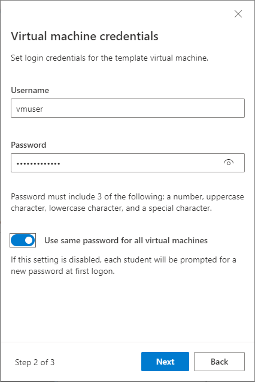
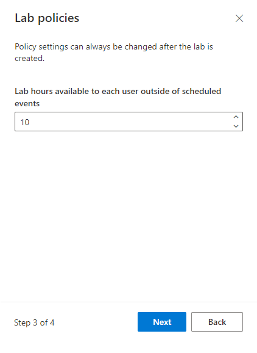
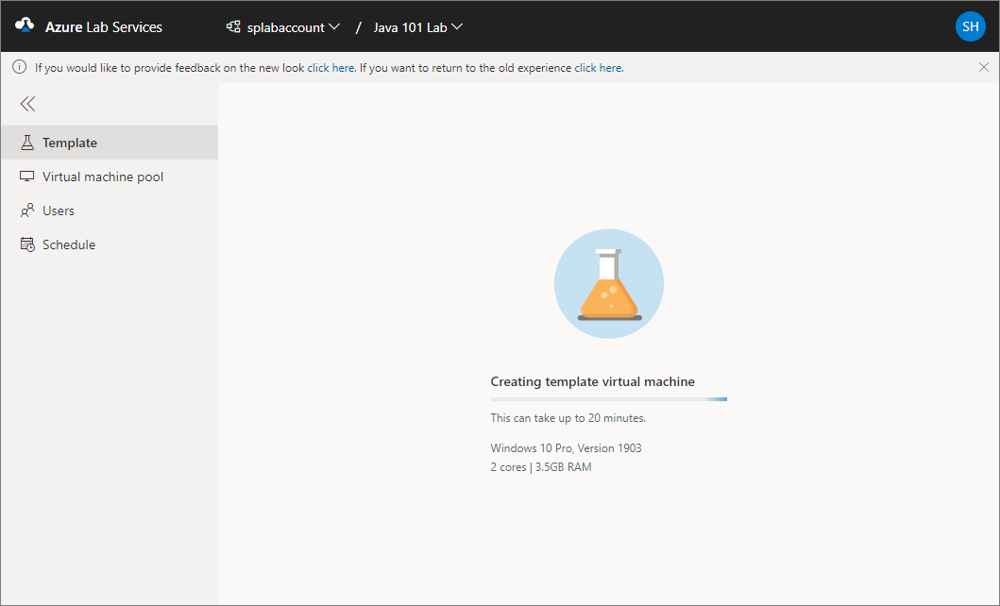
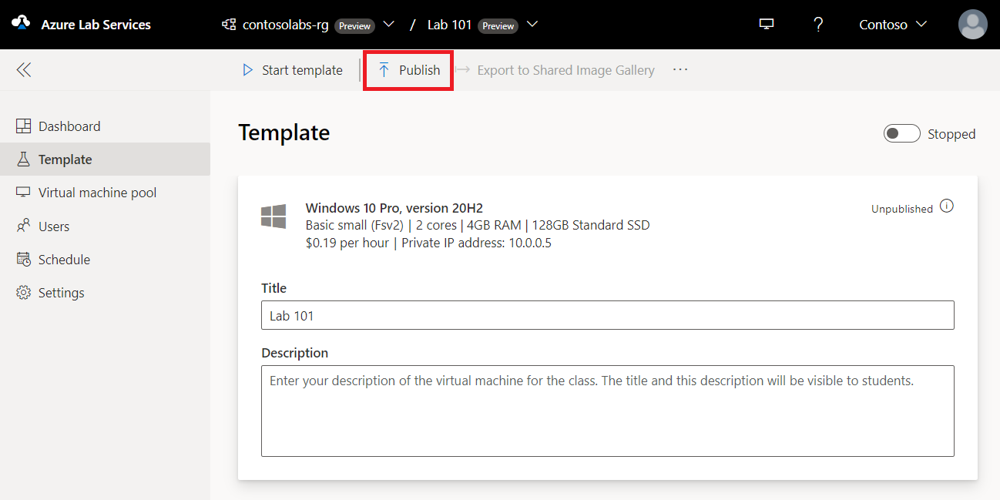
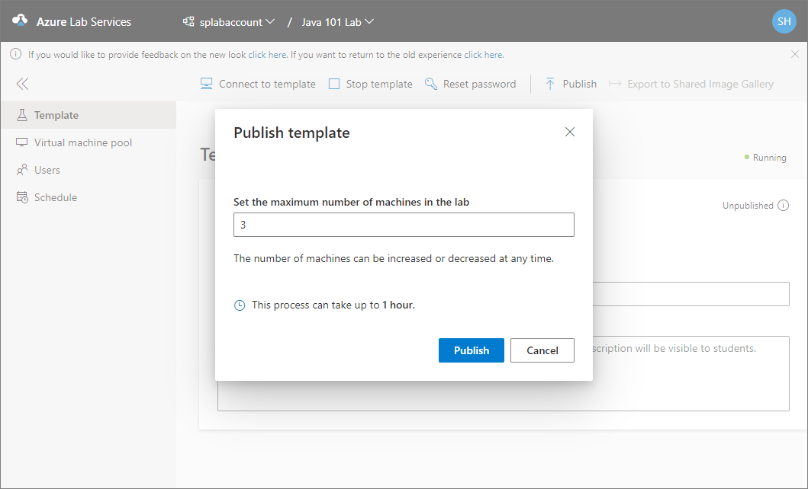
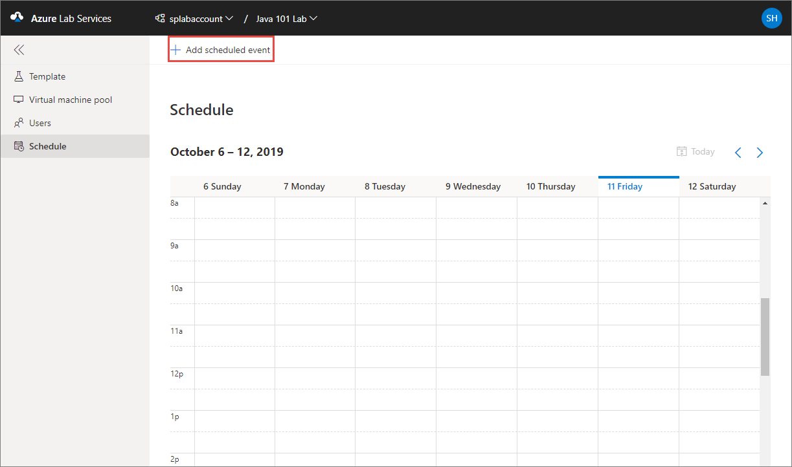
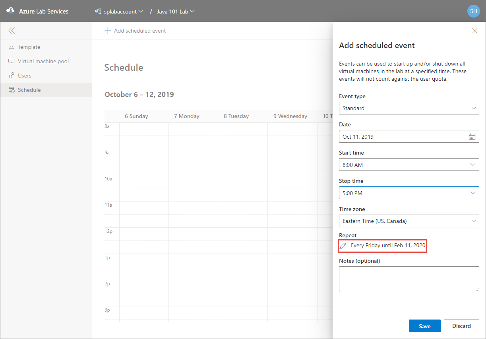
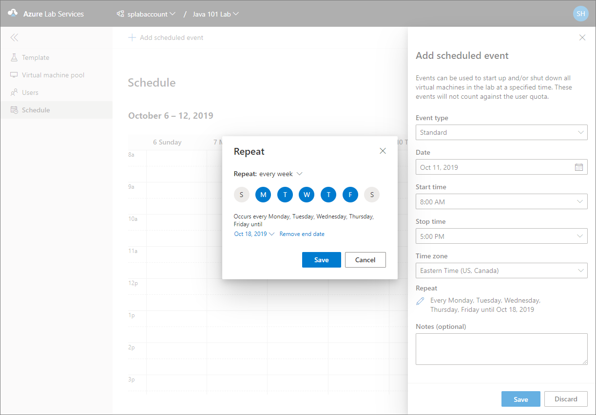
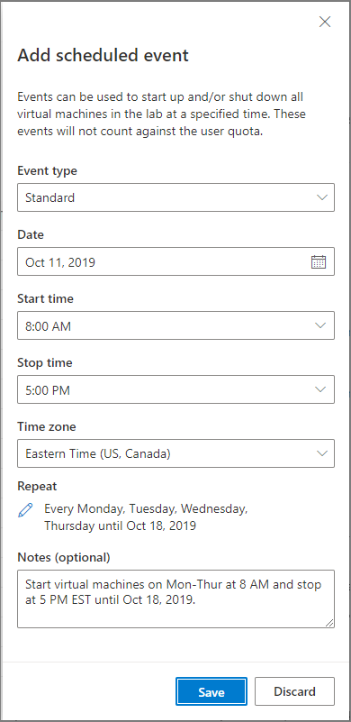
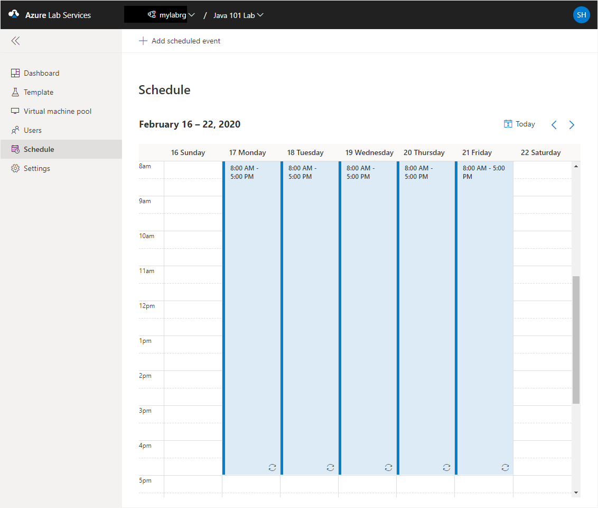

# Tutorial: Set up a classroom lab 
In this tutorial, you set up a classroom lab with virtual machines that are used by students in the classroom.  

In this tutorial, you do the following actions:

> [!div class="checklist"]
> * Create a classroom lab
> * Add users to the lab
> * Set schedule for the lab
> * Send invitation email to students

## Prerequisites
In this tutorial, you set up a lab with virtual machines for your class. To set up a classroom lab in a lab account, you must be a member of one of these roles in the lab account: Owner, Lab Creator, or Contributor. The account you used to create a lab account is automatically added to the owner role. So, you can use the user account that you used to create a lab account to create a classroom lab. 

Here is the typical workflow when using Azure Lab Services:

1. A lab account creator adds other users to the **Lab Creator** role. For example, the lab account creator/admin adds educators to the **Lab Creator** role so that they can create labs for their classes. 
2. Then, the educators create labs with VMs for their classes and send registration links to students in the class. 
3. Students use the registration link that they receive from educators to register to the lab. Once they are registered, they can use VMs in the labs to do the class work and home work. 

## Create a classroom lab
In this step, you create a lab for your class in Azure. 

1. Navigate to [Azure Lab Services website](https://labs.azure.com). Note that Internet Explorer 11 is not supported yet. 
2. Select **Sign in** and enter your credentials. Azure Lab Services supports organizational accounts and Microsoft accounts. 
3. Select **New lab**. 
    
    
4. In the **New Lab** window, do the following actions: 
    1. Specify a **name** for your lab, and select **Next**.  

        
    2. On the **Virtual machine credentials** page, specify default credentials for all VMs in the lab. Specify the **name** and the **password** for the user, and then select **Next**.  

        

        > [!IMPORTANT]
        > Make a note of user name and password. They won't be shown again.
    3. On the **Lab policies** page, select **Finish**. 

        
5. You should see the following screen that shows the status of the template VM creation. This operation takes up to 20 minutes. 

    
8. On the **Template** page, do the following steps: These steps are **optional** for the tutorial.

    1. Connect to the template VM by selecting **Connect**. If it's a Linux template VM, you choose whether you want to connect using SSH or RDP (if RDP is enabled).
    3. Install and configure software required for your class on the template VM. 
    4. **Stop** the template VM.  

    > [!NOTE]
    > Template VMs incur **cost** when running, so ensure that the template VM is shutdown when you don’t need it to be running. 

## Publish the template VM
In this step, you publish the template VM. When you publish the template VM, Azure Lab Services creates VMs in the lab by using the template. All virtual machines have the same configuration as the template.

1. On the **Template** page, select **Publish** on the toolbar. 

    

    > [!WARNING]
    > Once you publish, you can't unpublish. 
2. On the **Publish template** page, enter the number of virtual machines you want to create in the lab, and then select **Publish**. 

    
3. You see the **status of publishing** the template on page. This process can take up to an hour. 

    
4. Wait until the publishing is complete and then switch to the **Virtual machines pool** page by selecting **Virtual machines** on the left menu or by selecting **Virtual machines** tile. Confirm that you see virtual machines that are in **Unassigned** state. These VMs are not assigned to students yet. They should be in **Stopped** state. You can start a student VM, connect to the VM, stop the VM, and delete the VM on this page. You can start them in this page or let your students start the VMs. 

       

    > [!NOTE]
    > When an educator turns on a student VM, quota for the student isn't affected. Quota for a user specifies the number of lab hours available to the user outside of the scheduled class time. For more information on quotas, see [Set quotas for users](how-to-configure-student-usage.md?#set-quotas-for-users).

## Set a schedule for the lab
Create a scheduled event for the lab so that VMs in the lab are automatically started/stopped at specific times. The user quota (default: 10 hours) you specified earlier is the additional time assigned to each user outside this scheduled time. 

1. Switch to the **Schedules** page, and select **Add scheduled event** on the toolbar. 

    
2. On the **Add scheduled event** page, do the following steps:
    1. Confirm that **Standard** is selected the **Event type**.  
    2. Select the **start date** for the class. 
    4. Select the **start time** at which you want the VMs to be started.
    5. Select the **stop time** at which the VMs are to be shut down. 
    6. Select the **time zone** for the start and stop times you specified. 
3. On the same **Add scheduled event** page, select the current schedule in the **Repeat** section.  

    
5. On the **Repeat** dialog box, do the following steps:
    1. Confirm that **every week** is set for the **Repeat** field. 
    2. Select the days on which you want the schedule to take effect. In the following example, Monday-Friday is selected. 
    3. Select an **end date** for the schedule.
    8. Select **Save**. 

        

3. Now, on the **Add scheduled event** page, for **Notes (optional)**, enter any description or notes for the schedule. 
4. On the **Add scheduled event** page, select **Save**. 

    
5. Navigate to the start date in the calendar to verify that the schedule is set.
    
    

    For more information about creating and managing schedules for a class, see [Create and manage schedule for classroom labs](how-to-create-schedules.md).

## Add users to the lab

1. Select **Users** on the left menu. By default, the **Restrict access** option is enabled. When this setting is on, a user can't register with the lab even if the user has the registration link unless the user is in the list of users. Only users in the list can register with the lab by using the registration link you send. In this procedure, you add users to the list. Alternatively, you can turn off **Restrict access**, which allows users to register with the lab as long as they have the registration link. 
2. Select **Add users** on the toolbar, and then select **Add by email address**. 

    
1. On the **Add users** page, enter email addresses of users in separate lines or in a single line separated by semicolons. 

    
4. Select **Save**. You see the email addresses of users and their statuses (registered or not) in the list. 

    

    You will see names of users in the list after they are registered to the lab. 
    

## Send invitation emails to users

1. Switch to the **Users** view if you are not on the page already, and select **Invite all** on the toolbar. 

    
1. On the **Send invitation by email** page, enter an optional message, and then select **Send**. The email automatically includes the registration link. You can get this registration link by selecting **... (ellipsis)** on the toolbar, and **Registration link**. 

    
4. You see the status of **invitation** in the **Users** list. The status should change to **Sending** and then to **Sent on &lt;date&gt;**. 

    For more information about adding students to a class and managing their usage of the lab, see [How to configure student usage](how-to-configure-student-usage.md).

## Next steps
In this tutorial, you created a lab for your class in Azure. To learn how a student can access a VM in the lab using the registration link, advance to the next tutorial:

> [!div class="nextstepaction"]
> [Connect to a VM in the classroom lab](tutorial-connect-virtual-machine-classroom-lab.md)

