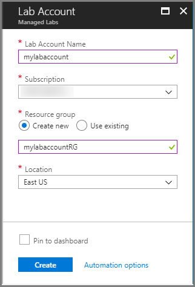

# Tutorial: Set up a lab account with Azure Lab Services
In Azure Lab Services, a lab account serves as the central account in which your organization's labs are managed. In your lab account, give permission to others to create labs, and set policies that apply to all labs under the lab account. In this tutorial, learn how to create a lab account as a lab administrator. 

In this tutorial, you do the following actions:

> [!div class="checklist"]
> * Create a lab account
> * Add a user to the Lab Creator role
> * Specify Marketplace images available for lab owners

If you don't have an Azure subscription, create a [free account](https://azure.microsoft.com/free/) before you begin.

## Create a lab account
The following steps illustrate how to use the Azure portal to create a lab account with Azure Lab Services. 

1. Sign in to the [Azure portal](https://portal.azure.com).
2. Select **All Services** on the left menu. Select **Lab Services** in the **DEVOPS** section. If you select star (`*`) next to **Lab Services**, it's added to the **FAVORITES** section on the left menu. From the next time onwards, you select **Lab Services** under **FAVORITES**.

    
3. On the **Lab Services** page, select **Add** on the toolbar. 

    
4. On the **Lab Account** page, do the following actions: 
    1. For **Lab account name**, enter a name. 
    2. Select the **Azure subscription** in which you want to create the lab account.
    3. For **Resource group**, select **Create new**, and enter a name for the resource group.
    4. For **Location**, select a location/region in which you want the lab account to be created. 
    5. Select an existing **shared image gallery** or create one. You can save the template VM in the shared image gallery for it to be reused by others. For detailed information on shared image galleries, see [Use a shared image gallery in Azure Lab Services](how-to-use-shared-image-gallery.md). 
    6. For **Peer virtual network**, select a peer virtual network (VNet) for the lab network. Labs created in this account are connected to the selected VNet and have access to the resources in the selected VNet. 
    7. Specify an **address range** for VMs in the lab. The address range should be in the classless inter-domain routing (CIDR) notation (example: 10.20.0.0/23). Virtual machines in the lab will be created in this address range. For more information, see [Specify an address range for VMs in the lab](how-to-configure-lab-accounts.md#specify-an-address-range-for-vms-in-the-lab).
    8. For the **Allow lab creator to pick lab location** field, specify whether you want lab creators to be able to select a location for the lab. By default, the option is disabled. When it's disabled, lab creators can't specify a location for the lab they are creating. The labs are created in the closest geographical location to lab account. When it's enabled, a lab creator can select a location at the time of creating a lab. 
    9. Select **Create**. 

        
5. Select the **bell icon** on the toolbar (**Notifications**), confirm that the deployment succeeded, and then select **Go to resource**. 

    Alternatively, select **Refresh** on the **Lab Accounts** page, and select the lab account you created. 

        
6. You see the following **lab account** page:

    

## Add a user to the Lab Creator role
To set up a classroom lab in a lab account, the user must be a member of the **Lab Creator** role in the lab account. The account you used to create the lab account is automatically added to this role. If you are planning to use the same user account to create a classroom lab, you can skip this step. To use another user account to create a classroom lab, do the following steps: 

To provide educators the permission to create labs for their classes, add them to the **Lab Creator** role:

1. On the **Lab Account** page, select **Access control (IAM)**, select **+ Add** on the toolbar, and then select **+ Add role assignment** on the toolbar. 

    
1. On the **Add role assignment** page, select **Lab Creator** for **Role**, select the user you want to add to the Lab Creators role, and select **Save**. 

    

## Specify Marketplace images available to lab creators
As a lab account owner, you can specify the Marketplace images that lab creators can use to create labs in the lab account. 

1. Select **Marketplace images** on the menu to the left. By default, you see the full list of images (both enabled and disabled). You can filter the list to see only enabled/disabled images by selecting the **Enabled only**/**Disabled only** option from the drop-down list at the top. 
    
    

    The Marketplace images that are displayed in the list are only the ones that satisfy the following conditions:
        
    - Creates a single VM.
    - Uses Azure Resource Manager to provision VMs
    - Doesn't require purchasing an extra licensing plan
2. To **disable** a Marketplace image that has been enabled, do one of the following actions: 
    1. Select **... (ellipsis)** in the last column, and select **Disable image**. 

         
    2. Select one or more images from the list by selecting the checkboxes before the image names in the list, and select **Disable selected images**. 

         
1. Similarly, to **enable** a Marketplace image, do one of the following actions: 
    1. Select **... (ellipsis)** in the last column, and select **Enable image**. 
    2. Select one or more images from the list by selecting the checkboxes before the image names in the list, and select **Enable selected images**. 

## Next steps
In this tutorial, you created a lab account. To learn about how to create a classroom lab as a profession, advance to the next tutorial:

> [!div class="nextstepaction"]
> [Set up a classroom lab](tutorial-setup-classroom-lab.md)

