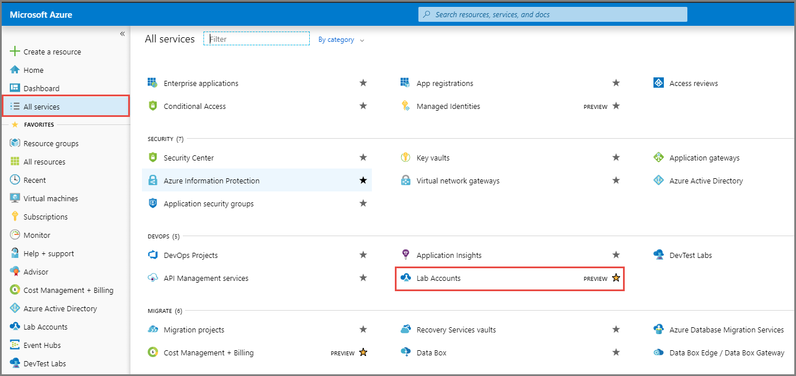
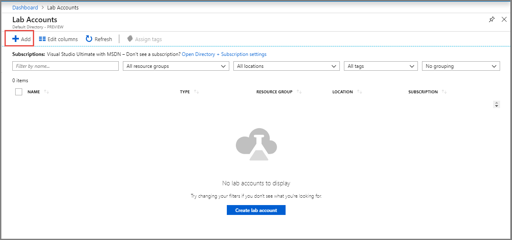
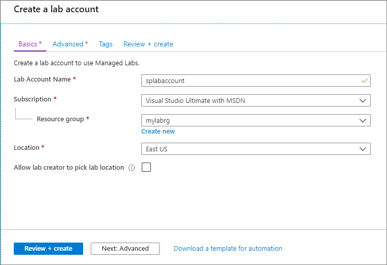
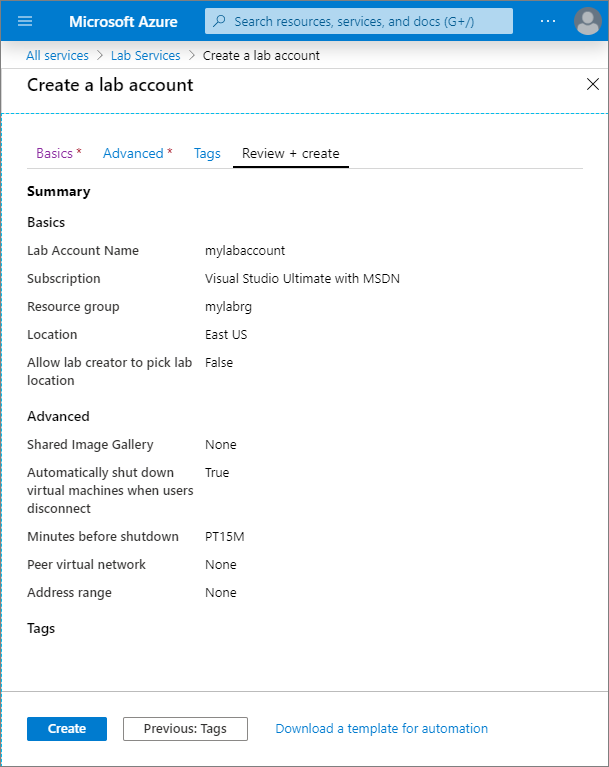
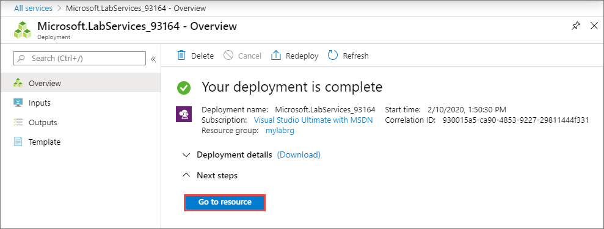
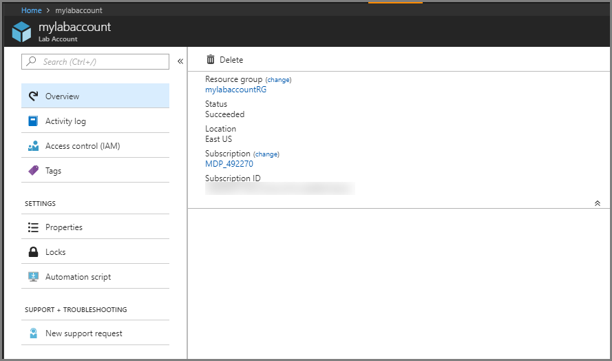

# Tutorial: Set up a lab account with Azure Lab Services
In Azure Lab Services, a lab account serves as the central account in which your organization's labs are managed. In your lab account, give permission to others to create labs, and set policies that apply to all labs under the lab account. In this tutorial, learn how to create a lab account. 

In this tutorial, you do the following actions:

> [!div class="checklist"]
> * Create a lab account
> * Add a user to the Lab Creator role

If you don't have an Azure subscription, create a [free account](https://azure.microsoft.com/free/) before you begin.

## Create a lab account
The following steps illustrate how to use the Azure portal to create a lab account with Azure Lab Services. 

1. Sign in to the [Azure portal](https://portal.azure.com).
2. Select **All Services** on the left menu. Select **DevOps** from **Categories**. Then, select **Lab Services**. If you select star (`*`) next to **Lab Services**, it's added to the **FAVORITES** section on the left menu. From the next time onwards, you select **Lab Services** under **FAVORITES**.

    
3. On the **Lab Services** page, select **Add** on the toolbar or select **Create lab account** button on the page. 

    
4. On the **Basics** tab of the **Create a lab account** page, do the following actions: 
    1. For **Lab account name**, enter a name. 
    2. Select the **Azure subscription** in which you want to create the lab account.
    3. For **Resource group**, select an existing resource group or select **Create new**, and enter a name for the resource group.
    4. For **Location**, select a location/region in which you want to create the lab account. 

        
    5. Select **Review + create**.
    6. Review the summary, and select **Create**. 

            
5. When the deployment is complete, expand **Next steps**, and select **Go to resource**. 

    
6. Confirm that you see the **Lab Account** page. 

    

## Add a user to the Lab Creator role
To set up a classroom lab in a lab account, the user must be a member of the **Lab Creator** role in the lab account. To provide educators the permission to create labs for their classes, add them to the **Lab Creator** role:

> [!NOTE]
> The account you used to create the lab account is automatically added to this role. If you are planning to use the same user account to create a classroom lab in this tutorial, skip this step. 

1. On the **Lab Account** page, select **Access control (IAM)**, select **+ Add** on the toolbar, and then select **+ Add role assignment** on the toolbar. 

    
1. On the **Add role assignment** page, select **Lab Creator** for **Role**, select the user you want to add to the Lab Creators role, and select **Save**. 

    

## Next steps
In this tutorial, you created a lab account. To learn about how to create a classroom lab as an educator, advance to the next tutorial:

> [!div class="nextstepaction"]
> [Set up a classroom lab](tutorial-setup-classroom-lab.md)

