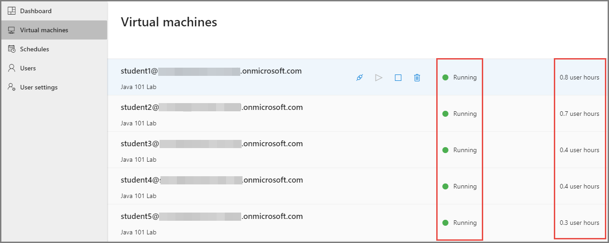
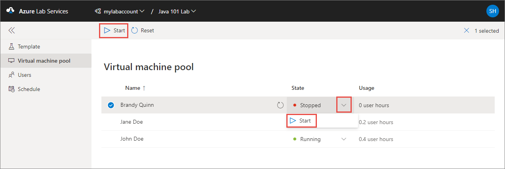

# Tutorial: Track usage of a lab in Azure Lab Service
This tutorial shows you how a lab creator/owner can track usage of a lab.

In this tutorial, you do the following actions:

> [!div class="checklist"]
> * View users registered with your lab
> * View the usage of VMs in the lab
> * Manage student VMs 

## View registered users

1. Navigate to [Azure Lab Services website](https://labs.azure.com). 
2. Select **Sign in** and enter your credentials. Azure Lab Services supports organizational accounts and Microsoft accounts.
3. On the **My labs** page, select the lab for which you want to track the usage. 
4. Select **Users** on the left menu or **Users** tile. You see students who have registered with your lab.  

    

    For more information about adding and managing users for the lab, see [Add and manage lab users](how-to-configure-student-usage.md).

## View the usage of VMs

1. Select **Virtual machines** on menu to the left. 
2. Confirm that you see the status of VMs and the number of hours the VMs have been running. The time that a lab owner spends on a student VM doesn't count against the usage time shown in the last column. 

    

## Manage student VMs 
On this page, you can start, stop, or reset student VMs by using controls in the **State** column or on the toolbar.

For more information about managing virtual machine pool for the lab, see [Set up and manage virtual machine pool](how-to-set-virtual-machine-passwords.md).

> [!NOTE]
> When an educator turns on a student VM, quota for the student isn't affected. Quota for a user specifies the number of lab hours available to the user outside of the scheduled class time. For more information on quotas, see [Set quotas for users](how-to-configure-student-usage.md?#set-quotas-for-users).

## Next steps
To learn more about classroom labs, see articles under [How-to guides](how-to-manage-lab-accounts.md).
