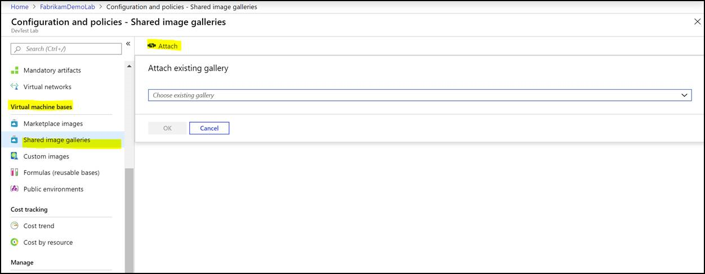
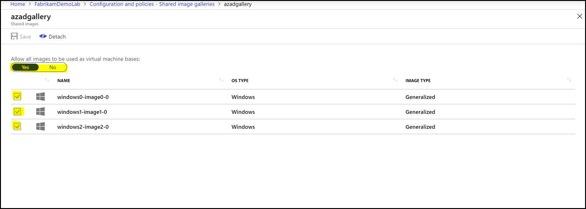

# Configure a shared image gallery in Azure DevTest Labs
DevTest Labs now supports the [Shared Image Gallery](../virtual-machines/windows/shared-image-galleries.md) feature. It enables lab users to access images from a shared location while creating lab resources. It also helps you build structure and organization around your custom-managed VM images. The Shared Image Gallery feature supports:

- Managed global replication of images
- Versioning and grouping of images for easier management
- Make your images highly available with Zone Redundant Storage (ZRS) accounts in regions that support availability zones. ZRS offers better resilience against zonal failures.
- Sharing across subscriptions, and even between tenants, using role-based access control (RBAC).

For more information, see [Shared Image Gallery documentation](../virtual-machines/windows/shared-image-galleries.md). 
 
If you have a large number of managed images that you need to maintain and would like to make them available throughout your company, you can use a shared image gallery as a repository that makes it easy to update and share your images. As a lab owner, you can attach an existing shared image gallery to your lab. Once this gallery is attached, lab users can create machines from these latest images. A key benefit of this feature is that DevTest Labs can now take the advantage of sharing images across labs, across subscriptions, and across regions. 

## Considerations
- You can only attach one shared image gallery to a lab at a time. If you would like to attach another gallery, you will need to detach the existing one and attach another. 
- DevTest Labs currently does not support uploading images to the gallery through the lab. 
- While creating a virtual machine using a shared image gallery image, DevTest Labs always uses the latest published version of this image.
- Although DevTest Labs automatically makes a best attempt to ensure shared image gallery replicates images to the region in which the Lab exists, it’s not always possible. To avoid users having issues creating VMs from these images, ensure the images are already replicated to the lab’s region.”

## Use Azure portal
1. Sign in to the [Azure portal](https://portal.azure.com).
1. Select **All Services** on the left navigational menu.
1. Select **DevTest Labs** from the list.
1. From the list of labs, select your **lab**.
1. Select **Configuration and policies** in the **Settings** section on the left menu.
1. Select **Shared Image Galleries** under **Virtual machine bases** on the left menu.

    
1. Attach an existing shared image gallery to your lab by clicking on the **Attach** button and selecting your gallery in the dropdown.

    
1. Go to the attached gallery and configure your gallery to **enable or disable** shared images for VM creation.

    
1. Lab users can then create a virtual machine using the enabled images by clicking on **+Add** and finding the image in the **choose your base** page.

    
## Use Azure Resource Manager template

### Attach a shared image gallery to your lab
If you're using an Azure Resource Manager template to attach a shared image gallery to your lab, you need to add it under the resources section of your Resource Manager template, as shown in the following example:

```json
"resources": [
{
    "apiVersion": "2018-10-15-preview",
    "type": "Microsoft.DevTestLab/labs",
    "name": "[parameters('newLabName')]",
    "location": "[resourceGroup (). location]",
    "resources": [
    {
        "apiVersion": "2018-10-15-preview",
        "name": "[variables('labVirtualNetworkName')]",
        "type": "virtualNetworks",
        "dependsOn": [
            "[resourceId('Microsoft.DevTestLab/labs', parameters('newLabName'))]"
        ]
    },
    {
        "apiVersion":"2018-10-15-preview",
        "name":"myGallery",
        "type":"sharedGalleries",
        "properties": {
            "galleryId":"[parameters('existingSharedGalleryId')]",
            "allowAllImages": "Enabled"
        },
        "dependsOn":[
            "[resourceId('Microsoft.DevTestLab/labs', parameters('newLabName'))]"
        ]
    }
    ]
} 

```

For a complete Resource Manager template example, see these Resource Manager template samples in our public GitHub repository: [Configure a shared image gallery while creating a lab](https://github.com/Azure/azure-devtestlab/tree/master/samples/DevTestLabs/QuickStartTemplates/101-dtl-create-lab-shared-gallery-configured).

### Create a VM using an image from the shared image gallery
If you're using an Azure Resource Manager template to create a virtual machine using a shared image gallery image, use the following sample:

```json

"resources": [
{
    "apiVersion": "2018-10-15-preview",
    "type": "Microsoft.DevTestLab/labs/virtualMachines",
    "name": "[variables('resourceName')]",
    "location": "[resourceGroup().location]",
    "properties": {
        "sharedImageId": "[parameters('existingSharedImageId')]",
        "size": "[parameters('newVMSize')]",
        "isAuthenticationWithSshKey": false,
        "userName": "[parameters('userName')]",
        "sshKey": "",
        "password": "[parameters('password')]",
        "labVirtualNetworkId": "[variables('labVirtualNetworkId')]",
        "labSubnetName": "[variables('labSubnetName')]"
    }
}
],

```

To learn more, see these Resource Manager template samples on our public GitHub.
[Create a virtual machine using a shared image gallery image](https://github.com/Azure/azure-devtestlab/tree/master/samples/DevTestLabs/QuickStartTemplates/101-dtl-create-vm-username-pwd-sharedimage).

## Use API

- Use API version 2018-10-15-preview.
- To attach your gallery, send the request as shown in the following snippet:
    
    ``` 
    PUT [Lab Resource Id]/SharedGalleries/[newGalleryName]
    Body: 
    {
        “properties”:{
            “galleryId”: “[Shared Image Gallery resource Id]”,
            “allowAllImages”:”Enabled”
        }
    }
    ```
- To view all images in your shared image gallery, you can list all shared images along with their resource IDs by

    ```
    GET [Lab Resource Id]/SharedGalleries/mySharedGallery/SharedImages
    ````
- To create a VM using shared images, you can do a PUT on virtual machines and in virtual machine properties, pass the ID of the shared images you got from the previous call. To the properties.SharedImageId


## Next steps
See the following articles on artifacts:

- [Specify mandatory artifacts for your lab](devtest-lab-mandatory-artifacts.md)
- [Create custom artifacts](devtest-lab-artifact-author.md)
- [Add an artifact repository to a lab](devtest-lab-artifact-author.md)
- [Diagnose artifact failures](devtest-lab-troubleshoot-artifact-failure.md)
