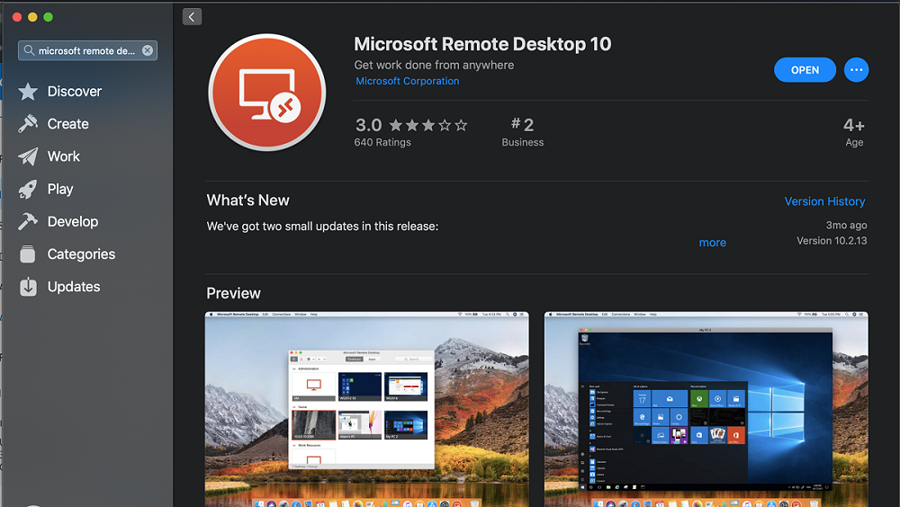
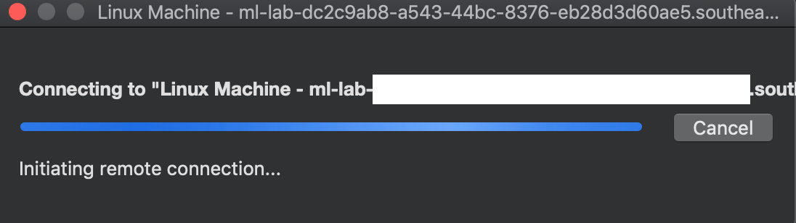
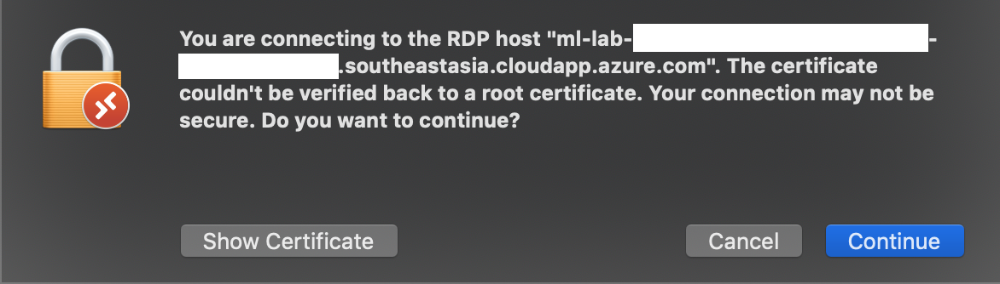
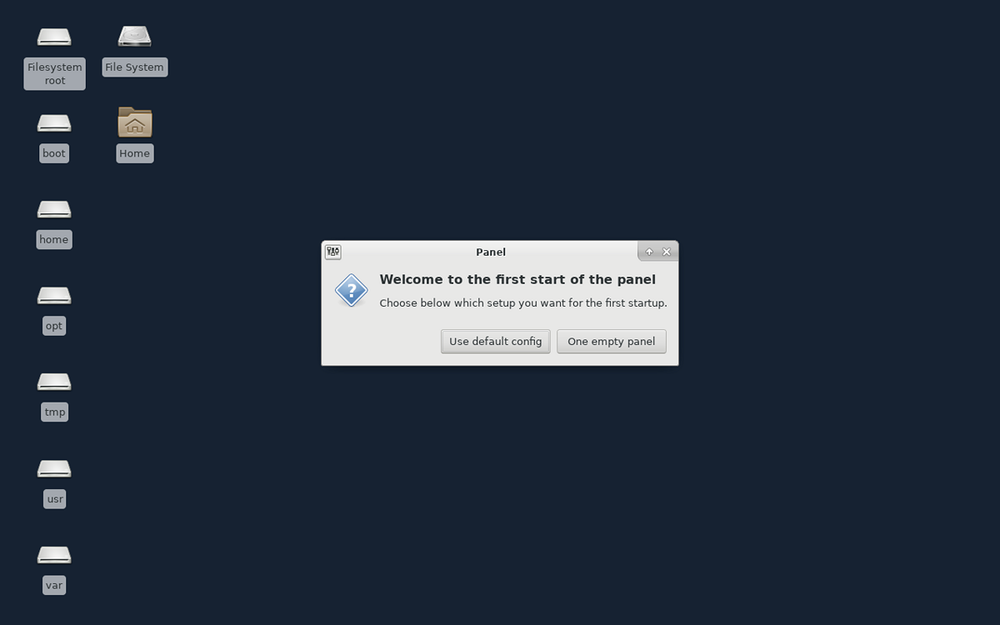

# Connect to a VM using Remote Desktop Protocol on a Mac
This section shows how a student can connect to a classroom lab VM from a Mac by using RDP.

## Install Microsoft Remote Desktop on a Mac
1. Open the App Store on your Mac, and search for **Microsoft Remote Desktop**.

    
1. Install the latest version of Microsoft Remote Desktop. 

## Access the VM from your Mac using RDP
1. Open the **RDP** file that's downloaded on your computer with **Microsoft Remote Desktop** installed. It should start connecting to the VM. 

    
1. Select **Continue** if you receive the following warning. 

    
1. You should see the VM. 

    > [!NOTE]
    > The following example is for a CentOS Linux VM. 

    

## Next steps
To learn how to connect to Linux VMs using RDP, see [Use remote desktop for Linux virtual machines](how-to-use-remote-desktop-linux-student.md)

