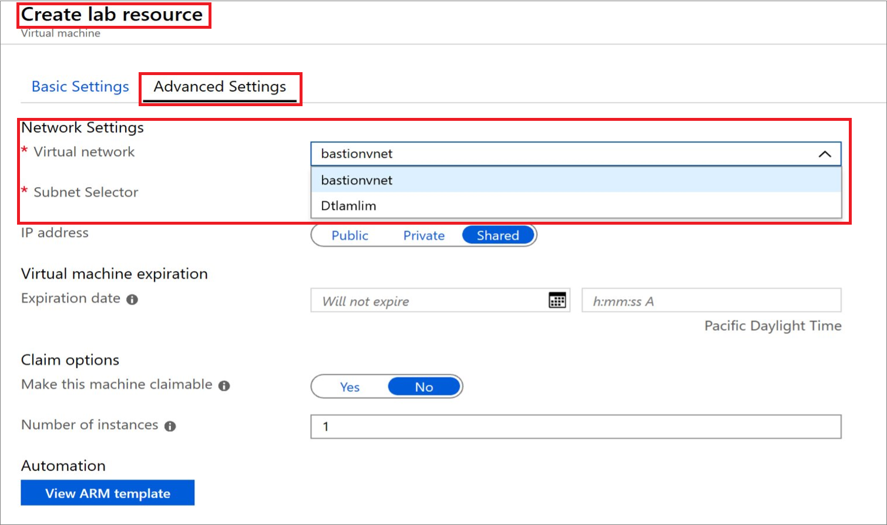
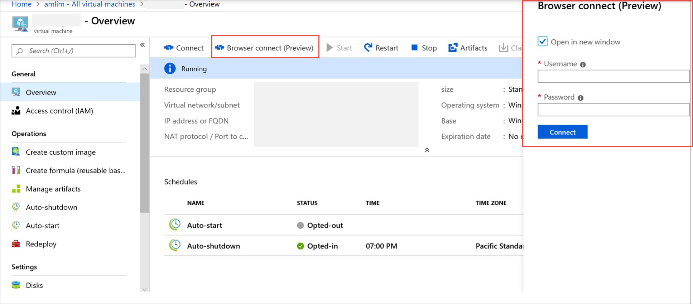

# Connect to your virtual machines through a browser 

DevTest Labs integrates with [Azure Bastion](https://docs.microsoft.com/azure/bastion/), which enables you to connect to your virtual machines through a browser. For information on how to enable this feature in DevTest Labs, see [Enable browser connection on lab virtual machines](enable-browser-connection-lab-virtual-machines.md).

Once the *Browser connect* is enabled, lab users can access virtual machines through a browser.  

## Create a lab virtual machine

You first need to create the lab virtual machine within a virtual network that has Bastion configured on it. Select the second **subnet** you created, not the AzureBastionSubnet. You can select a virtual network during virtual machine creation by going to the **Advanced settings** tab.

## Launch virtual machine in a browser

Once the virtual machine is created, you can launch it in a browser by clicking the *Browser connect* button and entering your username and password for the machine.  

## Next Steps

[Add a VM to a lab in Azure DevTest Labs](devtest-lab-add-vm.md)
