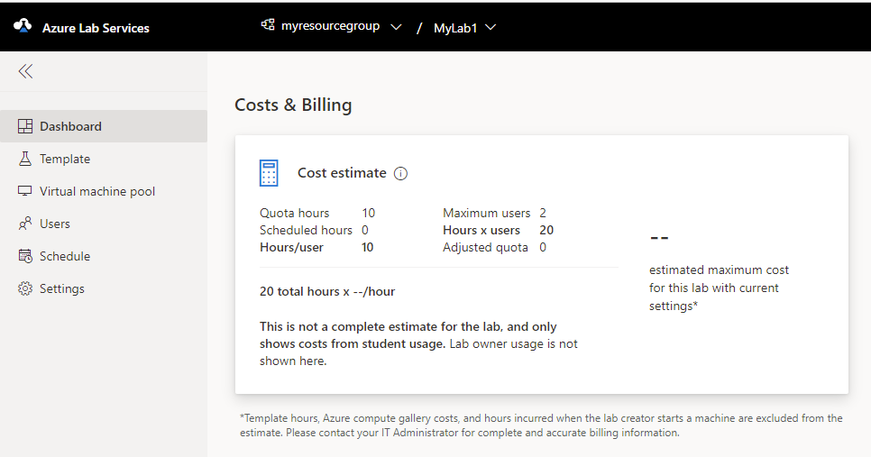
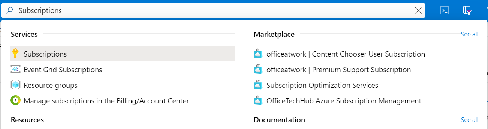
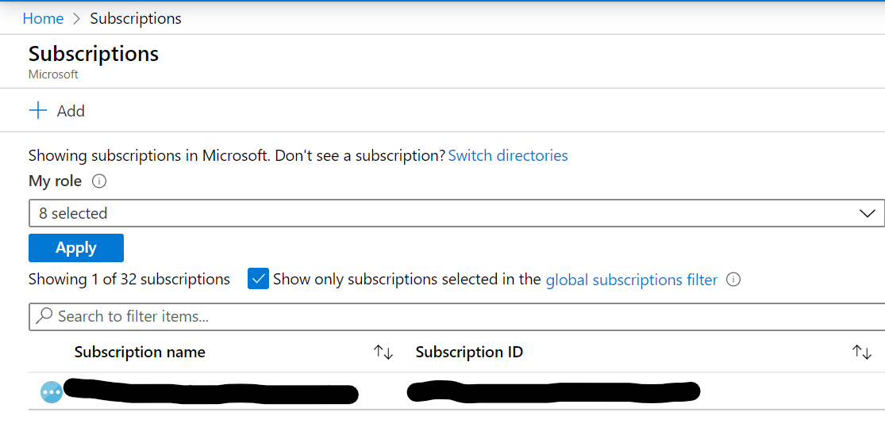
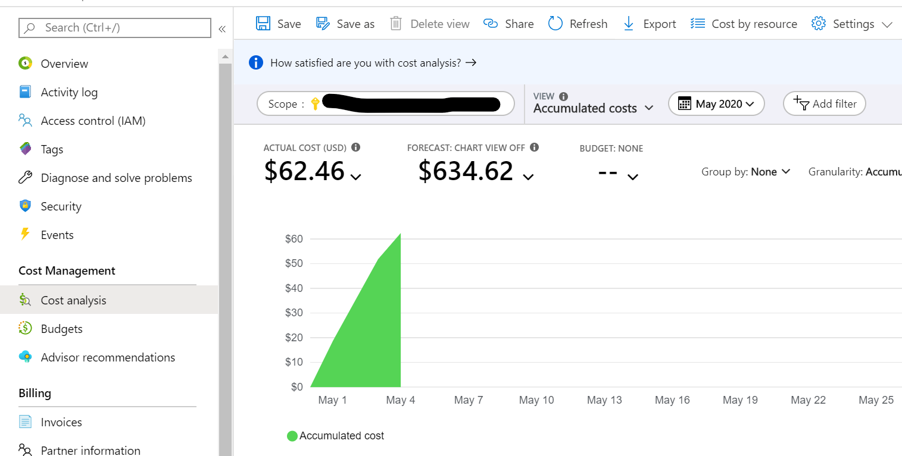
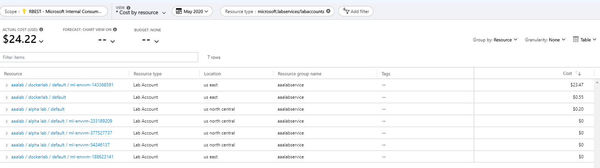
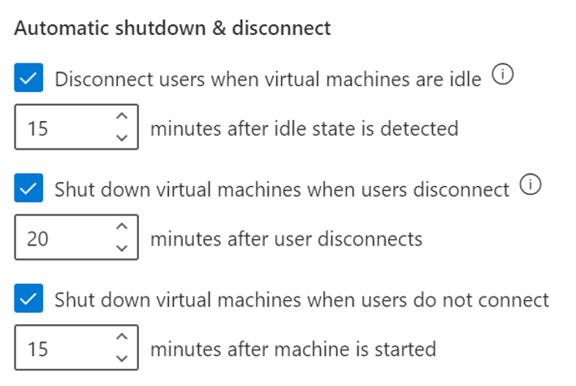
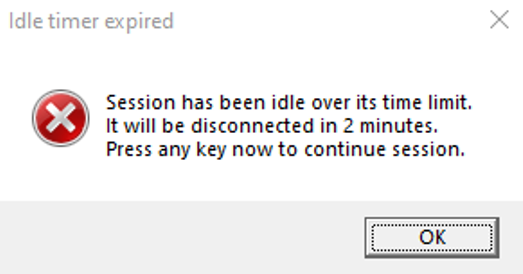
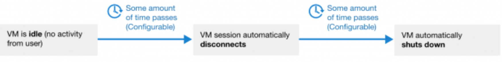

# Cost management for Azure Lab Services

For Azure Lab Services, cost management can be broken down into two distinct areas: cost estimation and cost analysis. Cost estimation occurs when you're setting up the lab to make sure that the initial structure of the lab will fit within the expected budget. Cost analysis usually occurs at the end of the month to determine the necessary actions for the next month.

## Estimate the lab costs

Each lab dashboard has a **Costs & Billing** section that lays out a rough estimate of what the lab will cost for the month. The cost estimate summarizes the hour usage with the maximum number of users by the estimated cost per hour. To get the most accurate estimate, set up the lab, including the [schedule](how-to-create-schedules.md). The dashboard will reflect the estimated cost. 

This estimate might not show all the possible costs. A few resources aren't included:

- The template preparation cost. It can vary significantly in the amount of time needed to create the template. The cost to run the template is the same as the overall lab cost per hour. 
- Any [shared image gallery](how-to-use-shared-image-gallery.md) costs, because a gallery can be shared among multiple labs. 
- Hours incurred when the lab creator starts a virtual machine (VM).

> [!div class="mx-imgBorder"]
> 

## Analyze the previous month's usage

The cost analysis is for reviewing the previous month's usage to help you determine any adjustments for the lab. You can find the breakdown of past costs in the [subscription cost analysis](https://docs.microsoft.com/azure/cost-management-billing/costs/quick-acm-cost-analysis). In the Azure portal, you can enter **Subscriptions** in the search box and then select the **Subscriptions** option. 

> [!div class="mx-imgBorder"]
> 

Select the specific subscription that you want to review.

> [!div class="mx-imgBorder"]
> 

Select **Cost Analysis** in the left pane under **Cost Management**.

> [!div class="mx-imgBorder"]
> 

This dashboard allows in-depth cost analysis, including the ability to export to different file types on a schedule. For more information, see [Cost Management + Billing overview](https://docs.microsoft.com/azure/cost-management-billing/cost-management-billing-overview).

You can filter by resource type. Using `microsoft.labservices/labaccounts` will show only the cost associated with Lab Services.

## Understand the usage

The following screenshot is an example of a cost analysis.

> [!div class="mx-imgBorder"]
> 

By default, there are six columns: **Resource**, **Resource type**, **Location**, **Resource group name**, **Tags**, and **Cost**. The **Resource** column contains the information about the lab account, lab name, and VM. The rows that show the lab account, lab name, and default (second and third rows) are the cost for the lab. The used VMs have a cost that you can see for the rows that show the lab account, lab name, default, and VM name. 

In this example, adding the first and second rows (both start with **aaalab / dockerlab**) will give you the total cost for the lab "dockerlab" in the "aaalab" lab account.

To get the overall cost for the image gallery, change the resource type to `Microsoft.Compute/Galleries`. A shared image gallery might not show up in the costs, depending on where the gallery is stored.

> [!NOTE]
> A shared image gallery is connected to the lab account. That means multiple labs can use the same image.

## Separate the costs

Some universities have used the lab account and the resource group as ways to separate the classes. Each class has its own lab account and resource group. 

In the cost analysis pane, add a filter based on the resource group name with the appropriate resource group name for the class. Then, only the costs for that class will be visible. This allows a clearer delineation between the classes when you're viewing the costs. You can use the [scheduled export](https://docs.microsoft.com/azure/cost-management-billing/costs/tutorial-export-acm-data) feature of the cost analysis to download the costs of each class in separate files.

## Manage costs

Depending on the type of class, there are ways to manage costs to reduce instances of VMs that are running without a student using them.

### Automatic shutdown settings for cost control

Automatic shutdown features enable you to prevent wasted VM usage hours in the labs. The following settings catch most of the cases where users accidentally leave their virtual machines running:

> [!div class="mx-imgBorder"]
> 

You can configure these settings at both the lab account level and the lab level. If you enable them at the lab account level, they're applied to all labs within the lab account. For all new lab accounts, these settings are turned on by default. 

#### Automatically disconnect users from virtual machines that the OS deems idle

> [!NOTE]
> This setting is available only for Windows virtual machines.

When the **Disconnect users when virtual machines are idle** setting is turned on, the user is disconnected from any machines in the lab when the Windows OS deems the session to be idle (including the template virtual machines). The [Windows OS definition of idle](https://docs.microsoft.com/windows/win32/taskschd/task-idle-conditions#detecting-the-idle-state) uses two criteria: 

* User absence: no keyboard or mouse input.
* Lack of resource consumption: All the processors and all the disks were idle for a certain percentage of time.

Users will see a message like this in the VM before they're disconnected: 

> [!div class="mx-imgBorder"]
> 
 
The virtual machine is still running when the user is disconnected. If the user reconnects to the virtual machine by signing in, windows or files that were open or work that was unsaved before the disconnect will still be there. In this state, because the virtual machine is running, it still counts as active and accrues cost. 
 
To automatically shut down idle Windows virtual machines that are disconnected, use the combination of **Disconnect users when virtual machines are idle** and **Shut down virtual machines when users disconnect** settings.

For example, if you configure the settings as follows:
 
* **Disconnect users when virtual machines are idle**: 15 minutes after the idle state is detected.
* **Shut down virtual machines when users disconnect**: 5 minutes after the user disconnects.
 
The Windows virtual machines will automatically shut down 20 minutes after the user stops using them. 
 
> [!div class="mx-imgBorder"]
> 

#### Automatically shut down virtual machines when users disconnect
 
The **Shut down virtual machines when users disconnect** setting supports both Windows and Linux virtual machines. When this setting is on, automatic shutdown will occur when:
 
* For Windows, a Remote Desktop (RDP) connection is disconnected.
* For Linux, an SSH connection is disconnected.
 
> [!NOTE]
> Only [specific distributions and versions of Linux](https://docs.microsoft.com/azure/virtual-machines/extensions/diagnostics-linux#supported-linux-distributions) are supported.
 
You can specify how long the virtual machines should wait for the user to reconnect before automatically shutting down. 

#### Automatically shut down virtual machines that are started but users don't connect
 
In a lab, a user might start a virtual machine but never connect to it. For example:
 
* A schedule in the lab starts all virtual machines for a class session, but some students don't show up and don't connect to their machines. 
* A user starts a virtual machine but forgets to connect. 
 
The **Shut down virtual machines when users do not connect** setting will catch these cases and automatically shut down the virtual machines. 
 
For information on how to configure and enable automatic shutdown of VMs on disconnect, see these articles:

* [Configure automatic shutdown of VMs for a lab account](how-to-configure-lab-accounts.md)
* [Configure automatic shutdown of VMs for a lab](how-to-enable-shutdown-disconnect.md)

### Scheduled time vs. quota time

Understanding [scheduled time](classroom-labs-concepts.md#schedules) and [quota time](classroom-labs-concepts.md#quota) will help you to configure a lab to better fit the needs of the professor and the students. 

Scheduled time is a set time where all the student VMs have been started and are available for connection. Scheduled time is commonly used when all the students have their own VMs and are following the professor's directions at a set time during the day (like class hours). The downside is that all the student VMs are started and are accruing costs, even if a student doesn't log in to a VM. 

Quota time is time allocated to each student for use at their discretion and is often used for independent studying. The VMs aren't started until the student starts the VM. 

A lab can use either quota time or scheduled time, or a combination of both. If a class doesn't need scheduled time, then use only quota time for the most effective use of the VMs.

### Scheduled event: stop only

In the schedule, you can add a stop-only event type that will stop all machines at a specific time. Some lab owners have set a stop-only event for every day at midnight to reduce the cost and quota usage when a student forgets to shut down the VM they're using. The downside to this type of event is that all VMs will be shut down, even if a student is using a VM.

### Other costs related to labs 

Some costs aren't rolled into Lab Services but can be tied to a lab service. You can connect a shared image gallery to a lab, but it won't show under the Lab Services costs and does have costs. To help keep overall costs down, you should remove any unused images from the gallery because the images have an inherent storage cost. 

Labs can have connections to other Azure resources through a virtual network. When a lab is removed, you should remove the virtual network and the other resources.

## Conclusion

Hopefully, the information in this article has given you a better understanding of the tools that can help you reduce usage costs.
