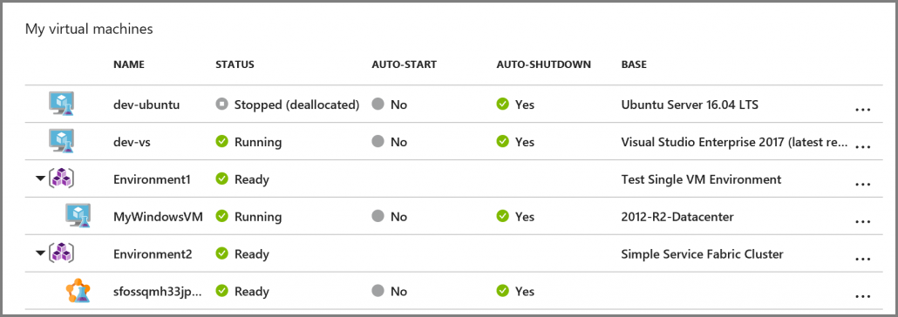
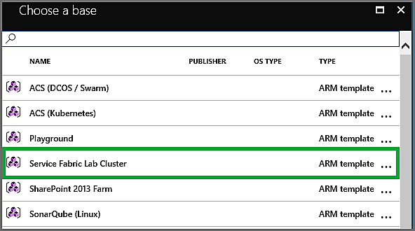
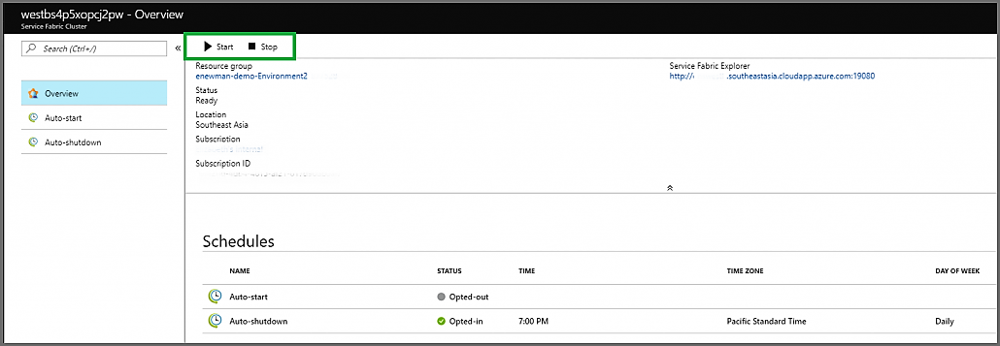
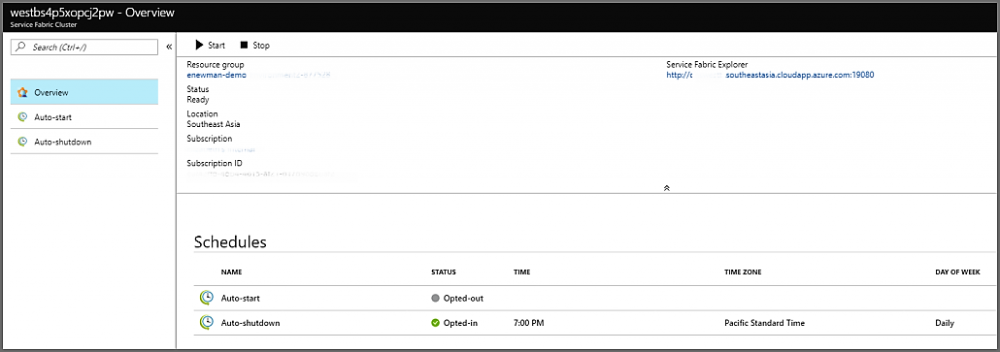
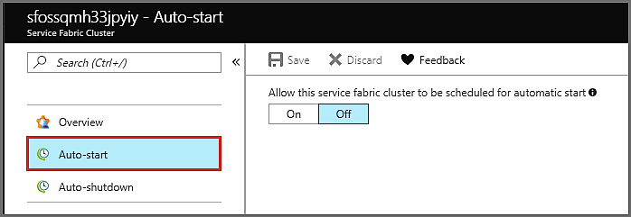
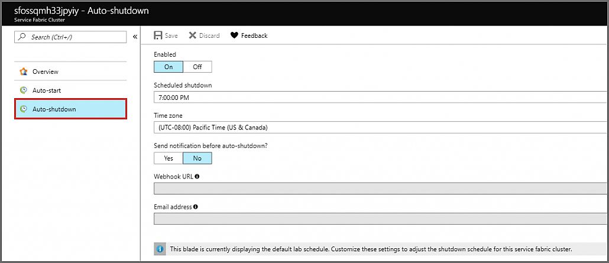

# Create an environment with self-contained Service Fabric cluster in Azure DevTest Labs
This article provides information on how to create an environment with a self-contained Service Fabric cluster in Azure DevTest Labs. 

## Overview
DevTest Labs can create self-contained test environments as defined by an Azure Resource Management template. These environments contain both IaaS resources, like virtual machines, and PaaS resources, like Service Fabric.

DevTest Lab provides the means to manage virtual machine resources defined within an environment by providing commands to control the virtual machines. These commands give you the ability to start or stop a virtual machine on a schedule. DevTest Labs can also help you manage Service Fabric clusters in an environmentl. You can start or stop a Service Fabric custer in an environment either manually or via a schedule.

The following image shows the updated view of **My Virtual Machines** with environments. This article covers how to create an environment with a self-contained Service Fabric cluster, and how to start and stop the cluster via schedules.

## Creating an environment
Service Fabric clusters are created using environments in DevTest Labs. Environments are made available by adding a link to a Git repository source with Resource Manager templates to the lab. For instruction on how to add a Git repository source to a lab, see [Add a Git repository to store custom artifacts and Resource Manager templates](devtest-lab-add-artifact-repo.md). For an overview how to create an environment, see [Create multi-VM environments and PaaS resources with Azure Resource Manager templates](devtest-lab-create-environment-from-arm.md).

Each environment is defined by an Azure Resource Manager template in the Git repository. To test Service Fabric in DevTest Labs, try the sample environment at:  [https://github.com/Azure/azure-devtestlab/tree/master/Environments/](https://github.com/Azure/azure-devtestlab/tree/master/Environments/). An environment named **Service Fabric Lab Cluster** is available when you try to create a lab resource. For more information about this specific environment, see the README.md file. 

The **Service Fabric Lab Cluster** environment creates a 5-node 1-nodetype cluster on either Linux or Windows. You need to provide administrator username and passwords for the VM. You also need to provide certificate information. Use [Create-ClusterCertificate.ps1](https://github.com/Azure/azure-devtestlab/tree/master/Environments/ServiceFabric-LabCluster/Create-ClusterCertificate.ps1) to get the needed base64 encoding of the certificate, certificate password and certificate thumbprint.

It is important to note that lab environments are self-contained within the resource group in which they are created. It means that the template that defines the environment, which can only access resources within the newly created resource group or [virtual networks configured to be used by the lab](devtest-lab-configure-vnet.md). This sample above creates all the required resources in the same resource group.

## Starting and Stopping a Cluster
Once a cluster is created within the environment, you can start or stop it by clicking a command from the list of lab resources or by clicking the commands on the menu bar for the cluster. The start command starts all nodes in a cluster. The stop command stops all nodes in a cluster. Once a cluster is stopped, the Service Fabric cluster itself remains in a ready state, but no nodes are available until the start command is re-issued on the cluster in the lab.

There are a few considerations to note when using a Service Fabric cluster in a test environment. It may take some time for the Service Fabric cluster to fully re-hydrate after the nodes have been restarted. To retain data from shutdown to startup, data must be saved on a managed disk attached to the virtual machine. There are performance implications when using an attached managed disk, so it is recommended for test environments only. If the disk used for data storage is not backed, then data is lost when the stop command is issued on the cluster.

## Configuring an auto startup and auto shutdown schedule
Service Fabric clusters can also be started or stopped on a schedule. The experience for this is comparable to the experience for virtual machines in a lab. To save money, by default, every cluster created in a lab automatically shuts down at the time defined by the lab shutdown policy. You can override by specifing whether the cluster should be shut down or by specifying the time the cluster is shut down. Select the Service Fabric cluster in the list of lab resources, and you see the status of startup and shutdown schedules for that cluster in the **Essentials** section.

To opt-in to the startup schedule, select **Auto-startup** on the left menu. This page is enabled only if the lab owner has allowed users to auto-start their virtual machines or Service Fabric clusters.

To change settings for shutdown, select **Auto-shutdown** on the left menu. On this page, you can opt-out of automatic shutdown, change the time for shutdown, or add notifications for when your cluster is shutdown.

## Next steps
See the following articles for details about environments: 

- [Create multi-VM environments and PaaS resources with Azure Resource Manager templates](devtest-lab-create-environment-from-arm.md)
- [Configure and use public environments in Azure DevTest Labs](devtest-lab-configure-use-public-environments.md)
