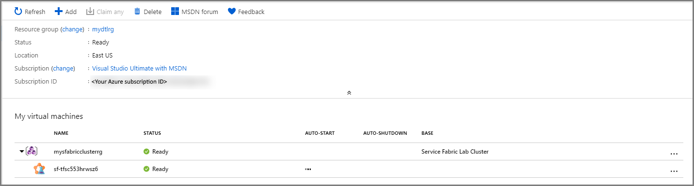
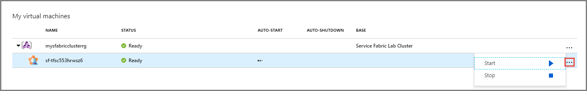
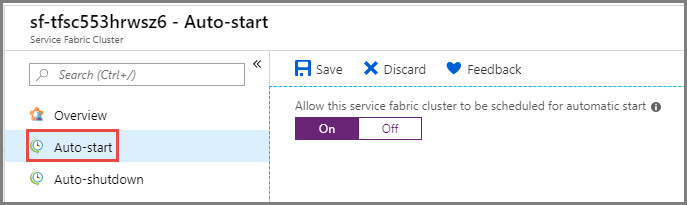
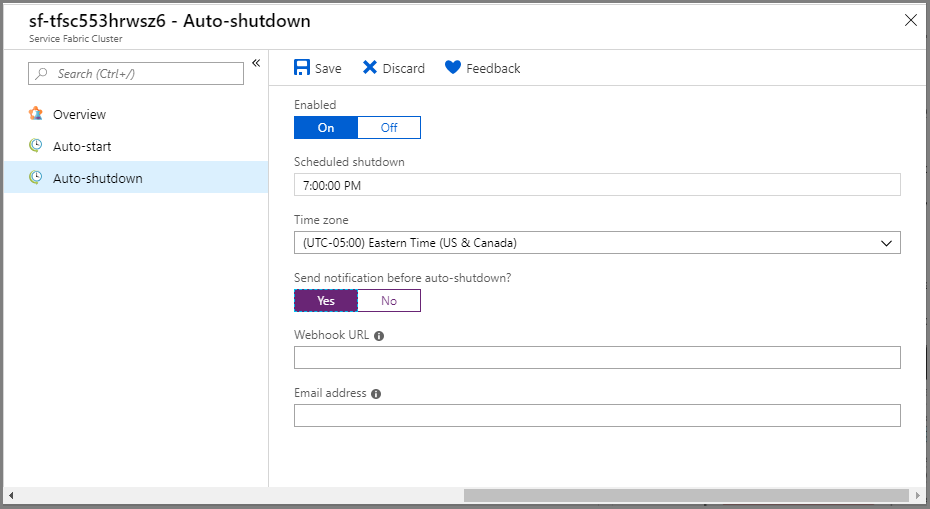

# Create an environment with self-contained Service Fabric cluster in Azure DevTest Labs
This article provides information on how to create an environment with a self-contained Service Fabric cluster in Azure DevTest Labs. 

## Overview
DevTest Labs can create self-contained test environments as defined by Azure Resource Management templates. These environments contain both IaaS resources, like virtual machines, and PaaS resources, like Service Fabric. DevTest Labs allows you to manage virtual machines in an environment by providing commands to control the virtual machines. These commands give you the ability to start or stop a virtual machine on a schedule. Similarly, DevTest Labs can also help you manage Service Fabric clusters in an environment. You can start or stop a Service Fabric cluster in an environment either manually or via a schedule.

## Create a Service Fabric cluster
Service Fabric clusters are created using environments in DevTest Labs. Each environment is defined by an Azure Resource Manager template in a Git repository. The [public Git repository](https://github.com/Azure/azure-devtestlab/tree/master/Environments/) for DevTest Labs contains the Resource Manager template to create a Service Fabric cluster in the [ServiceFabric-Cluster](https://github.com/Azure/azure-devtestlab/tree/master/Environments/ServiceFabric-LabCluster) folder. 

1. First, create a lab in Azure DevTest Labs by using instructions in the following article: [Create a lab](devtest-lab-create-lab.md). Notice that the **Public environments** option is **On** by default. 
2. Confirm that the Service Fabric provider is registered for your subscription by following these steps:
    1. Select **Subscriptions** on the left navigational menu, and select your **Subscription**
    2. On the **Subscription** page, select **Resource providers** in the **Settings** section on the left menu. 
    3. If **Microsoft.ServiecFabric** isn't registered, select **Register**. 
3. On the **DevTest Lab** page for your lab, select **+ Add** on the toolbar. 
    
    
3. On the **Choose a base** page, select **Service Fabric Lab Cluster** in the list. 

    
4. On the **Configure settings** page, do the following steps: 
    1. Specify a **name** for your cluster **environment**. This is the name of the resource group in Azure in which the Service Fabric cluster is going to be created. 
    2. Select the **operating system (OS)** for the cluster virtual machines. The default value is: **Windows**.
    3. Specify a name for the **administrator** for the cluster. 
    4. Specify a **password** for the administrator. 
    5. For the **certificate**, enter your certificate information as a Base64 encoded string. To create a certificate, do the following steps:
        1. Download the **Create-ClusterCertificate.ps1** file from the [Git repository](https://github.com/Azure/azure-devtestlab/tree/master/Environments/ServiceFabric-LabCluster). Alternatively, clone the repository on your machine. 
        2. Launch **PowerShell**. 
        3. Run the **ps1** file using the command `.\Create-ClusterCertificate.ps1`. You see a text file opened in notepad with the information you need to fill in the certificate-related fields on this page. . 
    6. Enter the **password for the certificate**.
    7. Specify the **thumbprint** for your certificate.
    8. Select **Add** on the **Configure Settings** page. 

        
5. After the cluster is created, you see a resource group with the name of the environment you provided in the previous step. When you expand, you see the Service Fabric cluster in it. If the status of resource group is stuck at **Creating**, select **Refresh** on the toolbar. The **Service Fabric cluster** environment creates a 5-node 1-nodetype cluster on either Linux or Windows.

    In the following example, **mysfabricclusterrg** is the name of the resource group that's created specifically for the Service Fabric cluster. It is important to note that lab environments are self-contained within the resource group in which they are created. It means that the template that defines the environment, which can only access resources within the newly created resource group or [virtual networks configured to be used by the lab](devtest-lab-configure-vnet.md). This sample above creates all the required resources in the same resource group.

    

## Start or stop the cluster
You can start or stop the cluster from either the DevTest Lab page itself or from the Service Fabric Cluster page provided by DevTest Labs. 

### From the DevTest Lab page
You can start or stop the cluster on the DevTest Lab page for your lab. 

1. Select **three dots (...)** for the Service Fabric cluster as shown in the following image: 

    

2. You see two commands in the context menu to **start** and **stop** the cluster. The start command starts all nodes in a cluster. The stop command stops all nodes in a cluster. Once a cluster is stopped, the Service Fabric cluster itself remains in a ready state, but no nodes are available until the start command is reissued on the cluster in the lab.

    There are a few considerations to note when using a Service Fabric cluster in a test environment. It may take some time for the Service Fabric cluster to fully rehydrate after the nodes have been restarted. To retain data from shutdown to startup, data must be saved on a managed disk attached to the virtual machine. There are performance implications when using an attached managed disk, so it is recommended for test environments only. If the disk used for data storage is not backed, then data is lost when the stop command is issued on the cluster.

### From the Service Fabric Cluster page 
There is another way to start or stop the cluster. 

1. Select your Service Fabric cluster in the tree view on the DevTest Lab page. 

    

2. On the **Service Fabric Cluster** page for the cluster, you see commands on the toolbar to start or stop the cluster. 

    

## Configure auto startup and auto shutdown schedule
Service Fabric clusters can also be started or stopped on a schedule. This experience is similar to the experience for virtual machines in a lab. To save money, by default, every cluster created in a lab automatically shuts down at the time defined by the lab [shutdown policy](devtest-lab-set-lab-policy.md?#set-auto-shutdown-policy). You can override by specifying whether the cluster should be shut down or by specifying the time the cluster is shut down. 

### Opt in to the auto start schedule
To opt in to the startup schedule, do the following steps:

1. Select **Auto-start** on the left menu
2. Select **On** for **Allow this service fabric cluster to be scheduled for automatic start**. This page is enabled only if the lab owner has allowed users to autostart their virtual machines or Service Fabric clusters.
3. Select **Save** on the toolbar. 

    

### Configure auto shutdown settings 
To change settings for shutdown, do the following steps:

1. Select **Auto-shutdown** on the left menu. 
2. On this page, you can opt out of automatic shutdown by selecting **Off** for **Enabled**. 
3. If you have selected **On** for **Enabled**, follow these steps:
    1. Specify the **time** for shutdown.
    2. Specify the **timezone** for the time. 
    3. Specify whether you want DevTest Labs to send **notifications** before auto-shutdown. 
    4. If you selected **Yes** for the notification option, specify the **Webhook URL** and/or **email address** to send notifications. 
    5. Select **Save** on the toolbar.

        

## To view nodes in the Service Fabric cluster
The Service Fabric cluster page you have seen in the steps earlier is specific to the DevTest Labs page. It doesn't show you the nodes in the cluster. To see more information about the cluster, follow these steps:

1. On the **DevTest Lab** page for your lab, select the **resource group** in the tree view in the **My virtual machines** section.

    
2. On the **Resource Group** page, you see all the resources in the resource group in a list. Select your **Service Fabric cluster** from the list. 

    
3. You see the **Service Fabric Cluster** page for your cluster. This is the page that the Service Fabric provides. You see all the information about the clusters such as nodes, node types, etc.

    

## Next steps
See the following articles for details about environments: 

- [Create multi-VM environments and PaaS resources with Azure Resource Manager templates](devtest-lab-create-environment-from-arm.md)
- [Configure and use public environments in Azure DevTest Labs](devtest-lab-configure-use-public-environments.md)
