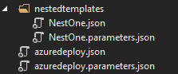

# Deploy nested Azure Resource Manager templates for testing environments
A nested deployment allows you to execute other Azure Resource Manager templates from within a main Resource Manager template. It enables you to decompose your deployment into a set of targeted and purpose-specific templates. It provides benefits in terms of testing, reuse, and readability. The article [Using linked templates when deploying Azure resources](../azure-resource-manager/templates/linked-templates.md) provides a good overview of this solution with several code samples. This article provides an example that's specific to Azure DevTest Labs. 

## Key parameters
While you can create your own Resource Manager template from scratch, we recommend that you use the [Azure Resource Group project](../azure-resource-manager/templates/create-visual-studio-deployment-project.md) in Visual Studio, which makes it easy to develop and debug templates. When you add a nested deployment resource to azuredeploy.json, Visual Studio adds several items to make the template more flexible. These items include the subfolder with the secondary template and parameters file, variable names within the main template file, and two parameters for the storage location for the new files. The **_artifactsLocation** and **_artifactsLocationSasToken** are the key parameters that the DevTest Labs uses. 

If you aren't familiar with how the DevTest Labs works with environments, see [Create multi-VM environments and PaaS resources with Azure Resource Manager templates](devtest-lab-create-environment-from-arm.md). Your templates are stored in the repository linked to the lab in DevTest Labs. When you create a new environment with those templates, the files are moved into an Azure Storage container in the lab. To be able to identify and copy the nested files, DevTest Labs identifies the _artifactsLocation and _artifactsLocationSasToken parameters and copies the subfolders up to the storage container. Then, it automatically inserts the location and Shared Access Signature (SaS) token into parameters. 

## Nested deployment example
Here is a simple example of a nested deployment:

```json

"$schema": "https://schema.management.azure.com/schemas/2015-01-01/deploymentTemplate.json#",
"contentVersion": "1.0.0.0",
"parameters": {
    "_artifactsLocation": {
        "type": "string"
    },
    "_artifactsLocationSasToken": {
        "type": "securestring"
    }},
"variables": {
    "NestOneTemplateFolder": "nestedtemplates",
    "NestOneTemplateFileName": "NestOne.json",
    "NestOneTemplateParametersFileName": "NestOne.parameters.json"},
    "resources": [
    {
        "name": "NestOne",
        "type": "Microsoft.Resources/deployments",
        "apiVersion": "2016-09-01",
        "dependsOn": [ ],
        "properties": {
            "mode": "Incremental",
            "templateLink": {
                "uri": "[concat(parameters('_artifactsLocation'), '/', variables('NestOneTemplateFolder'), '/', variables('NestOneTemplateFileName'), parameters('_artifactsLocationSasToken'))]",
                "contentVersion": "1.0.0.0"
            },
            "parametersLink": {
                "uri": "[concat(parameters('_artifactsLocation'), '/', variables('NestOneTemplateFolder'), '/', variables('NestOneTemplateParametersFileName'), parameters('_artifactsLocationSasToken'))]",
                "contentVersion": "1.0.0.0"
            }
        }    
    }],
"outputs": {}
```

The folder in the repository containing this template has a subfolder `nestedtemplates` with the files **NestOne.json** and **NestOne.parameters.json**. In the **azuredeploy.json**, URI for the template is built using the artifacts location, nested template folder, nested template file name. Similarly, URI for the parameters is built using the artifacts location, nested template folder, and parameter file for the nested template. 

Here is the image of the same project structure in Visual Studio: 



You can add additional folders in the primary folder but not any deeper than a single level. 

## Next steps
See the following articles for details about environments: 

- [Create multi-VM environments and PaaS resources with Azure Resource Manager templates](devtest-lab-create-environment-from-arm.md)
- [Configure and use public environments in Azure DevTest Labs](devtest-lab-configure-use-public-environments.md)
- [Connect an environment to your lab's virtual network in Azure DevTest Labs](connect-environment-lab-virtual-network.md)