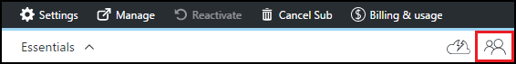
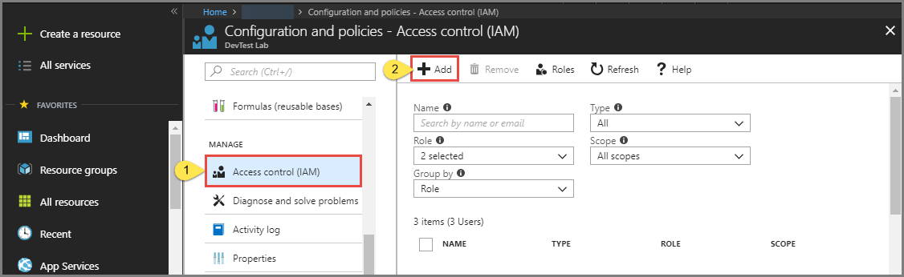

# Add owners and users in Azure DevTest Labs
> [!VIDEO https://channel9.msdn.com/Blogs/Azure/How-to-set-security-in-your-DevTest-Lab/player]
> 
> 

Access in Azure DevTest Labs is controlled by [Azure Role-Based Access Control (RBAC)](../role-based-access-control/overview.md). Using RBAC, you can segregate duties within your team into *roles* where you grant only the amount of access necessary to users to perform their jobs. Three of these RBAC roles are *Owner*, *DevTest Labs User*, and *Contributor*. In this article, you learn what actions can be performed in each of the three main RBAC roles. From there, you learn how to add users to a lab - both via the portal and via a PowerShell script, and how to add users at the subscription level.

## Actions that can be performed in each role
There are three main roles that you can assign a user:

* Owner
* DevTest Labs User
* Contributor

The following table illustrates the actions that can be performed by users in each of these roles:

| **Actions users in this role can perform** | **DevTest Labs User** | **Owner** | **Contributor** |
| --- | --- | --- | --- |
| **Lab tasks** | | | |
| Add users to a lab |No |Yes |No |
| Update cost settings |No |Yes |Yes |
| **VM base tasks** | | | |
| Add and remove custom images |No |Yes |Yes |
| Add, update, and delete formulas |Yes |Yes |Yes |
| Whitelist Azure Marketplace images |No |Yes |Yes |
| **VM tasks** | | | |
| Create VMs |Yes |Yes |Yes |
| Start, stop, and delete VMs |Only VMs created by the user |Yes |Yes |
| Update VM policies |No |Yes |Yes |
| Add/remove data disks to/from VMs |Only VMs created by the user |Yes |Yes |
| **Artifact tasks** | | | |
| Add and remove artifact repositories |No |Yes |Yes |
| Apply artifacts |Yes |Yes |Yes |

> [!NOTE]
> When a user creates a VM, that user is automatically assigned to the **Owner** role of the created VM.
> 
> 

## Add an owner or user at the lab level
Owners and users can be added at the lab level via the Azure portal. 
A user can be an external user with a valid [Microsoft account (MSA)](devtest-lab-faq.md#what-is-a-microsoft-account).
The following steps guide you through the process of adding an owner or user to a lab in Azure DevTest Labs:

1. Sign in to the [Azure portal](https://go.microsoft.com/fwlink/p/?LinkID=525040).
2. Select **All services**, and then select **DevTest Labs** from the list.
3. From the list of labs, select the desired lab.
4. On the lab's blade, select **Configuration and policies**. 
5. On the **Configuration and policies** page, select **Access control (IAM)** from the menu on the left. 
6. Select **Add role assignment** on the toolbar to add a user to a role.
1. In the **Add permissions** window, do the following actions: 
    1. Select a role (for example: DevTest Labs User). The section [Actions that can be performed in each role](#actions-that-can-be-performed-in-each-role) lists the various actions that can be performed by users in the Owner, DevTest User, and Contributor roles.
    2. Select the user to be added to the role. 
    3. Select **Save**. 
11. When you return to the **Users** blade, the user has been added.  

## Add an external user to a lab using PowerShell

[!INCLUDE [updated-for-az](../../includes/updated-for-az.md)]

In addition to adding users in the Azure portal, you can add an external user to your lab using a PowerShell script. 
In the following example, modify the parameter values under the **Values to change** comment.
You can retrieve the `subscriptionId`, `labResourceGroup`, and `labName` values from the lab blade in the Azure portal.

> [!NOTE]
> The sample script assumes that the specified user has been added as a guest to the Active Directory, and will fail if that is not the case. To add a user not in the Active Directory to a lab, use the Azure portal to assign the user to a role as illustrated in the section, [Add an owner or user at the lab level](#add-an-owner-or-user-at-the-lab-level).   
> 
> 

    # Add an external user in DevTest Labs user role to a lab
    # Ensure that guest users can be added to the Azure Active directory:
    # https://azure.microsoft.com/documentation/articles/active-directory-create-users/#set-guest-user-access-policies

    # Values to change
    $subscriptionId = "<Enter Azure subscription ID here>"
    $labResourceGroup = "<Enter lab's resource name here>"
    $labName = "<Enter lab name here>"
    $userDisplayName = "<Enter user's display name here>"

    # Log into your Azure account
    Connect-AzAccount

    # Select the Azure subscription that contains the lab. 
    # This step is optional if you have only one subscription.
    Select-AzSubscription -SubscriptionId $subscriptionId

    # Retrieve the user object
    $adObject = Get-AzADUser -SearchString $userDisplayName

    # Create the role assignment. 
    $labId = ('subscriptions/' + $subscriptionId + '/resourceGroups/' + $labResourceGroup + '/providers/Microsoft.DevTestLab/labs/' + $labName)
    New-AzRoleAssignment -ObjectId $adObject.Id -RoleDefinitionName 'DevTest Labs User' -Scope $labId

## Add an owner or user at the subscription level
Azure permissions are propagated from parent scope to child scope in Azure. Therefore, owners of an Azure subscription that contains labs are automatically owners of those labs. They also own the VMs and other resources created by the lab's users, and the Azure DevTest Labs service. 

You can add additional owners to a lab via the lab's blade in the [Azure portal](https://go.microsoft.com/fwlink/p/?LinkID=525040). 
However, the added owner's scope of administration is more narrow than the subscription owner's scope. 
For example, the added owners do not have full access to some of the resources that are created in the subscription by the DevTest Labs service. 

To add an owner to an Azure subscription, follow these steps:

1. Sign in to the [Azure portal](https://go.microsoft.com/fwlink/p/?LinkID=525040).
2. Select **All Services**, and then select **Subscriptions** from the list.
3. Select the desired subscription.
4. Select **Access** icon. 
   
    
5. On the **Users** blade, select **Add**.
   
    
6. On the **Select a role** blade, select **Owner**.
7. On the **Add users** blade, enter the email address or name of the user you want to add as an owner. If the user can't be found, you get an error message explaining the issue. If the user is found, that user is listed under the **User** text box.
8. Select the located user name.
9. Select **Select**.
10. Select **OK** to close the **Add access** blade.
11. When you return to the **Users** blade, the user has been added as an owner. This user is now an owner of any labs created under this subscription, and thus is able to perform owner tasks. 

[!INCLUDE [devtest-lab-try-it-out](../../includes/devtest-lab-try-it-out.md)]

