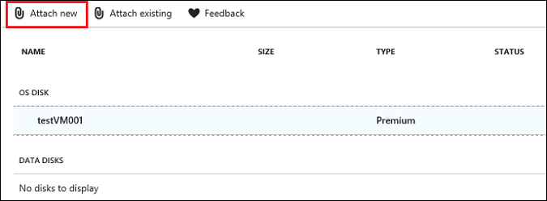
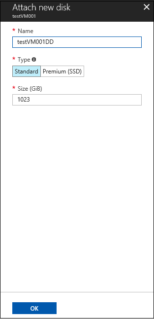
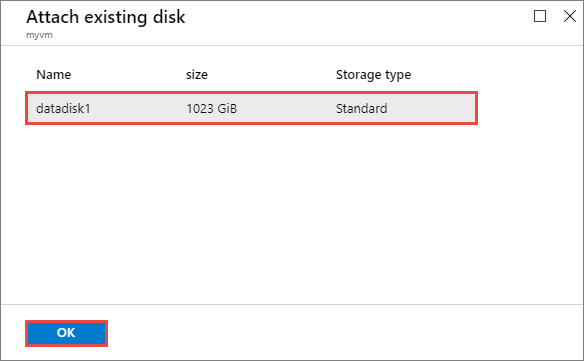
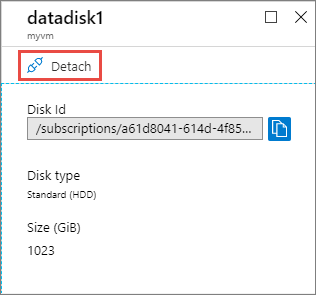

# Attach or detach a data disk to a virtual machine in Azure DevTest Labs
[Azure Managed Disks](https://docs.microsoft.com/azure/virtual-machines/windows/managed-disks-overview) manages the storage accounts associated with virtual machine data disks. A user attaches a new data disk to a VM, specifies the type and size of disk that's needed, and Azure creates and manages the disk automatically. The data disk can then be detached from the VM and either reattached later to the same VM, or attached to a different VM that belongs to the same user.

This functionality is handy for managing storage or software outside of each individual virtual machine. If the storage or software already exists inside a data disk, it can be easily attached, detached, and reattached to any VM that is owned by the user that owns that data disk.

## Attach a data disk
Before you attach a data disk to a VM, review these tips:

- The size of the VM controls how many data disks you can attach. For details, see [Sizes for virtual machines](https://docs.microsoft.com/azure/virtual-machines/windows/sizes).
- You can only attach a data disk to a VM that is running. Make sure the VM is running before you try to attach a data disk.

### Attach a new disk
Follow these steps to create and attach a new managed data disk to a VM in Azure DevTest Labs.

1. Sign in to the [Azure portal](https://go.microsoft.com/fwlink/p/?LinkID=525040).
1. Select **All Services**, and then select **DevTest Labs** from the list.
1. From the list of labs, select the desired lab. 
1. From the list of **My virtual machines**, select a running VM.
1. From the menu on the left, select **Disks**.

    
1. Choose **Attach new** to create a new data disk and attach it to the VM.

    
1. Complete the **Attach new disk** pane by entering a data disk name, type, and size.

    
1. Select **OK**.

After a few moments, the new data disk is created and attached to the VM and appears in the list of **DATA DISKS** for that VM.

### Attach an existing disk
Follow these steps to reattach an existing available data disk to a running VM. 

1. Select a running VM for which you want to reattach a data disk.
1. From the menu on the left, select **Disks**.
1. Select **Attach existing** to attach an available data disk to the VM.

    

1. From the **Attach existing disk** pane, select OK.

    

After a few moments, the data disk is attached to the VM and appears in the list of **DATA DISKS** for that VM.

## Detach a data disk
When you no longer need a data disk that's attached to a VM, you can easily detach it. Detaching removes the disk from the VM, but keeps it in storage for use later.

If you want to use the existing data on the disk again, you can reattach it to the same virtual machine or to another one.

### Detach from the VM's management pane
1. From your list of virtual machines, select a VM that has a data disk attached.
1. From the menu on the left, select **Disks**.

     
1. From the list of **DATA DISKS**, select the data disk that you want to detach.
1. Select **Detach** from the top of the disk's details pane.

    
1. Select **Yes** to confirm that you want to detach the data disk.

The disk is detached and is available to attach to another VM. 
### Detach from the lab's main pane
1. On your lab's main pane, select **My data disks**.

    
1. Right-click the data disk you want to detach – or select its ellipsis (...) – and choose **Detach**.

    
1. Select **Yes** to confirm that you want to detach it.

   > [!NOTE]
   > If a data disk is already detached, you can choose to remove it from your list of available data disks by selecting **Delete**.
   >
   >

## Upgrade an unmanaged data disk
If you have an existing VM that uses unmanaged data disks, you can easily convert the VM to use managed disks. This process converts both the OS disk and any attached data disks.

To upgrade an unmanaged data disk, follow the steps outlined in this article to [detach the data disk](#detach-a-data-disk) from an unmanaged VM. Then, [reattach the disk](#attach-an-existing-disk) to a managed VM to automatically upgrade the data disk from unmanaged to managed.

[!INCLUDE [devtest-lab-try-it-out](../../includes/devtest-lab-try-it-out.md)]

## Next steps
Learn how to manage data disks for [claimable virtual machines](devtest-lab-add-claimable-vm.md#unclaim-a-vm).

