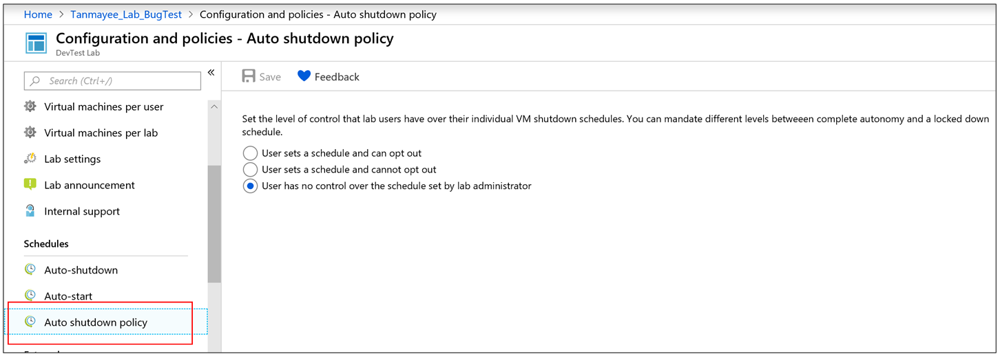
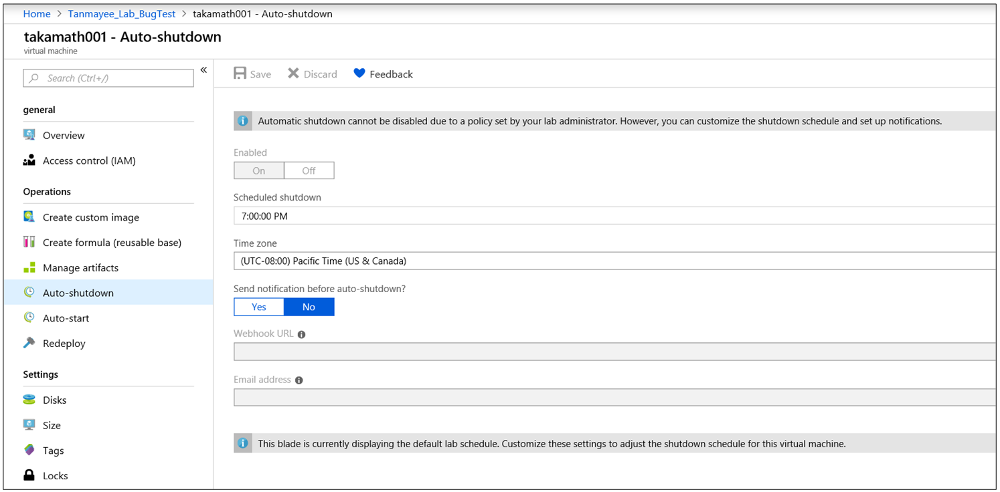
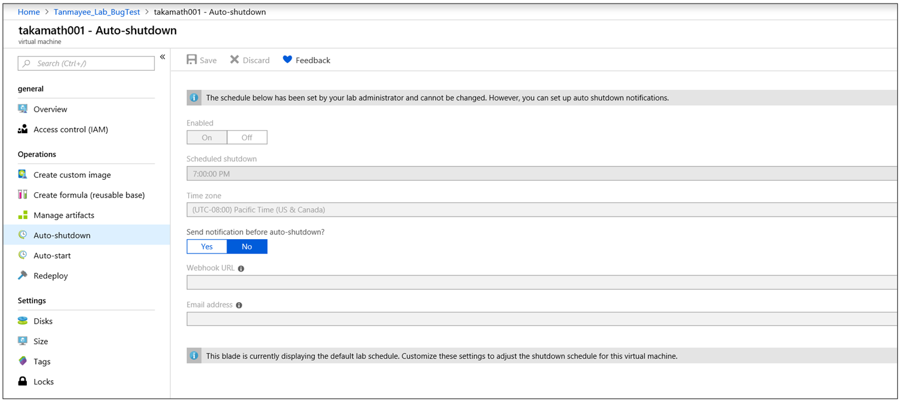

# Configure autoshutdown settings for a VM in Azure DevTest Labs
Azure DevTest Labs enables you to control cost and minimize waste in your labs by managing policies (settings) for each lab. This article shows you how to configure autoshutdown policy for a lab account and configure autoshutdown settings for a lab in the lab account. To view how to set every lab policy, see [Define lab policies in Azure DevTest Labs](devtest-lab-set-lab-policy.md).  

## Autoshutdown policy for a lab
As a lab owner, you can configure a shutdown schedule for all the VMs in your lab. By doing so, you can save costs from running machines that aren't being used (idle). You can enforce a shutdown policy on all your lab VMs centrally but also save your lab users the effort from setting up a schedule for their individual machines. This feature enables you to set the policy on your lab schedule starting from offering no control to full control, to your lab users. As a lab owner, you can configure this policy by taking the following steps:

1. On the home page for your lab, select **Configuration and policies**.
2. Select **Auto shutdown policy** in the **Schedules** section of the left menu.
3. Select one of the options. The following sections give you more details about these options: The set policy applies only to new VMs created in the lab and not to the already existing VMs. 

    

## Configure autoshutdown settings for a lab
The autoshutdown policy helps to minimize lab waste by allowing you to specify the time that this lab's VMs shut down.

To view (and change) the policies for a lab, follow these steps:

1. Sign in to the [Azure portal](https://portal.azure.com).
2. Select **All services**, and then select **DevTest Labs** from the list.
3. From the list of labs, select the desired lab.   
4. Select **Configuration and policies**.

    
5. On the lab's **Configuration and policies** pane, select **Auto-shutdown** under **Schedules**.
   
    
6. Select **On** to enable this policy, and **Off** to disable it.
7. If you enable this policy, specify the time (and time zone) to shut down all VMs in the current lab.
8. Specify **Yes** or **No** for the option to send a notification 15 minutes prior to the specified autoshutdown time. If you choose **Yes**, enter a webhook URL endpoint or email address specifying where you want the notification to be posted or sent. The user receives notification and is given the option to delay the shutdown. For more information, see the [Notifications](#notifications) section. 
9. Select **Save**.

    By default, once enabled, this policy applies to all VMs in the current lab. To remove this setting from a specific VM, open the VM's management pane and change its **Autoshutdown** setting.

## Configure autoshutdown settings for a VM

### User sets a schedule and can opt out
If this policy option is set for the lab, users can override or opt out of the lab schedule. This option grants lab users full control over auto shutdown schedule of their VMs. Lab users see no change in their VM auto shutdown schedule page.

### User sets a schedule and cannot opt out
If this policy option is set for the lab, users can override the lab schedule. However, they can't opt out of auto shutdown policy. This option makes sure that every machine in your lab is under an auto shutdown schedule. Lab users can update auto shutdown schedule of their VMs, and set up shut down notifications.

### User has no control over the schedule set by lab admin
If this policy option is set for the lab, users can't override or opt out of the lab schedule. This option offers lab admin the complete control on the schedule for every machine in the lab. Lab users can only set up auto shutdown notifications for their VMs.

## Notifications
Once autoshutdown set up by the lab owner, notifications will be sent to the lab users 15 minutes before the autoshutdown triggered if any of their VMs will be affected. This option gives lab users a chance to save their work before the shutdown. The notification also provides links for each VM for the following actions:

- Skip the autoshutdown for this time
- Snooze the autoshutdown for an hour or 2 hours, so that they can keep working on the VM.

Notification is sent through the configured web hook endpoint or an email address specified by lab owners in the autoshutdown settings. Webhooks allow you to build or set up integrations that subscribe to certain events. When one of those events is triggered, DevTest Labs will send an HTTP POST payload to the webhook's configured URL. For more information about webhooks, see [Create a webhook or API Azure Function](../azure-functions/functions-create-a-web-hook-or-api-function.md). 

We recommend you to use web hooks because they're extensively supported by various apps (for example, Slack, Azure Logic Apps, and so on.) and allows you to implement your own way for sending notifications. For an example of receiving autoshutdown notification from emails by using Azure Logic Apps, see[Create a logic app that receives email notifications](devtest-lab-auto-shutdown.md#create-a-logic-app-that-receives-email-notifications). 

## Next steps
See [Manage autoshutdown policies for a lab in Azure DevTest Labs](devtest-lab-auto-shutdown.md)
