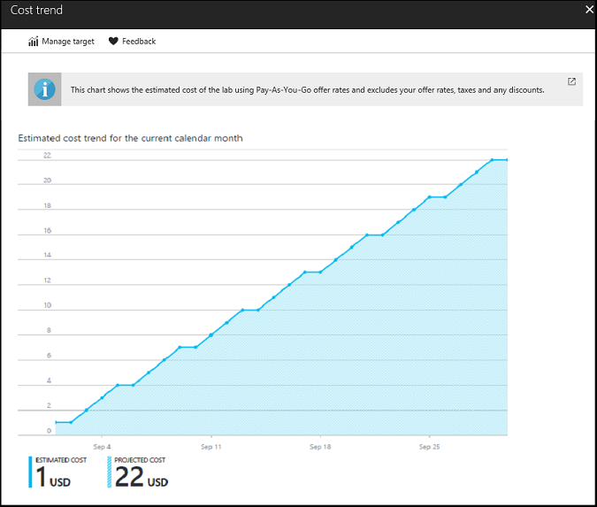
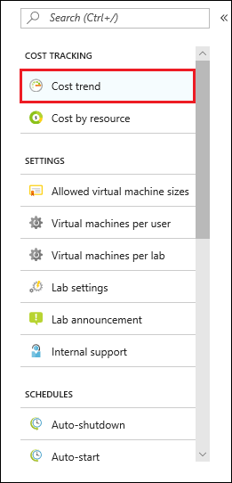
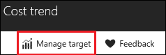
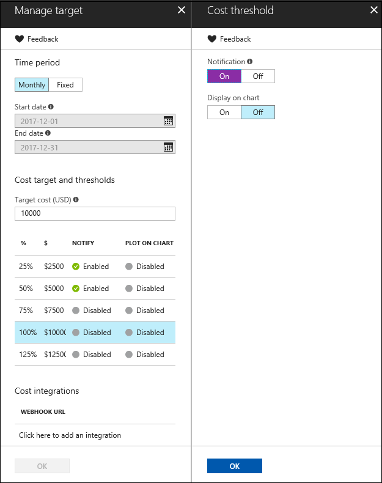

# View the monthly estimated lab cost trend in Azure DevTest Labs
The Cost Management feature of DevTest Labs helps you track the cost of your lab. 
This article illustrates how to use the **Monthly Estimated Cost Trend** chart 
to view the current calendar month's estimated cost-to-date and the projected end-of-month cost for the current calendar month. 
This article also shows you how to better manage lab costs by setting spending targets and thresholds that, when reached, trigger DevTest Labs to report the results to you.

## Viewing the Monthly Estimated Cost Trend chart
To view the Monthly Estimated Cost Trend chart, follow these steps: 

1. Sign in to the [Azure portal](http://go.microsoft.com/fwlink/p/?LinkID=525040).
1. If necessary, select **All Services**, and then select **DevTest Labs** from the list. (Your lab might already be shown on the Dashboard under **All Resources**).
1. From the list of labs, select the desired lab.  
1. On the lab's **Overview** area, select **Configuration and policies**.   
1. On the left under **COST TRACKING**, select **Cost trend**.

   The following screen shot shows an example of a cost chart. 
   
    

The **Estimated cost** value is the current calendar month's estimated cost-to-date. The **Projected cost** is the estimated cost for the entire current calendar month, calculated using the lab cost for the previous five days.

The cost amounts are rounded up to the next whole number. For example: 

* 5.01 rounds up to 6 
* 5.50 rounds up to 6
* 5.99 rounds up to 6

As it states above the chart, the costs you see by default in the chart are *estimated* costs using [Pay-As-You-Go](https://azure.microsoft.com/offers/ms-azr-0003p/) offer rates. You can also set your own spending targets that are displayed in the charts by [managing the cost targets for your lab.](#managing-cost-targets-for-your-lab)

Additionally, the following are *not* included in the cost calculation:

* CSP and Dreamspark subscriptions are currently not supported as Azure DevTest Labs uses the [Azure billing APIs](../billing/billing-usage-rate-card-overview.md) to calculate the lab cost, which does not support CSP or Dreamspark subscriptions.
* Your offer rates. Currently, you can't use the offer rates (shown under your subscription) that you have negotiated with Microsoft or Microsoft partners. Only Pay-As-You-Go rates are used.
* Your taxes
* Your discounts
* Your billing currency. Currently, the lab cost is displayed only in USD currency.

## Managing cost targets for your lab
DevTest Labs lets you better manage the costs in  your lab by setting a spending target that you can then view in the Monthly Estimated Cost Trend chart. DevTest Labs can also send you a notification when the specified target spending or threshold is reached. 

1. On your lab's **Overview** pane, select **Configuration and policies**.
1. On the left under **COST TRACKING**, select **Cost trend**.

    

1. In the **Cost trend** pane, select **Manage target**.

    

1. In the Manage target pane, specify your desired spending target and thresholds. You can also set whether each selected threshold is reported on the cost trend chart or through a webhook notification.

    

   - Select a time period during which you want cost targets tracked.
      - **Monthly**: cost targets are tracked per month.
      - **Fixed**: cost targets are tracked for the date range you specify in the Start date and End date fields. Typically, this might correspond with how long your project is scheduled to run.
   - Specify a **Target cost**. For example, this might be how much you plan to spend on this lab in the time period you defined.
   - Select to enable or disable any threshold you want reported – in increments of 25% – up to 125% of your specified **Target cost**.
      - **Notify**: When this threshold is met, you are notified by a webhook URL you specify.
      - **Plot on chart**: When this threshold is met, the results are plotted on the cost trend graph that you can view, as described in [Viewing the Monthly Estimated Cost Trend chart](#viewing-the-monthly-estimated-cost-trend-chart).
   - If you choose to **Notify** when the threshold is met, you must specify a webhook URL. In the Cost integrations area, select **Click here to add an integration**.

      Enter a Webhook URL in the Configure notification pane and then select **OK**.

       

      - If you specify **Notify**, you must define a webhook URL.
      - Likewise, if you define a webhook URL, you must set **Notification** to **On** in the Cost threshold pane.
      - You must create a webhook prior to entering it here.  

      For more information about webhooks, see [Create a webhook or API Azure Function](../azure-functions/functions-create-a-web-hook-or-api-function.md). 
 

[!INCLUDE [devtest-lab-try-it-out](../../includes/devtest-lab-try-it-out.md)]

## Related blog posts
* [Two more things to keep your cost on track in DevTest Labs](https://blogs.msdn.microsoft.com/devtestlab/2016/06/21/keep-your-cost-on-track/)
* [Why Cost Thresholds?](https://blogs.msdn.microsoft.com/devtestlab/2016/04/11/why-cost-thresholds/)

## Next steps
Here are some things to try next:

* [Define lab policies](devtest-lab-set-lab-policy.md) - Learn how to set the various policies used to govern how your lab and its VMs are used. 
* [Create custom image](devtest-lab-create-template.md) - When you create a VM, you specify a base, which can be either a custom image or a Marketplace image. This article illustrates
  how to create a custom image from a VHD file.
* [Configure Marketplace images](devtest-lab-configure-marketplace-images.md) - DevTest Labs supports creating VMs based on Azure Marketplace images. This article
  illustrates how to specify which, if any, Azure Marketplace images can be used when creating VMs in a lab.
* [Create a VM in a lab](devtest-lab-add-vm.md) - Illustrates how to create a VM from a base image (either custom or Marketplace), and how to work with
  artifacts in your VM.

