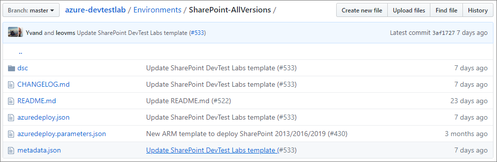
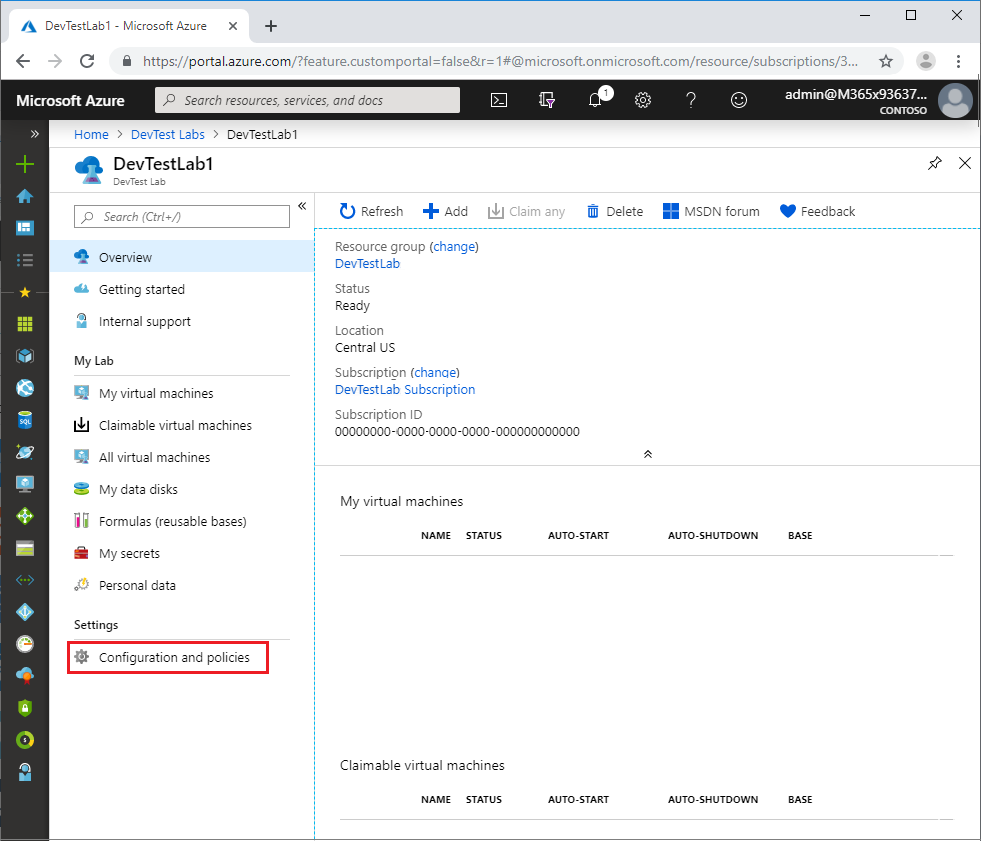
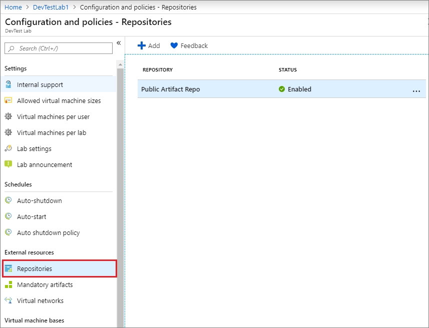
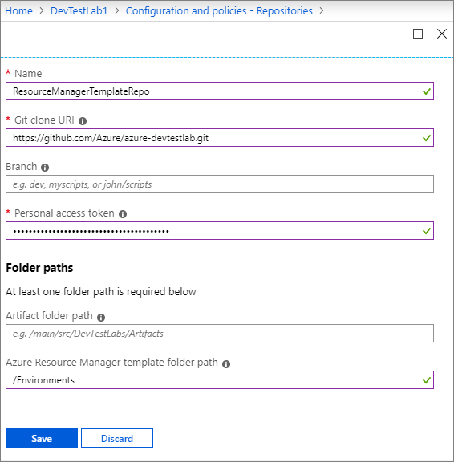
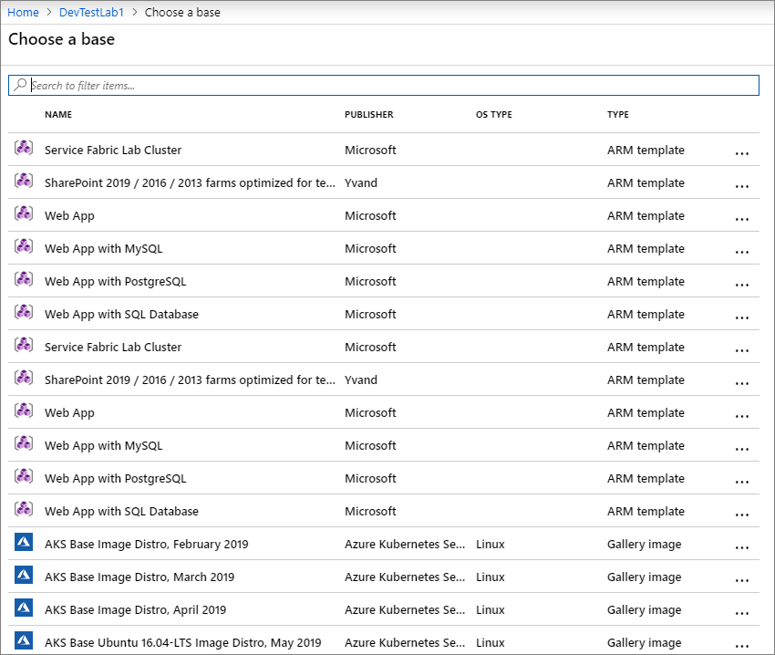
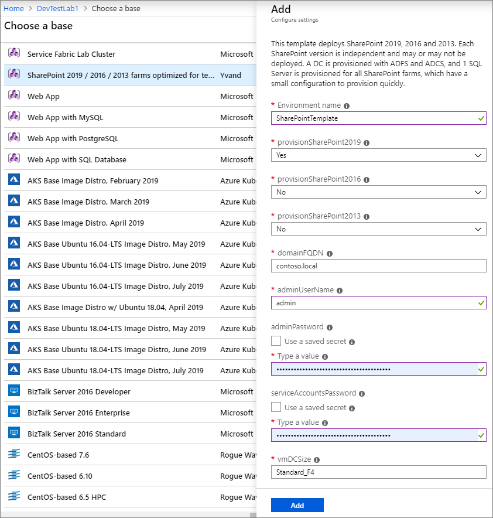
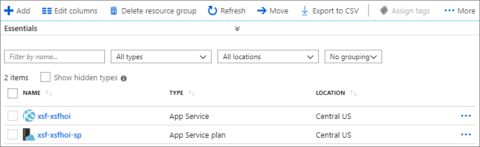
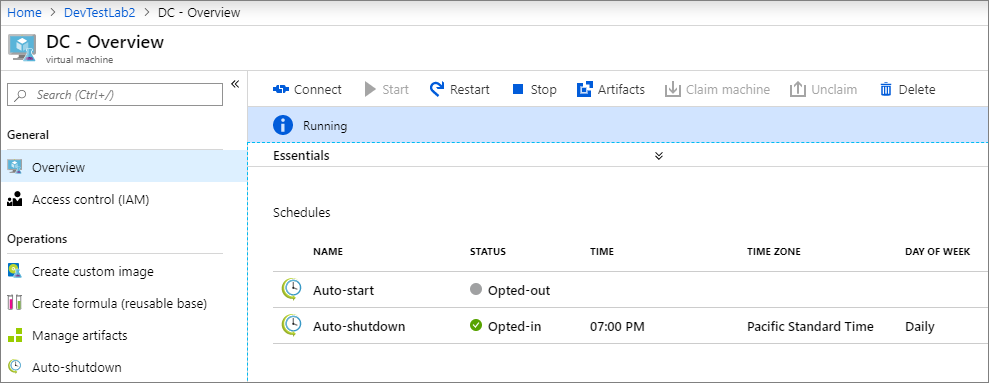

# Create multi-VM environments and PaaS resources with Azure Resource Manager templates

The [Azure portal](http://go.microsoft.com/fwlink/p/?LinkID=525040) enables you to easily [add one VM at a time to a lab](https://docs.microsoft.com/azure/devtest-lab/devtest-lab-add-vm). However, if the environment contains multiple VMs, each VM must be individually created. For scenarios such as a multi-tier Web app or a SharePoint farm, a mechanism is needed to allow for the creation of multiple VMs in a single step. By using Azure Resource Manager templates, you can now define the infrastructure and configuration of your Azure solution and repeatedly deploy multiple VMs in a consistent state. This feature provides the following benefits:

- Azure Resource Manager templates are loaded directly from your source control repository (GitHub or Azure DevOps Services Git).
- Once configured, your users can create an environment by picking an Azure Resource Manager template from the Azure portal, just as they do with other types of [VM bases](./devtest-lab-comparing-vm-base-image-types.md).
- Azure PaaS resources can be provisioned in an environment from an Azure Resource Manager template in addition to IaaS VMs.
- The cost of environments can be tracked in the lab in addition to individual VMs created by other types of bases.
- PaaS resources are created and will appear in cost tracking; however, VM auto shutdown does not apply to PaaS resources.

Learn more about the many [benefits of using Resource Manager templates](https://docs.microsoft.com/azure/azure-resource-manager/resource-group-overview#the-benefits-of-using-resource-manager) to deploy, update, or delete all of your lab resources in a single operation.

> [!NOTE]
> When you use a Resource Manager template as a basis to create more lab VMs, there are some differences to keep in mind whether you are creating Multi-VMs or single-VMs. [Use a virtual machine's Azure Resource Manager template](devtest-lab-use-resource-manager-template.md) explains these differences in greater detail.
>

## DevTest Labs public environments
Azure DevTest Labs has a [public repository of Azure Resource Manager templates](https://github.com/Azure/azure-devtestlab/tree/master/Environments) that you can use to create environments without having to connect to an external GitHub source by yourself. This repository includes frequently used templates such as Azure Web Apps, Service Fabric Cluster, and development SharePoint Farm environment. This feature is similar to the public repository of artifacts that is included for every lab that you create. The environment repository allows you to quickly get started with pre-authored environment templates with minimum input parameters to provide you with a smooth getting started experience for PaaS resources within labs. For more information, see [Configure and use public environments in DevTest Labs](devtest-lab-configure-use-public-environments.md).

## Configure your own template repositories
As one of the best practices with infrastructure-as-code and configuration-as-code, environment templates should be managed in source control. Azure DevTest Labs follows this practice and loads all Azure Resource Manager templates directly from your GitHub or Azure DevOps Services Git repositories. As a result, Resource Manager templates can be used across the entire release cycle, from the test environment to the production environment.

Check out the templates created by the DevTest Labs team in the [public GitHub repository](https://github.com/Azure/azure-devtestlab/tree/master/Environments). In this public repository, you can view templates shared by others that you can use directly or customize them to suit your needs. After you create your template, store it in this repository to share it with others. You can also set up your own Git repository with templates that can be used to set up environments in the cloud. 

There are a couple of rules to follow to organize your Azure Resource Manager templates in a repository:

- The master template file must be named `azuredeploy.json`. 

	

- If you want to use parameter values defined in a parameter file, the parameter file must be named `azuredeploy.parameters.json`.
- You can use the parameters `_artifactsLocation` and `_artifactsLocationSasToken` to construct the parametersLink URI value, allowing DevTest Labs to automatically manage nested templates. For more information, see [How Azure DevTest Labs makes nested Resource Manager template deployments easier for testing environments](https://blogs.msdn.microsoft.com/devtestlab/2017/05/23/how-azure-devtest-labs-makes-nested-arm-template-deployments-easier-for-testing-environments/).
- Metadata can be defined to specify the template display name and description. This metadata must be in a file named `metadata.json`. The following example metadata file illustrates how to specify the display name and description: 

    ```json
    { 
        "itemDisplayName": "<your template name>", 
        "description": "<description of the template>" 
	}
    ```

The following steps guide you through adding a repository to your lab using the Azure portal. 

1. Sign in to the [Azure portal](http://go.microsoft.com/fwlink/p/?LinkID=525040).
1. Select **All Services**, and then select **DevTest Labs** from the list.
1. From the list of labs, select the desired lab.   
1. On the lab's **Overview** pane, select **Configuration and Policies**.

	

1. From the **Configuration and Policies** settings list, select **Repositories**. The **Repositories** pane lists the repositories that have been added to the lab. A repository named `Public Repo` is automatically generated for all labs, and connects to the [DevTest Labs GitHub repo](https://github.com/Azure/azure-devtestlab) that contains several VM artifacts for your use.

	

1. Select **Add+** to add your Azure Resource Manager template repository.
1. When the second **Repositories** pane opens, enter the necessary information as follows:
	- **Name** - Enter the repository name that is used in the lab.
	- **Git clone URL** - Enter the GIT HTTPS clone URL from GitHub or Azure DevOps Services.  
	- **Branch** - Enter the branch name to access your Azure Resource Manager template definitions. 
	- **Personal access token** - The personal access token is used to securely access your repository. To get your token from Azure DevOps Services, select **&lt;YourName> > My profile > Security > Public access token**. To get your token from GitHub, select your avatar followed by selecting **Settings > Public access token**. 
	- **Folder paths** - Using one of the two input fields, enter the folder path that starts with a forward slash - / - and is relative to your Git clone URI to either your artifact definitions (first input field) or your Azure Resource Manager template definitions.   
	
		


1. Once all the required fields are entered and pass the validation, select **Save**.

The next section will walk you through creating environments from an Azure Resource Manager template.

## Create an environment from a Resource Manager template using the Azure portal

Once an Azure Resource Manager template repository has been configured in the lab, your lab users can create an environment using Azure portal with the following steps:

1. Sign in to the [Azure portal](http://go.microsoft.com/fwlink/p/?LinkID=525040).
1. Select **All Services**, and then select **DevTest Labs** from the list.
1. From the list of labs, select the desired lab.   
1. On the lab's pane, select **Add+**.
1. The **Choose a base** pane displays the base images you can use with the Azure Resource Manager templates listed first. Select the desired Azure Resource Manager template.

	
  
1. On the **Add** pane, enter the **Environment name** value. The environment name is what is displayed to your users in the lab. The remaining input fields are defined in the Azure Resource Manager template. If default values are defined in the template or the `azuredeploy.parameter.json` file is present, default values are displayed in those input fields. For parameters of type *secure string*, you can use the secrets stored in your Azure key vault. To learn about saving secrets in a key vault and using them when creating lab resources, see [Store secrets in Azure Key Vault](devtest-lab-store-secrets-in-key-vault.md).  

	

	> [!NOTE]
	> There are several parameter values that - even if specified - are displayed as empty values. Therefore, if users assign those values to parameters in an Azure Resource Manager template, DevTest Labs does not display the values. Instead, blank input fields are shown where lab users must enter a value when creating the environment.
	> 
	> - GEN-UNIQUE
	> - GEN-UNIQUE-[N]
	> - GEN-SSH-PUB-KEY
	> - GEN-PASSWORD 
 
1. Select **Add** to create the environment. The environment starts provisioning immediately with the status displaying in the **My virtual machines** list. A new resource group is automatically created by the lab to provision all the resources defined in the Azure Resource Manager template.
1. Once the environment is created, select the environment in the **My virtual machines** list to open the resource group pane and browse all of the resources provisioned in the environment.
	
	
   
   You can also expand the environment to view just the list of VMs that are provisioned in the environment.
	
	

1. Click any of the environments to view the available actions - such as applying artifacts, attaching data disks, changing auto-shutdown time, and more.

	

## Deploy a Resource Manager template to create a VM
After you have saved a Resource Manager template and customized it for your needs, you can use it to automate VM creation. 
- [Deploy resources with Resource Manager templates and Azure PowerShell](https://docs.microsoft.com/azure/azure-resource-manager/resource-group-template-deploy) describes how to use Azure PowerShell with Resource Manager templates to deploy your resources to Azure. 
- [Deploy resources with Resource Manager templates and Azure CLI](https://docs.microsoft.com/azure/azure-resource-manager/resource-group-template-deploy-cli) describes how to use Azure CLI with Resource Manager templates to deploy your resources to Azure.

> [!NOTE]
> Only a user with lab owner permissions can create VMs from a Resource Manager template by using Azure PowerShell. If you want to automate VM creation using a Resource Manager template and you only have user permissions, you can use the [**az lab vm create** command in the CLI](https://docs.microsoft.com/cli/azure/lab/vm#az-lab-vm-create).

### General limitations 

Consider these limitations when using a Resource Manager template in DevTest Labs:

- Any Resource Manager template you create cannot refer to existing resources; it can only refer to new resources. In addition, if you have an existing Resource Manager template that you typically deploy outside of DevTest Labs and it contains references to existing resources, it can't be used in the lab.

   The only exception to this is that you **can** reference an existing virtual network. 

- Formulas can't be created from lab VMs that were created from a Resource Manager template. 

- Custom images can't be created from lab VMs that were created from a Resource Manager template. 

- Most policies are not evaluated when you deploy Resource Manager templates.

   For example, you might have a lab policy specifying that a user can only create five VMs. However, a user can deploy a Resource Manager template that creates dozens of VMs. Policies that are not evaluated include:

   - Number of VMs per user
   - Number of premium VMs per lab user
   - Number of premium disks per lab user


### Configure environment resource group access rights for lab users

Lab users can deploy a Resource Manager template. But by default, they have Reader access rights, which means they can’t change the resources in an environment resource group. For example, they cannot stop or start their resources.

Follow these steps to give your lab users Contributor access rights. Then, when they deploy a Resource Manager template, they will be able to edit the resources in that environment. 


1. On your lab's **Overview** pane, select **Configuration and policies**.
1. Select **Lab settings**.
1. In the Lab Settings pane, select **Contributor** to grant write permissions to lab users.

	

1. Select **Save**.

## Next steps
* Once a VM has been created, you can connect to the VM by selecting **Connect** on the VM's management pane.
* View and manage resources in an environment by selecting the environment in the **My virtual machines** list in your lab. 
* Explore the [Azure Resource Manager templates from Azure Quickstart template gallery](https://github.com/Azure/azure-quickstart-templates).
