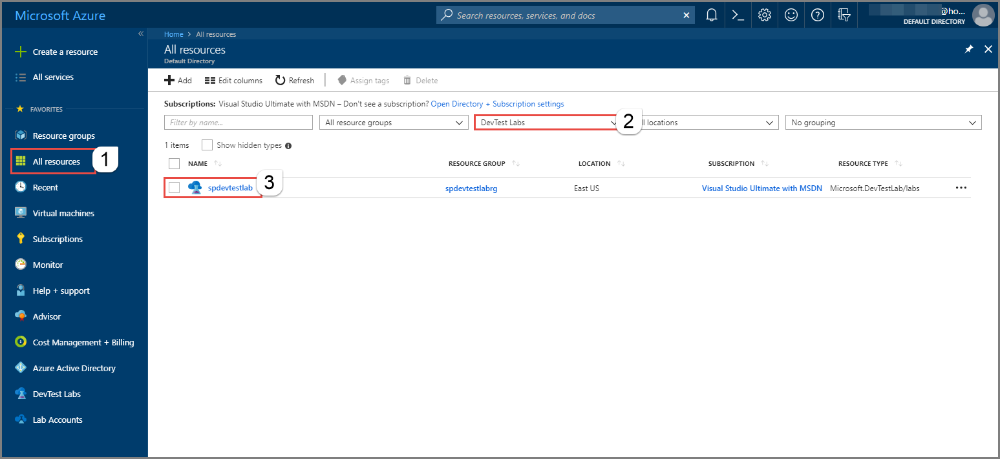
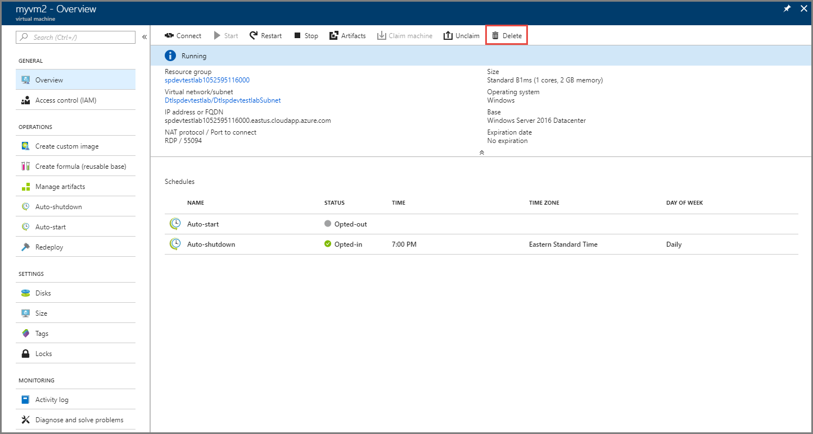

# Delete a lab or VM in a lab in Azure DevTest Labs
This article shows you how to delete a lab or VM in a lab.

## Delete a lab
When you delete a DevTest Labs instance from a resource group, the DevTest Labs service performs the following actions: 

- All the resources that were automatically created at the time of lab creation are automatically deleted. The resource group itself is not deleted. If you had manually created any resources this resource group, the service doesn't delete them. 
- All VMs in the lab and resource groups associated with these VMs are automatically deleted. When you create a VM in a lab, the service creates resources (disk, network interface, public IP address, etc.) for the VM in a separate resource group. However, if you manually create any additional resources in these resource groups, the DevTest Labs service does not delete those resources and the resource group. 

To delete a lab, do the following actions: 

1. Sign in to the [Azure portal](https://portal.azure.com).
2. Select **All resource** from menu on the left, select **DevTest Labs** for the type of service, and select the lab.

    
3. On the **DevTest Lab** page, click **Delete** on the toolbar. 

    
4. On the **Confirmation** page, enter the **name** of your lab, and select **Delete**. 

    
5. To see the status of the operation, select **Notifications** icon (Bell). 

    

 
## Delete a VM in a lab
If I delete a VM in a lab, some of the resources (not all) that were created at the time of lab creation are deleted. The following resources are not deleted: 

-	Key vault in the main resource group
-	Availability set, load balancer, public IP address in the VM resource group. These resources are shared by multiple VMs in a resource group. 

Virtual machine, network interface, and disk associated with the VM are deleted. 

To delete a VM in a lab, do the following actions: 

1. Sign in to the [Azure portal](https://portal.azure.com).
2. Select **All resource** from menu on the left, select **DevTest Labs** for the type of service, and select the lab.

    
3. Select **... (ellipsis)** for the VM in the list of VMs, and select **Delete**. 

    
4. On the **confirmation** dialog box, select **Ok**. 
5. To see the status of the operation, select **Notifications** icon (Bell). 

To delete a VM from the **Virtual Machine page**, select **Delete** from the toolbar as shown in the following image:

 

## Next steps
If you want to create a lab, see the following articles: 

- [Create a lab](devtest-lab-create-lab.md)
- [Add a VM to the lab](devtest-lab-add-vm.md)