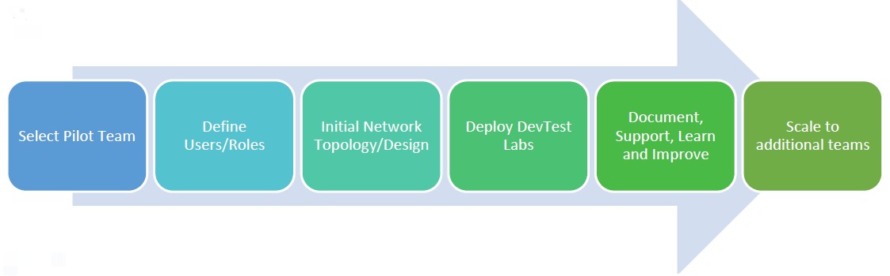

# Orchestrate the implementation of Azure DevTest Labs
This article provides a recommended approach for rapid deployment and implementation of Azure DevTest Labs. The following image emphasizes the overall process as prescriptive guidance while observing flexibility for supporting various industry requirements and scenarios.

## Assumptions
This article assumes that you have the following items in place before implementing a DevTest Labs pilot:

- **Azure subscription**: The pilot team has access to deploying resources into an Azure subscription. If the workloads are only development and testing, it’s recommended to select the Enterprise DevTest offer for additional available images and lower rates on Windows virtual machines.
- **On-Premises Access**: If necessary, on-premises access has already been configured. The on-premises access can be accomplished via a Site-to-site VPN connection or via Express Route. Connectivity via Express Route can typically take many weeks to establish, it’s recommended to have the Express Route in place before starting the project.
- **Pilot Teams**: The initial development project team(s) that uses DevTest Labs has been identified along with applicable development or testing activities and establish requirements/goals/objectives for those teams.

## Milestone 1: Establish initial network topology and design
The first area of focus when deploying an Azure DevTest Labs solution is to establish the planned connectivity for the virtual machines. The following steps outline the necessary procedures:

1. Define **initial IP address ranges** that are assigned to the DevTest Labs subscription in Azure. This step requires forecasting the expected usage in number of VMs so that you can provide a large enough block for future expansion.
2. Identify **methods of desired access** into the DevTest Labs (for example, external / internal access). A key point in this step is to determine whether virtual machines have public IP addresses (that is, accessible from the internet directly).
3. Identify and establish **methods of connectivity** with the rest of the Azure cloud environment and on-premises. If the forced routing with Express Route is enabled, it’s likely that the virtual machines need appropriate proxy configurations to traverse the corporate firewall.
4. If VMs are to be **domain joined**, determine whether they join a cloud-based domain (AAD Directory Services for example) or an on-premises domain. For on-premises, determine which organizational unit (OU) within active directory that the virtual machines joins. In addition, confirm that users have access to join (or establish a service account that has the ability to create machine records in the domain)

## Milestone 2: Deploy the pilot lab
Once the network topology is in place, the first/pilot lab can be created by taking the following the steps:

1. Create an initial DevTest Labs environment (step-by-step instructions can be found [here](https://github.com/Azure/fta-devops/blob/master/devtest-labs/articles/devtest-labs-walkthrough-it.md))
2. Determine allowable VM images and sizes for use with lab. Decide whether custom images can be uploaded into Azure for use with DevTest Labs.
3. Secure access to the lab by creating initial Role Base Access Controls (RBAC) for the lab (lab owners and lab users). We recommend that you use synchronized active directory accounts with Azure Active Directory for identity with DevTest Labs.
4. Configure DevTest Labs to use policies such as schedules, cost management, claimable VMs, custom images, or formulas.
5. Establish an online repository such as Azure Repos/Git.
6. Decide on the use of public or private repositories or combination of both. Organize JSON Templates for deployments and long-term sustainment.
7. If needed, create custom artifacts. This step is optional. 

## Milestone 3: Documentation, support, learn, and improve
The initial pilot teams may require in-depth support for getting started. Use their experiences to ensure the right documentation and support is in place for continued rollout of Azure DevTest Labs.

1. Introduce the pilot teams to their new DevTest Labs resources (demos, documentation)
2. Based on pilot teams' experiences, plan and deliver documentation as needed
3. Formalize process for onboarding new teams (creating and configuring labs, providing access, etc)
4. Based on initial uptake, verify original forecast of IP address space is still reasonable and accurate
5. Ensure appropriate compliance and security reviews have been completed

## Next steps
See the next article in this series: [Governance of Azure DevTest Labs infrastructure](devtest-lab-guidance-governance-resources.md)
