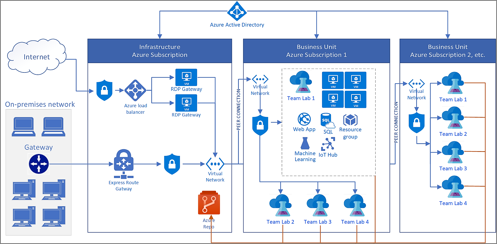

# Azure DevTest Labs - Reference architecture for an enterprise
This article provides a reference architecture for deploying a solution based on Azure DevTest Labs in an Enterprise. It includes on-premises connectivity via Express Route, a remote desktop gateway to remotely signing into virtual machines, connectivity to an artifact repository for private artifacts, and other PaaS services used in a lab.

## Architecture
The key elements in the reference architecture are:

- **Azure Active Directory (AAD)**: Azure DevTest Labs uses the [Azure Active Directory service for identity management](../active-directory/fundamentals/active-directory-whatis.md). There are two key things to consider in providing access to an environment based on DevTest Labs to users:
    - **Resource management**:  It provides access to the Azure portal to manage resources (create virtual machines, create environments, start/stop/restart/delete/applyartifacts, and so on). It's done in Azure using Roble-based access control (RBAC) and by applying a role assignment for the user, setting resource, and access level permissions.
    - **Virtual machines (network-level)**:  In the default configuration, virtual machines use a local admin account.  If there is a domain available ([AAD Domain services](../active-directory-domain-services/active-directory-ds-overview.md), an on-premises domain, or a cloud-based domain), machines can be joined to the domain. Once joined, users would use their domain-based identities to connect to the VMs.
- **On-Premises connectivity**: In the architecture diagram above, [Express Route](../expressroute/expressroute-introduction.md) i used,  but you can also use a [Site-to-Site VPN](../vpn-gateway/vpn-gateway-about-vpn-gateway-settings.md). Although it's not required for DevTest Labs, it’s commonly seen in enterprises. It's required only if there is a reason to connect to corporate resources. Common reasons are: 
    - On-premises data that cannot be moved to the cloud yet
    - Preference to join the lab's virtual machines to the on-premises domain
    - Forcing all network traffic in and out of the cloud environment through an on-premises firewall for security/compliance reasons
- **Network security groups**: A common way to restrict traffic to the cloud environment (or within the cloud environment) based on source and destination IP addresses is to use a [network security group](../virtual-network/security-overview.md). For example, allowing only the network traffic originating from the corporate network into the lab’s networks.
- **Remote desktop gateway**:  Enterprises typically block outgoing remote desktop connections at the corporate firewall. To enable connectivity to the cloud-based environment in DevTest Labs, there are several options like using a [remote desktop gateway](/windows-server/remote/remote-desktop-services/desktop-hosting-logical-architecture) (whitelist the static IP for the gateway load balancer) or [directing all incoming RDP traffic](../vpn-gateway/vpn-gateway-forced-tunneling-rm.md) over the Express Route/Site-to-Site VPN connection. It's a common consideration when planning a deployment of DevTest Labs in the Enterprise.
- **Azure networking (VNets, Subnets)**:  The [Azure networking](../networking/networking-overview.md) topology is another key element in the overall DevTest Labs architecture. It enables resources from labs to communicate (or not), access to on-premises (or not) and access to the internet (or not). The architecture diagram includes the most common way customers are using DevTest Labs (all labs connected via [VNet Peering](../virtual-network/virtual-network-peering-overview.md) using a [hub-spoke model](/architecture/reference-architectures/hybrid-networking/hub-spoke) to the Express Route/Site-to-Site VPN connection to on-premises), but since DevTest Labs uses Azure Networking directly there aren’t any restrictions on how to set up the networking infrastructure.
- **DevTest Labs**:  DevTest Labs is a key part of the overall architecture. To learn about the service, see [About DevTest Labs](devtest-lab-overview.md).
- **Virtual machines and other resources (SaaS, PaaS, IaaS)**:  One of the key workloads supported by DevTest Labs are virtual machines along with other Azure resources.  DevTest Labs makes it easy and fast for an enterprise to give access to Azure resources (including Virtual Machines and other Azure Resources).  Learn more about access to Azure for [developers](devtest-lab-developer-lab.md) and [testers](devtest-lab-test-env.md).

## Scalability considerations
Although DevTest Labs doesn’t have any built-in quotas or limits, other Azure resources are used in the typical operations of a lab do have [subscription-level quotas](../azure-subscription-service-limits.md). As a result, in a typical enterprise deployment, you must have multiple Azure subscriptions to cover a large deployment of DevTest Labs. The quotas most commonly reached by enterprises are:

- **Resource groups**:  In the default configuration, DevTest Labs creates a resource group for every new virtual machine or an environment that a user creates using the service. Subscriptions can contain a [maximum of 980 resource groups](../azure-subscription-service-limits.md#subscription-limits---azure-resource-manager), so this limit is the upper limit of virtual machines and environments in a subscription. There are two other configurations you should consider:
    - **[All virtual machines go to the same resource group](resource-group-control.md)**:  Although it helps you with the resource group limit, it impacts the resource type per resource group limit.
    - **Using Shared Public IPs**:  All VMs of the same size and same region go into the same resource group. It's a ‘middle ground’ between resource group quotas and resource type per resource group quotas if virtual machines are allowed to have Public IP addresses. 
- **Resources per resource group per resource Type**: The default limit for [Resources per resource Group per resource Type is 800](../azure-subscription-service-limits.md#resource-group-limits).  When using the all VMs go to the same resource group configuration, users will hit this subscription limit much sooner, especially if the VMs have many extra disks.
- **Storage accounts**: A lab in DevTest Labs comes with a storage account and the Azure quota for [number of storage accounts per region per subscription is 250](../azure-subscription-service-limits.md#storage-limits). It means that the upper limit for number of DevTest Labs in the same region is also 250.
- **Role assignments**: A role assignment is how to give a user or principal access to a resource (owner, resource, permission level). In Azure, there a [limit of 2000 role assignments per subscription](../azure-subscription-service-limits.md#role-based-access-control-limits). The DevTest Labs service (in the default configuration) creates a resource group for each VM and the owner will be granted the **Owner** permission for the DevTest Labs VM and **Reader** permission to the resource group.  In this way, each new VM created uses two additional role assignments to role assignments created when giving users permission to the lab.
- **API reads/writes**: There are various ways (REST APIs, PowerShell, CLI, Azure SDK, and so on) to automate Azure and DevTest Labs and through the automation it’s possible to hit another limit on API requests. Each subscription allows up to [12000 read requests and 1200 write requests per hour](../azure-resource-manager/resource-manager-request-limits.md).  It’s a limit to be aware of when automating DevTest Labs.

## Manageability considerations
DevTest Labs has a great administrative user interface when working with a single lab. In an enterprise, there are likely multiple Azure Subscriptions and many labs. It means that making changes to all the labs consistently requires scripting/automation.  Here are some examples and best ways to manage the DevTest Labs deployment:

- **Changes to lab settings**: A common scenario is to update a specific lab setting across all the labs in the deployment. For example, a new VM instance size is available and all labs must be updated to allow it.  It’s best to automate these changes by using Azure PowerShell scripts, Azure CLI, or REST APIs.  
- **Artifact repository personal access token**:  Typically, personal access tokens for a Git repo expire (90 days, 1 yr, 2 yrs). To ensure continuity, it’s important to either extend the personal access token or create a new one and use automation to apply the new personal access token to all the labs.
- **Restricting changes to a lab setting**:  It’s often the case where there is a particular setting (for example, allowing Marketplace Images to be used) that must be restricted. It can be done either via Azure policy (preventing changes to that resource type) or by creating a custom role and granting that role instead of ‘owner’ to the lab. It can be done for most of the settings in the lab (Internal Support, Lab Announcement, Allowed VM sizes, and so on)
- **Requiring VMs follow a naming convention**: It's a common request to easily identify VMs that are part of the cloud-based development and testing environment. You can do so [with Azure Policy](https://github.com/Azure/azure-policy/tree/master/samples/TextPatterns/allow-multiple-name-patterns).

It’s important to note that DevTest Labs uses underlying resources in Azure (networking, disks, compute, so on) that are managed the same way in Azure.  For example, Azure policy applies to Virtual Machines created in a lab. The Azure Security center can report on VM compliance. The Azure Backup Service can provide regular backups for VMs in the lab, and so on. 

## Security considerations
Azure DevTest Labs uses existing resources in Azure (compute, networking, and so on) and thus automatically benefits from all the great security features built-in to the platform. For example, to secure any incoming remote desktop connections to only originate from the corporate network, it’s as simple as adding a network security group to the virtual network on the remote desktop gateway. The only additional security consideration for Azure DevTest Labs is the level of permissions provided to team members who will be using the labs on a day to day basis.  The common permissions given are [“Owner” and ”DevTest Labs User”](devtest-lab-add-devtest-user.md). For more information about these roles, see [Add owners and users in Azure DevTest Labs](devtest-lab-add-devtest-user.md).

## Next Steps
See the next article in this series: [Scale up your Azure DevTest Labs infrastructure](devtest-lab-guidance-scale.md)
