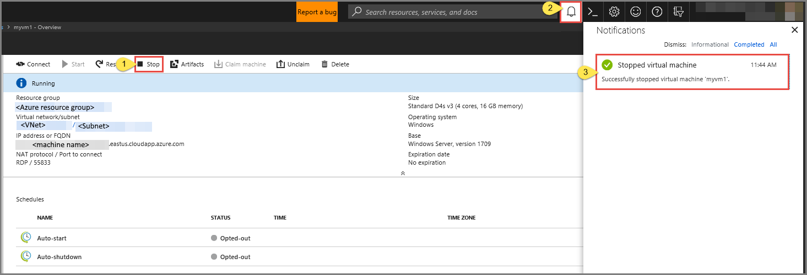
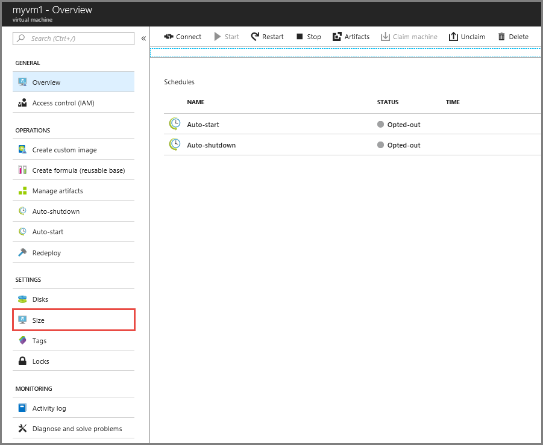
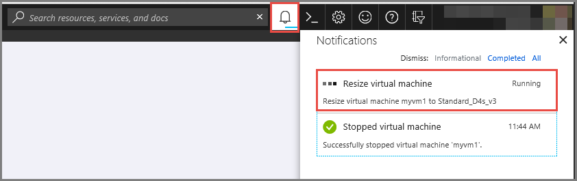

# Resize a VM in a lab in Azure DevTest Labs
One of the important features of Azure virtual machines is that it lets you change the size of a virtual machine (VM) based on your needs for CPU, network, or disk performance. Azure DevTest Labs supports this feature for VMs in a lab now. The resize feature adheres to the lab policy for allowed VM sizes in the lab. That is, you can change the size of a VM to only allowed sizes in the lab. 

## Steps to resize a VM in a lab 
To resize a VM in a lab in Azure DevTest Labs, take the following steps: 

> [!NOTE]
> If you are connected to the VM via a remote desktop session (RDP), save your work, and disconnect from the VM before resizing it.

1. Sign in to the [Azure portal](https://portal.azure.com).
2. Select **All Services**, and then select **DevTest Labs** from the list.
3. From the list of labs, select the lab that includes the VM  you want to resize.  
4. In the left panel, select **My Virtual Machines**. 
5. From the list of VMs, select a VM.
6. Select **Stop** on the toolbar if the VM is running. Check the status of the operation in the **Notifications** window. Wait until the VM is stopped and then close the **Notifications** window. 

    
1. In the Virtual Machine page for your VM, select **Size** under **SETTINGS** in the left menu.

    
1. In the **Choose a size** window, browse and select a size for your VM, and click **Select**.     
1. Check the status of the resize operation in the **Notifications** window.

    
10. After the resize operation succeeds, close the **Notifications** window. 
11. Select **Overview** in the left menu, and select **Restart** on the toolbar to restart the VM. 

## Next steps
For detailed information about the resize feature supported by Azure virtual machines, see [Resize virtual machines](https://azure.microsoft.com/blog/resize-virtual-machines/).

