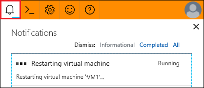

# Restart a VM in a lab in Azure DevTest Labs
You can quickly and easily restart a virtual machine in  DevTest Labs by following the steps in this article. Consider the following before restarting a VM:

- The VM must be running for the restart feature to be enabled.
- If a user is connected to a running VM when they perform a restart, they must reconnect to the VM after it starts back up.
- If an artifact is being applied when you restart the VM, you receive a warning that the artifact might not be applied.

    

   > [!NOTE]
   > If the VM has stalled while applying an artifact, you can use the restart VM feature as a potential way to resolve the issue.
   >
   >

## Steps to restart a VM in a lab in Azure DevTest Labs
1. Sign in to the [Azure portal](https://go.microsoft.com/fwlink/p/?LinkID=525040).
1. Select **All Services**, and then select **DevTest Labs** from the list.
1. From the list of labs, select the lab that includes the VM  you want to restart.
1. In the left panel, select **My Virtual Machines**.
1. From the list of VMs, select a running VM.
1. At the top of the VM management pane, select **Restart**.

    

1. Monitor the status of the restart by selecting the **Notifications** icon at the top right of the window.

    

You can also restart a running VM by selecting its ellipsis (...) in the list of **My Virtual Machines**.

## Next steps
* Once it is restarted, you can reconnect to the VM by selecting **Connect** on the its management pane.
* Explore the [DevTest Labs Azure Resource Manager quickStart template gallery](https://github.com/Azure/azure-devtestlab/tree/master/samples/DevTestLabs/QuickStartTemplates)
