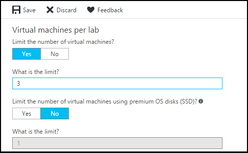

# Manage all policies for a lab in Azure DevTest Labs

Azure DevTest Labs lets you control cost and minimize waste in your labs by managing policies (settings) for each lab. This article explains in step-by-step detail how to set each policy.  

## Set allowed virtual machine sizes
The policy for setting the allowed VM sizes helps to minimize lab waste by enabling you to specify which VM sizes are allowed in the lab. If this policy is activated, only VM sizes from this list can be used to create VMs.

1. In the [Azure portal](http://go.microsoft.com/fwlink/p/?LinkID=525040), select a lab and then select **Configuration and policies**.

    

1. On the lab's **Configuration and policies** pane, select **Allowed virtual machines sizes**.
   
    

1. Select **On** to enable this policy, and **Off** to disable it.

1. If you enable this policy, select one or more VM sizes that can be created in your lab.

1. Select **Save**.

## Set virtual machines per user
The policy for **Virtual machines per user** lets you specify the maximum number of VMs that can be created by an individual user. If a user attempts to create or claim a VM when the user limit has been met, an error message indicates that the VM cannot be created/claimed. 

1. On the lab's **Configuration and policies** pane, select **Virtual machines per user**.
   
    

1. Select **Yes** to limit the number of VMs per user. If you do not want to limit the number of VMs per user, select **No**. If you select **Yes**, enter a numeric value indicating the maximum number of VMs that can be created or claimed by a user. 

1. Select **Yes** to limit the number of VMs that can use SSD (solid-state disk). If you do not want to limit the number of VMs that can use SSD, select **No**. If you select **Yes**, enter a value indicating the maximum number of VMs that can be created using SSD. 

1. Select **Save**.

## Set virtual machines per lab
The policy for **Virtual machines per lab** lets you specify the maximum number of VMs that can be created for the current lab. If a user attempts to create a VM when the lab limit has been met, an error message indicates that the VM cannot be created. 

1. On the lab's **Configuration and policies** pane, select **Virtual machines per lab**.
   
    

1. Select **Yes** to limit the number of VMs per lab. If you do not want to limit the number of VMs per lab, select **No**. If you select **Yes**, enter a numeric value indicating the maximum number of VMs that can be created or claimed by a user. 

1. Select **Yes** to limit the number of VMs that can use SSD (solid-state disk). If you do not want to limit the number of VMs that can use SSD, select **No**. If you select **Yes**, enter a value indicating the maximum number of VMs that can be created using SSD. 

1. Select **Save**.

## Set auto-shutdown
The auto-shutdown policy helps minimize lab waste by letting you specify the time that this lab's VMs shut down.

1. On the lab's **Configuration and policies** pane, select **Auto-shutdown**.
   
    

1. Select **On** to enable this policy, and **Off** to disable it.

1. If you enable this policy, specify the time (and time zone) to shut down all VMs in the current lab.

1. Specify **Yes** or **No** for the option to send a notification 15 minutes prior to the specified auto-shutdown time. If you choose **Yes**, enter a webhook URL endpoint or an email address specifying where you want the notification to be posted or sent. The user receives notification and is given the option to delay the shutdown.

   For more information about webhooks, see [Create a webhook or API Azure Function](../azure-functions/functions-create-a-web-hook-or-api-function.md). 

1. Select **Save**.

By default, once enabled, this policy applies to all VMs in the current lab. To remove this setting from a specific VM, open the VM's management pane and change its **Auto-shutdown** setting.

## Set auto-start
The auto-start policy lets you specify when the VMs in the current lab should be started.  

1. On the lab's **Configuration and policies** pane, select **Auto-start**.
   
    

2. Select **On** to enable this policy, and **Off** to disable it.

3. If you enable this policy, specify the scheduled start time, time zone, and the days of the week for which the time applies. 

4. Select **Save**.

Once enabled, this policy is not automatically applied to any VMs in the current lab. To apply this setting to a specific VM, open the VM's management pane and change its **Auto-start** setting.

## Set expiration date
You can set an expiration date when you [create the VM](devtest-lab-add-vm.md). In **Advanced settings**, choose the calendar icon to specify a date on which the VM is automatically deleted. By default, the VM never expires.

[!INCLUDE [devtest-lab-try-it-out](../../includes/devtest-lab-try-it-out.md)]

## Next steps
Once you've defined and applied the various VM policy settings for your lab, here are some things to try next:

* [Understand shared IP addresses](devtest-lab-shared-ip.md) - Explains how shared IP addresses are used in DevTest Labs to minimize the number of public IP addresses required to connect to your lab VMs.
* [Configure cost management](devtest-lab-configure-cost-management.md) - Illustrates how to use the **Monthly Estimated Cost Trend** chart  
  to view the current month's estimated cost-to-date and the projected end-of-month cost.
* [Create custom image](devtest-lab-create-template.md) - When you create a VM, you specify a base, which can be either a custom image or a Marketplace image. This article illustrates
  how to create a custom image from a VHD file.
* [Configure Marketplace images](devtest-lab-configure-marketplace-images.md) - Azure DevTest Labs supports creating VMs based on Azure Marketplace images. This article
  illustrates how to specify which, if any, Azure Marketplace images can be used when creating VMs in a lab.
* [Create a VM in a lab](devtest-lab-add-vm.md) - Illustrates how to create a VM from a base image (either custom or Marketplace), and how to work with
  artifacts in your VM.

