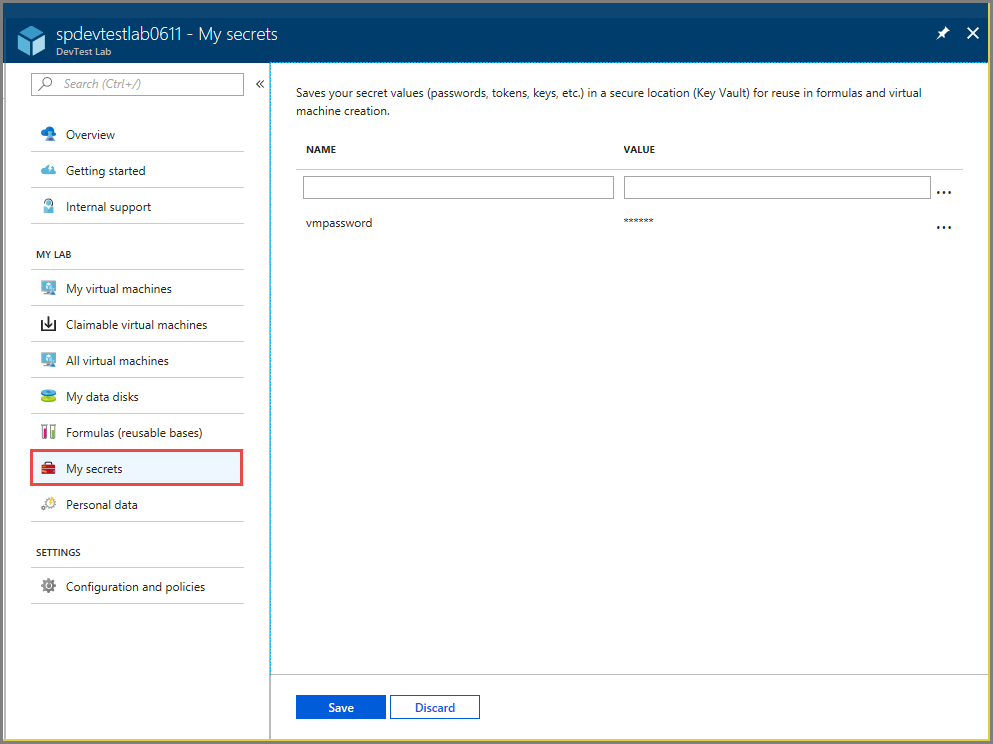
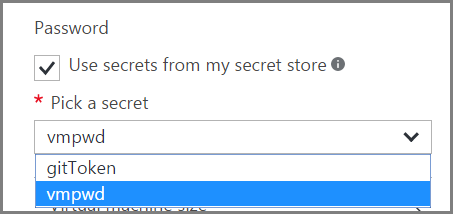

# Store secrets in a key vault in Azure DevTest Labs
You're often asked to enter a complex secret when using Azure DevTest Labs: password for your Windows VM, public SSH key for your Linux VM, or personal access token to clone your Git repo through an artifact. Because secrets are usually long and have random characters, making sure that the input is correct can be tricky.

To solve this problem but also to keep your secrets in a safe place, DevTest Labs has introduced a personal secret store for each lab user. There, you can save your secret with a name into the key vault that DevTest Labs creates for you, and use it later.

## Store a secret 
To save your secret into your secret store, go to My secret store and enter a name and your secret as the value.

## Use a secret

### Use a secret when creating a VM
In the DevTest Labs portal, when a secret is needed to create a VM or to use an artifact, in addition to an input box asking for the secret, you'll see a check box where you can select to use the secrets from the secret store. After it's selected, the input box will turn into a drop-down list, where you can simply pick a secret.

### Use a secret when creating a formula or an environment 
In addition to creating VMs and using artifacts, you can save your secret name with formulas and Azure Resource Manager templates. Here's an example of how it's used in a Resource Manager template to provision a new lab VM:

## Next steps
* Once the VM has been created, you can connect to the VM by selecting **Connect** on the VM's pane.
* Learn how to [create custom artifacts for your DevTest Labs VM](devtest-lab-artifact-author.md).
* Explore the [DevTest Labs Azure Resource Manager QuickStart template gallery](https://github.com/Azure/azure-devtestlab/tree/master/Samples).
