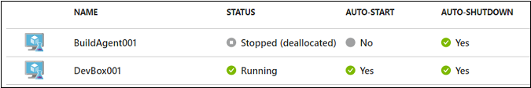
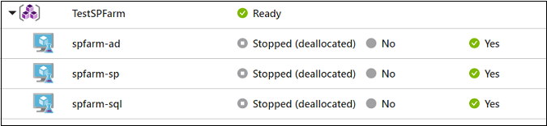
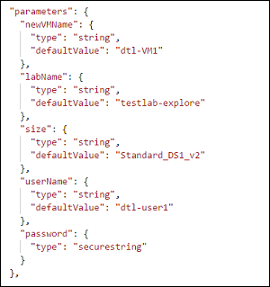

# Create virtual machines using an Azure Resource Manager template 

When you are creating a virtual machine (VM) in DevTest Labs through the [Azure portal](https://go.microsoft.com/fwlink/p/?LinkID=525040), you can view the Azure Resource Manager template before you save the VM. The template can then be used as a basis to create more lab VMs with the same settings.

This article describes Multi-VM vs. single-VM Resource Manager templates and shows you how to view and save a template when creating a VM.

[!INCLUDE [updated-for-az](../../includes/updated-for-az.md)]

## Multi-VM vs. single-VM Resource Manager templates
There are two ways to create VMs in DevTest Labs using a Resource Manager template: provision the Microsoft.DevTestLab/labs/virtualmachines resource or provision the Microsoft.Compute/virtualmachines resource. Each is used in different scenarios and requires different permissions.

- Resource Manager templates that use a Microsoft.DevTestLab/labs/virtualmachines resource type (as declared in the “resource” property in the template) can provision individual lab VMs. Each VM then shows up as a single item in the DevTest Labs virtual machines list:

   

   This type of Resource Manager template can be provisioned through the Azure PowerShell command **New-AzResourceGroupDeployment** or through the Azure CLI command **az group deployment create**. It requires administrator permissions, so users who are assigned with a DevTest Labs user role can’t perform the deployment. 

- Resource Manager templates that use a Microsoft.Compute/virtualmachines resource type can provision multiple VMs as a single environment in the DevTest Labs virtual machines list:

   

   VMs in the same environment can be managed together and share the same lifecycle. Users who are assigned with a DevTest Labs user role can create environments using those templates as long as the administrator has configured the lab that way.

The remainder of this article discusses Resource Manager templates that use Microsoft.DevTestLab/labs/virtualmachines. These are used by lab admins to automate lab VM creation (for example, claimable VMs) or golden image generation (for example, image factory).

[Best practices for creating Azure Resource Manager templates](https://docs.microsoft.com/azure/azure-resource-manager/resource-manager-template-best-practices) offers many guidelines and suggestions to help you create Azure Resource Manager templates that are reliable and easy to use.

## View and save a virtual machine's Resource Manager template
1. Follow the steps at [Create your first VM in a lab](tutorial-create-custom-lab.md#add-a-vm-to-the-lab) to begin creating a virtual machine.
1. Enter the required information for your virtual machine and add any artifacts you want for this VM.
1. Swtich to the **Advanced Settings** tab. 
1. At the bottom of the Configure settings window, choose **View ARM template**.
1. Copy and save the Resource Manager template to use later to create another virtual machine.

   

After you have saved the Resource Manager template, you must update the parameters section of the template before you can use it. You can create a parameter.json that customizes just the parameters, outside of the actual Resource Manager template. 

The Resource Manager template is now ready to use to [create a VM](devtest-lab-create-environment-from-arm.md).

## Set expiration date
In scenarios such as training, demos and trials, you may want to create virtual machines and delete them automatically after a fixed duration so that you don’t incur unnecessary costs. You can create a lab VM with an expiration date by specifying the **expirationDate** property for the VM. Check out the same Resource Manager template in [our GitHub repository](https://github.com/Azure/azure-devtestlab/tree/master/samples/DevTestLabs/QuickStartTemplates/101-dtl-create-vm-username-pwd-customimage-with-expiration).

### Next steps
* Learn how to [Create multi-VM environments with Resource Manager templates](devtest-lab-create-environment-from-arm.md).
* [Deploy a Resource Manager template to create a VM](devtest-lab-create-environment-from-arm.md#automate-deployment-of-environments)
* Explore more quickstart Resource Manager templates for DevTest Labs automation from the [public DevTest Labs GitHub repo](https://github.com/Azure/azure-quickstart-templates).
