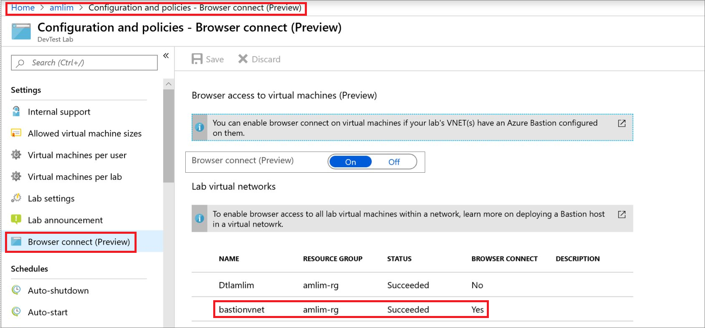

# Enable browser connection on lab virtual machines 
DevTest Labs integrates with [Azure Bastion](https://docs.microsoft.com/azure/bastion/), which enables you to connect to your virtual machines through a browser. You first need to enable browser connection on lab virtual machines.

As an owner of a lab you can enable accessing all lab virtual machines through a browser. You don't need an additional client, agent, or piece of software. Azure Bastion provides secure and seamless RDP/SSH connectivity to your virtual machines directly in the Azure portal over TLS. When you connect via Azure Bastion, your virtual machines don't need a public IP address. For more information, see [What is Azure Bastion?](../bastion/bastion-overview.md)

This article shows how to enable browser connection on lab virtual machines.

## Prerequisites 
Either deploy a Bastion host in your existing lab's virtual network **(OR)** connect your lab with a Bastion configured virtual network. 

To learn how to deploy a Bastion host in a virtual network, see  [Create an Azure Bastion host](../bastion/bastion-create-host-portal.md). When creating the Bastion host, select the lab's virtual network. 

First, you need to create a second subnet in the Bastion virtual network because the AzureBastionSubnet doesn't allow creation of non-Bastion resources in it. 

## Create a second sub net in the Bastion virtual network
You can't create lab VMs in an Azure Bastion subnet. Create another subnet within the Bastion virtual network as shown in the following image:

## Enable VM creation in the subnet
Now, enable the creation of VMs in this subnet by following these steps: 

1. Sign in to the [Azure portal](https://portal.azure.com).
1. Select **All Services** on the left navigational menu. 
1. Select **DevTest Labs** from the list. 
1. From the list of labs, select *your lab*. 

    > [!NOTE]
    > Azure Bastion is now generally available in the following regions: West US, East US, West Europe, South Central US, Australia East, and Japan East. So, create a lab in one of these regions if your lab isn't in one of them. 
    
1. Select **Configuration and policies** in the **Settings** section on the left menu. 
1. Select **Virtual networks**.
1. Select **Add** from the toolbar. 
1. Select the **virtual network** that has the Bastion host deployed. 
1. Select the subnet for VMs, not the **AzureBastionSubnet**, the other one you created earlier. Close the page and reopen it if you don't see the subnet in the list at the bottom. 

    
1. Select **Use in virtual machine creation** option. 
1. Select **Save** on the toolbar. 
1. If you have an old virtual network for the lab, remove it by selecting **...*  and **Remove**. 

## Enable browser connection 

Once you have a Bastion configured virtual network inside the lab, as a lab owner, you can enable browser connect on lab virtual machines.

To enable browser connect on lab virtual machines, follow these steps:

1. In the Azure portal, navigate to *your lab*.
1. Select **Configuration and policies**.
1. In **Settings**, select **Browser connect**. If you don't see this option, close the **Configuration policies** page, and reopen it. 

    

## Next Steps
See the following article to learn how to connect to your VMs using a browser: [Connect to your virtual machines through a browser](connect-virtual-machine-through-browser.md)
