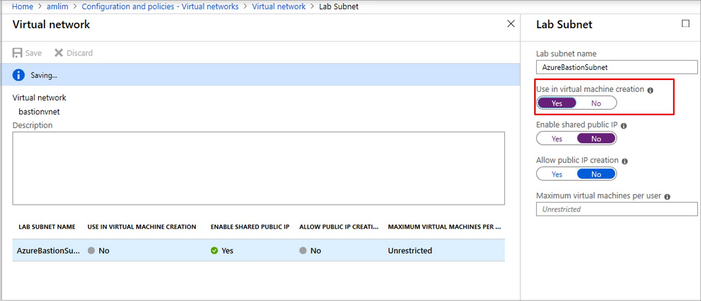

# Enable browser connection on lab virtual machines 

DevTest Labs integrates with [Azure Bastion](https://docs.microsoft.com/azure/bastion/), which enables you to connect to your virtual machines through a browser. You first need to enable browser connection on lab virtual machines.

As an owner of a lab you can enable accessing all lab virtual machines through a browser. You don't need an additional client, agent, or piece of software. Azure Bastion provides secure and seamless RDP/SSH connectivity to your virtual machines directly in the Azure portal over TLS. When you connect via Azure Bastion, your virtual machines don't need a public IP address. For more information, see [What is Azure Bastion?](../bastion/bastion-overview.md)

> [!NOTE]
> Enabling browser connection on lab virtual machines is in preview.

This article shows how to enable browser connection on lab virtual machines.

## Prerequisites 
Either deploy a Bastion host in your existing lab's virtual network **(OR)** connect your lab with a Bastion configured VNet. 

To learn how to deploy a Bastion host in a VNet, see  [Create an Azure Bastion host (Preview)](../bastion/bastion-create-host-portal.md). When creating the Bastion host, select the lab's virtual network. 

To learn how to connect your lab with a Bastion configured VNet, see [Configure a virtual network in Azure DevTest Labs](devtest-lab-configure-vnet.md). Select the VNet that has the Bastion host deployed and the **AzureBastionSubnet** in it. Here are the detailed steps: 

1. Sign in to the [Azure portal](https://portal.azure.com).
1. Select **All Services** on the left navigational menu. 
1. Select **DevTest Labs** from the list. 
1. From the list of labs, select *your lab*. 

    > [!NOTE]
    > Azure Bastion is currently in preview. It's limited to the following regions: West US, East US, West Europe, South Central US, Australia East, and Japan East. So, create a lab in one of these regions if your lab isn't in one of them. 
1. Select **Configuration and policies** in the **Settings** section on the left menu. 
1. Select **Virtual networks**.
1. Select **Add** from the toolbar. 
1. Select the **VNet** that has the Bastion host deployed. 
1. Select the subnet: **AzureBastionSubnet**. 

    
1. Select **Use in virtual machine creation** option. 
1. Select **Save** on the toolbar. 
1. If you have an old VNet for the lab, remove it by selecting **...*  and **Remove**. 

## Enable browser connection 

Once you have a Bastion configured VNet inside the lab, as a lab owner, you can enable browser connect on lab virtual machines.

To enable browser connect on lab virtual machines, follow these steps:

1. In the Azure portal, navigate to *your lab*.
1. Select **Configuration and policies**.
1. In **Settings**, select **Browser connect (Preview)**.

## Next Steps
See the following article to learn how to connect to your VMs using a browser: [Connect to your virtual machines through a browser](connect-virtual-machine-through-browser.md)