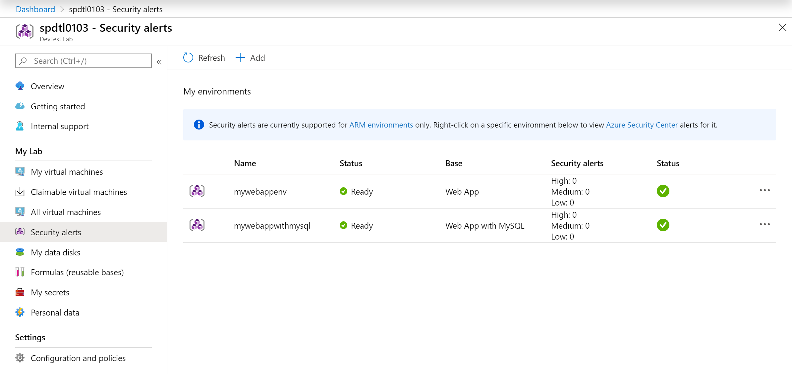
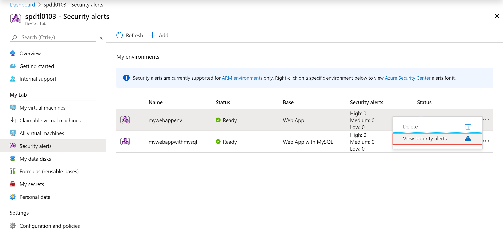
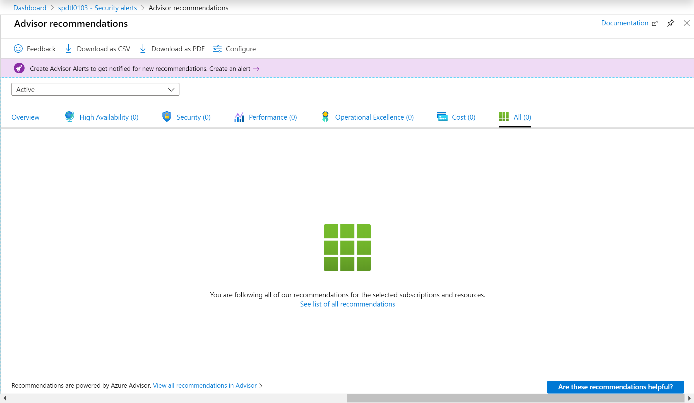

# Security alerts for environments in Azure DevTest Labs
This article shows you how to view security alerts for environments in Azure DevTest Labs. 

## Prerequisites
Currently, you can view security alerts only for environments deployed into your lab. To test or use this feature, deploy an environment into your lab. 

## View security alerts for an environment

1. On the home page for your lab, select **Security alerts** on the left menu. You should see the number of security alerts (high, medium, and low).

    
2. Right-click on three dots (...) in the last column, and select **View security alerts**. 

    
3. You see more details about the alerts and advisor recommendations. 

    

## Next steps
To learn more about environments, see the following articles:

- [Create multi-vm environments and PaaS resources with Azure Resource Manager templates](devtest-lab-create-environment-from-arm.md)
- [Configure and use public environments](devtest-lab-configure-use-public-environments.md)
