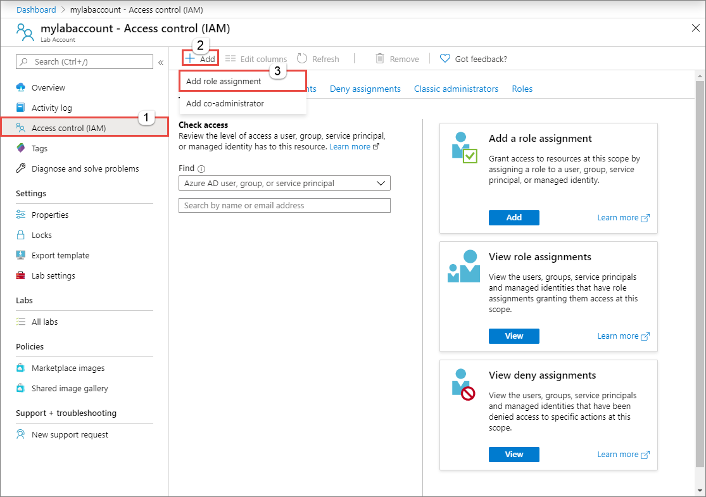
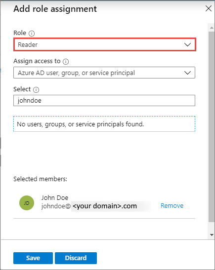
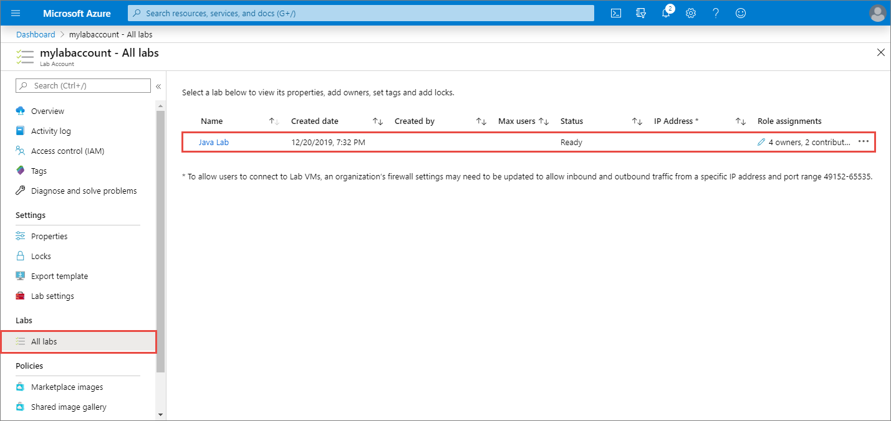

# How to add additional owners to an existing lab in Azure Lab Services
This article shows you how you, as an administrator, can add additional owners to an existing lab.

## Add user to the reader role for the lab account
To add an user as an additional owner to an existing lab, you must first give the user **read** permissions on the lab account.

1. Sign in to the [Azure portal](https://portal.azure.com).
2. Select **All Services** on the left menu. Search for **Lab Services**, and then select it.
3. Select your **lab account** from the list. 
2. On the **Lab Account page**, select **Access Control (IAM)** on the left menu. 
2. On the **Access control (IAM)** page, select **Add** on the toolbar, and the select **Add role assignment**.

    
3. On the **Add a role assignment** page, do the following steps: 
    1. Select **Reader** for the **role**. 
    2. Select the user. 
    3. Select **Save**. 

        

## Add user to the owner role for the lab

1. Back on the **Lab Account** page, select **All labs** on the left menu.
2. Select the **lab** to which you want to add user as an owner. 
    
        
3. On the **Lab** page, select **Access control (IAM)** on the left menu.
4. On the **Access control (IAM)** page, select **Add** on the toolbar, and the select **Add role assignment**.
5. On the **Add a role assignment** page, do the following steps: 
    1. Select **Owner** for the **role**. 
    2. Select the user. 
    3. Select **Save**. 

## Next steps
Confirm that the user sees the lab upon logging into the [Lab Services portal](https://labs.azure.com).